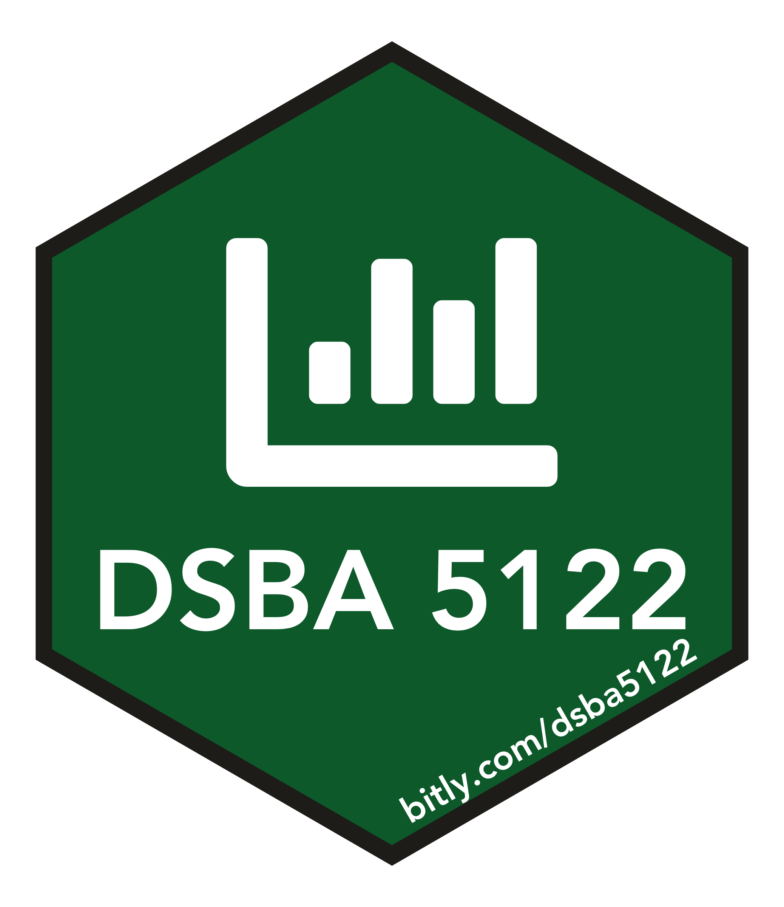

# DSBA 5122: Visual Analytics 

This repository contains the code for generating [dsba5122-spring2019.netlify.com](https://dsba5122-spring2019.netlify.com).

## Attribution

This course was forked from Andrew Heiss' [MPA 635 Data Visualization](https://github.com/andrewheiss/datavizf18.classes.andrewheiss.com). Many of the resources were used (and many added too) and like Andrew's repo, this course is provided under CC BY-NC-SA 4.0.

Much thanks goes to the many open source contributors of the course materials (directly or inspired by their work):
* [Andrew Heiss](https://www.andrewheiss.com/) 
* [Allison Hill](https://alison.rbind.io/)
* [Thomas Lin Pedersen](https://www.data-imaginist.com/)
* [Jenny Bryan](https://jennybryan.org/)
* [Matthew Kay](http://www.mjskay.com/)
* [Garrick Aden-Buie](https://www.garrickadenbuie.com/project/)
* [David Robinson](http://varianceexplained.org/about/)
* [Davis Vaughn](https://blog.davisvaughan.com/)
* [Jessica Hullman](http://users.eecs.northwestern.edu/~jhullman/)
* [Robert Kosara](https://eagereyes.org/)
* [Mike Kearney](https://mikewk.com/)
* [Emil Hvitfeldt](https://www.hvitfeldt.me/blog/)
* [Julia Silge](https://juliasilge.com/)
* [Chester Ismay](https://ismayc.github.io/)
* [David Schoch](http://schochastics.net/)
* [Tyler Bradley](https://tbradley1013.github.io/)

## Theme

This site uses Andrew's custom [`ath-tufte-hugo_18-19` theme](https://github.com/andrewheiss/ath-tufte-hugo_18-19) as a submodule.

When cloning for the first time, use this command to get the theme too:

    git clone --recursive https://github.com/andrewheiss/ath-tufte-hugo_18-19.git

To get the theme later, use this command:

    git submodule add \
      https://github.com/andrewheiss/ath-tufte-hugo_18-19.git \
      themes/ath-tufte-hugo_18-19

To update to the latest version of the theme, use:

    git submodule update --recursive --remote
    
## License

 This work is licensed under a <a rel="license" href="http://creativecommons.org/licenses/by-nc-sa/4.0/">Creative Commons Attribution-NonCommercial-ShareAlike 4.0 International License</a>

