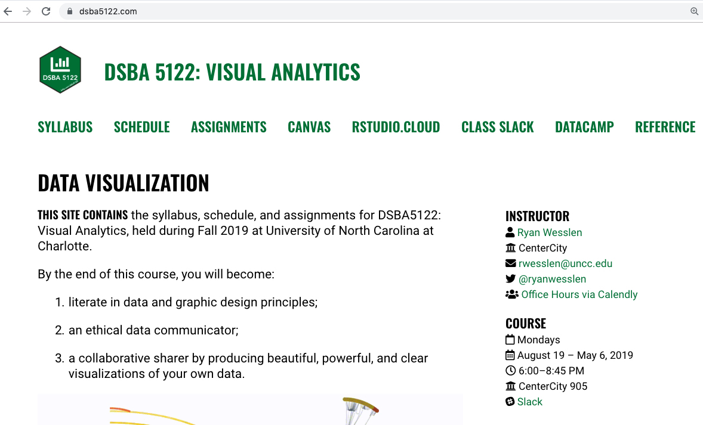

```{r setup, include=FALSE}
options(htmltools.dir.version = FALSE)
library(xaringanthemer)
mono_accent(base_color = "#046A38")
```

class: center, middle

# Welcome


---

# Introduce yourself

- Name

- Program (DSBA, HI, other?)

- Programming & Visualization Experience

- What are you interested in learning more about in visualizations?

---



<https://dsba5122-spring2019.netlify.com> or <https://bitly.com/dsba5122>

---

.pull-left[
## RStudio Locally

- **Pros**: It's on your computer. 

- **Cons**: Different settings (OS, versions, packages, etc.) can make sharing/replication painful.

]
.pull-right[
## RStudio.Cloud

- **Benefits**: Clean environment, easy to replicate/share

- **Cons**: Sometimes slow or down (cost of free), limited to 1GB of memory
]

--

Use RStudio.Cloud to run in-class demos and test purposes but use local version for your homeworks and projects.

FYI there's also [Docker](https://ropenscilabs.github.io/r-docker-tutorial/) and/or [Cloud](https://www.andrewheiss.com/blog/2017/04/27/super-basic-practical-guide-to-docker-and-rstudio/) approaches!

---

class: center, middle

# Let's get started!


---

class: inverse, middle, center

# Intro to Visual Analytics

---

## The use of computer-supported, interactive visual representations of data to **amplify cognition**.

### - Scientific visualization (1987)

### - Information visualization (1999)

### - Visual analytics (2005)

---

class: middle, center

# Scientific visualization

.pull-left[
## Volume Visualization


]

.pull-right[
## Flow visualization


]
---

class: middle

## Data visualization domains:

.pull-left[
### Information Visualization (InfoVis)

- Low-level, system 1 processing 

- Intuitive, perceptual decision-making

- Single, isolated graph/chart

- Typically, non-expert or average user

- Goal: identify best external (visual) representation
]
--
.pull-right[
### Visual Analytics (VA)

- High-level, system 2 processing

- Effortful, deliberate decision-making

- Highly interactive, coordinated-multiple views

- Typically, expert or specialized knowledge

- Goal: "human-in-the-loop" decision-making (e.g., integrate with machine learning)
]

--

 This course is labelled "Visual Analytics" but includes many elements of Information Visualization.

---

* InfoVis, VA, and SciVis

* Historical

- Classics: Snow (2), Minard (2), Du Bois (5), provide Jeff Heer's talk

* What makes a good visualization?

---

Why look at Data?

Chapter 1.1 Kieran

[Chapter](http://socviz.co/lookatdata.html)

---

class: center, middle


---

class: center, middle


---

[GitHub](https://github.com/lockedata/datasauRus)


---

class: center, middle


---

class: center, middle


---

class: center, middle


---

class: center, middle


---

class: center, middle


---

class: center, middle


---

class: center, middle


---

class: center, middle


---

class: center, middle


