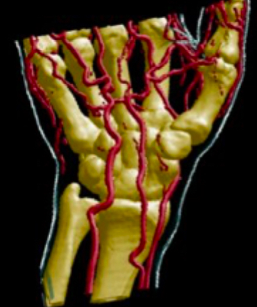
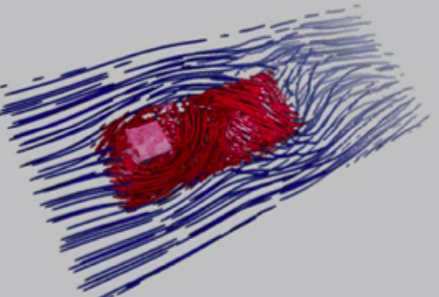
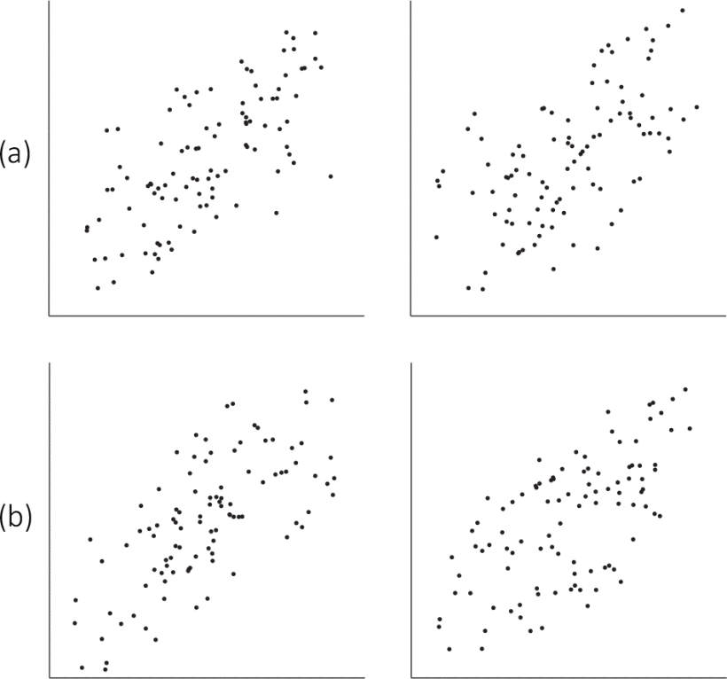
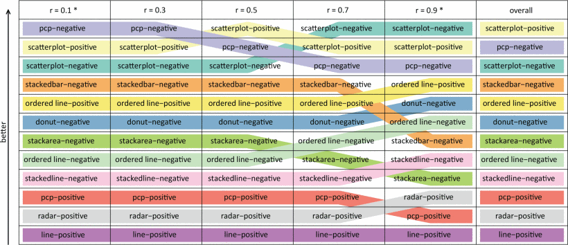
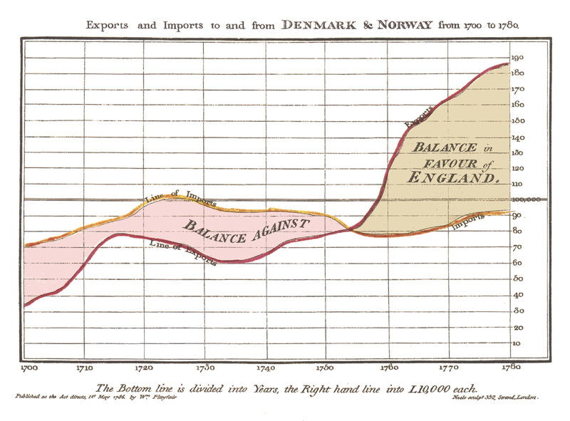
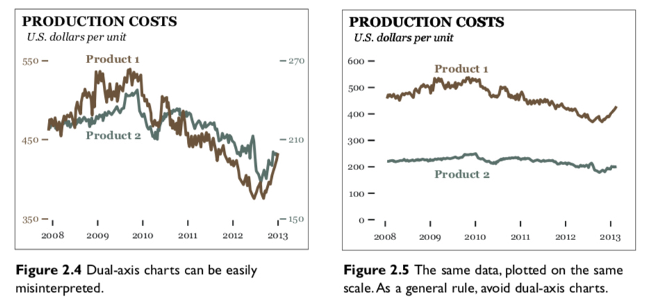
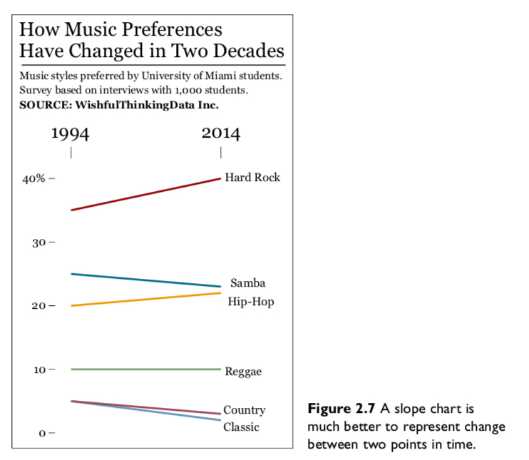

```{r setup, include=FALSE}
options(htmltools.dir.version = FALSE)
library(xaringanthemer)
mono_light(
  base_color = "#046A38",
  white_color = "#ffffff",
  text_font_size = "28px",
  header_h1_font_size = "40px",
  header_h2_font_size = "35px", 
  header_h3_font_size = "30px",
  code_font_size = "14px",
  header_font_google = google_font("Josefin Sans"),
  text_font_google   = google_font("Montserrat", "300", "300i"),
  code_font_google   = google_font("Droid Mono")
)
```

class: center, middle

# Welcome


---

# Introduce yourself

- Name

- What's your academic and professional background?

- Programming (e.g., R, python, JavaScript, SQL) & visualization experience (e.g., Excel, ggplot2, Tableau, Spotfire)

- What are you interested to learn more about data visualizations?

--

To do by next class: Send me an introduction email <rwesslen@uncc.edu> answering these questions. It's up to you on length. This is my chance to learn about your background.

---


<https://dsba5122-spring2019.netlify.com> or <https://bitly.com/dsba5122>

---

class: center, middle

# Let's get started!


---

class: inverse, middle, center

# Intro to Visual Analytics (and Information Visualization)

---

# What is a visualization?

## The use of computer-supported, interactive visual representations of data to **amplify cognition**. 

### - Card, Mackinley, and Shneiderman (1999)

---

# Data visualization is separated into three disciplines:

### - Scientific visualization (1987)

### - Information visualization (1999)

### - Visual analytics (2005)

---

class: middle, center

# Scientific visualization (SciVis)

.pull-left[
## Volume Visualization
```{r out.width = "300px", fig.align="center", echo=FALSE}

```
]

.pull-right[
## Flow visualization

```{r out.width = "300px", fig.align="center", echo=FALSE}

```
]
---
# Information Visualization (InfoVis)

- Low-level, system 1 processing 

- Intuitive, perceptual decision-making

- Single, isolated graph/chart

- Typically, non-expert or average user

--

**Goal**: identify best external (visual) representation

---
# InfoVis: [Harrison et al., 2014](https://ieeexplore.ieee.org/document/7192661)

Which visualization best aids in a "just-noticeable" difference in correlation?

```{r out.width = "400px", fig.align="center", echo=FALSE}

```

---

class: middle, center

```{r out.width = "450px", fig.align="center", echo=FALSE}
knitr::include_graphics("../images/slides/01-class/harrison2.gif")
```

---
# InfoVis: [Harrison et al., 2014](https://ieeexplore.ieee.org/document/7192661)

```{r out.width = "700px", fig.align="center", echo=FALSE}

```

---

# Visual Analytics (VA)

- High-level, system 2 processing

- Effortful, deliberate decision-making

- Highly interactive, coordinated-multiple views

- Typically, expert or specialized knowledge

--

**Goal**: "human-in-the-loop" decision-making (e.g., integrate with machine learning)

--

This course is called "Visual Analytics" but includes a lot on Information Visualization.

---

# VA: VAiROMA by [Cho et al., 2015](https://ieeexplore.ieee.org/abstract/document/7192676)

How to visualize Roman History from Wikipedia?

```{r out.width = "700px", fig.align="center", echo=FALSE}
knitr::include_graphics("../images/slides/01-class/cho1.gif")
```

---

class: middle, center

# VA: VAiROMA by [Cho et al., 2015](https://ieeexplore.ieee.org/abstract/document/7192676)

```{r out.width = "700px", fig.align="center", echo=FALSE}
knitr::include_graphics("../images/slides/01-class/cho2.gif")
```

---

class: inverse, middle, center

## A *Very* Brief History of Data Visualizations

```{r out.width = "450px", fig.align="center", echo=FALSE}

```

William Playfair, 1786

---

class: center

## Cholera in London: 1854

```{r out.width = "330px", fig.align="center", echo=FALSE}
knitr::include_graphics("../images/slides/01-class/cholera_cartoon.jpg")
```

---

.pull-left[
## John Snow

```{r out.width = "600px", fig.align="center", echo=FALSE}
knitr::include_graphics("../images/slides/01-class/johnSnow.jpg")
```
]

--

.pull-right[

## The other John Snow

```{r out.width = "320px", fig.align="center", echo=FALSE}
knitr::include_graphics("../images/slides/01-class/John_Snow.jpg")
```
]

---
background-image: url("../images/slides/01-class/snow_map.png")
background-size: cover
---

```{r out.width = "700px", fig.align="center", echo=FALSE}
knitr::include_graphics("../images/slides/01-class/snow_map2.png")
```

---

## Tufte's Perspective 

1. Place data in an appropriate context for assessing **cause and effect**.

2. Making quantitatives comparisons (e.g., Workhouse & Brewery).

3. Considering alternative explanations and contrary cases.

4. Assessment for possible errors (e.g., compared with what?)

---
background-image: url("../images/slides/01-class/minard.jpg")
background-size: cover
---
background-image: url("../images/slides/01-class/33863r.jpg")
---
class: top, center
```{r out.width = "600px", echo=FALSE}
knitr::include_graphics("../images/slides/01-class/33887v.jpg")
```
---
background-image: url("../images/slides/01-class/33864r.jpg")
---
background-image: url("../images/slides/01-class/33892r.jpg")
background-size: cover
---
background-image: url("../images/slides/01-class/33889r.jpg")
---

class: middle, center

```{r out.width = "700px",fig.align="center", echo=FALSE}
vembedr::embed_youtube("N00g9Q9stBo") 
```

Watch [Jeff Heer](https://homes.cs.washington.edu/~jheer/)'s 2009 "Brief History of Data Visualization".

---

class: middle, center, inverse

# Why look at Data?

> “The greatest value of a picture is when it forces us to notice what we never expected to see.” — John Tukey

```{r out.width = "200", fig.align="center", echo=FALSE}
knitr::include_graphics("../images/slides/01-class/tukey.jpg")
```

---
class: middle, center

```{r out.width = "570px", fig.align="center", echo=FALSE}
knitr::include_graphics("../images/slides/01-class/ch-01-anscombe-1.png")
```
Anscombe's Quartet (1973), Healy: Ch. 1
---
class: middle, center

## Datasaurus Dozen

```{r out.width = "650px", fig.align="center", echo=FALSE}
knitr::include_graphics("../images/slides/01-class/DataSaurusDozen.gif")
```

[Matejka and Fitzmaurice, 2017](https://www.autodeskresearch.com/publications/samestats) / [GitHub](https://github.com/lockedata/datasauRus)

---
```{r out.width = "530px", fig.align="center", echo=FALSE}
knitr::include_graphics("../images/slides/01-class/ch-01-jackman-outlier.png")
```
---
```{r out.width = "650px", fig.align="center", echo=FALSE}
knitr::include_graphics("../images/slides/01-class/ch-01-correlations-1.png")
```
---
class: inverse, middle, center

# Five Qualities of Great Visualizations

"But why do I never stumble on to an article or blog post showing ... how a visualization helped a group of doctors do something remarkable? Is it just because this stuff does not get reported or what?" -Enrico Bertini (NYU)

Ch. 2 of Cairo "The Truthful Art"

---
background-image: url("../images/slides/01-class/hockey.png")
---
## Five Qualities of Great Visualizations

1. It is truthful.

2. It is functional.

3. It is beautiful.

4. It is insightful.

5. It is enlightening.

---

# It is truthful

.pull-left[

]
--
.pull-right[

]

--

"If someone hides data from you, it’s probably because he has something to hide." (Cairo, Ch. 2)

---

"Truth and untruth aren’t absolutes. They are the extremes at either end of a spectrum" (Cairo, Ch. 2)

- Avoid self-deception

- Be honest with your audience



---
class: middle, center
# It is functional


---
class: middle, center

```{r out.width = "650px", fig.align="center", echo=FALSE}

```


---

class: middle, center

# It is beautiful


---
background-image: url("../images/slides/01-class/ch-01-chartjunk-life-expectancy.png")
background-size: cover
---
background-image: url("../images/slides/01-class/ch-01-holmes-monstrous-only.png")
background-size: cover
---

# It is insightful

“The purpose of visualization is insight, not pictures" - Card, Mackinley, and Shneiderman (1999)

Two types of insight in data visualizations (Chang et al., 2009):

1. Eureka (or Aha!) moments

2. Knowledge-building

---

# It is enlightening

"Some topics do matter more than others indeed because **they are more critical to the well-being of more people.**"

--

- What is the importance of your data visualization?

--

- Find topics that are important (and fun) to understand, especially in cases where you don't know the right question to ask (i.e., exploratory data analysis).


