```{r setup, include=FALSE}
options(htmltools.dir.version = FALSE)
library(xaringanthemer)
mono_light(
  base_color = "#046A38",
  white_color = "#ffffff",
  text_font_size = "28px",
  header_h1_font_size = "40px",
  header_h2_font_size = "35px", 
  header_h3_font_size = "30px",
  code_font_size = "14px",
  header_font_google = google_font("Josefin Sans"),
  text_font_google   = google_font("Montserrat", "300", "300i"),
  code_font_google   = google_font("Droid Mono")
)
```

class: center, middle, inverse

# The Truth Continuum (Chapter 3)

### "Any visualization is a model."

???

what is a model? its an abstraction or a "metaphor"

- requires certain assumptions, sacrifices to focus on core elements of a specific

- requires design choices; what to assume away, what to 

- power comes from simplicity; focus on core mechanisms that may be very powerful at explaining very complicated processes

--

"The more adequately a model fits ... without being needlessly complex, and the easier ... to interpret it correctly, the better it will be."

---

class: center, middle

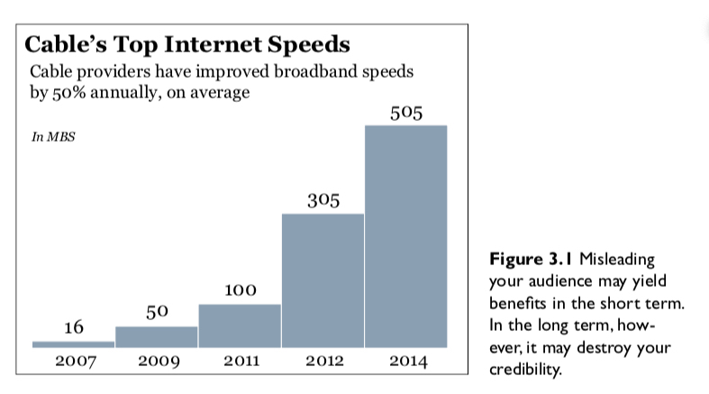

???

This only focuses on the "top speed" - ignores average speed, low speeds (eg bad coverage areas)

---

class: center, middle

```{r out.width = "500px", fig.align="center", echo=FALSE}
knitr::include_graphics("../images/slides/02-class/dubious4.png")
```

---

class: center, middle

```{r out.width = "500px", fig.align="center", echo=FALSE}
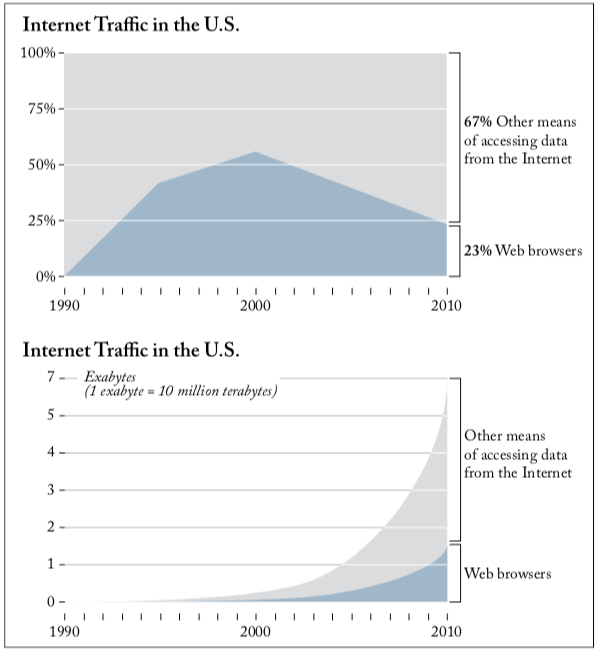
```

---

class: center, middle

```{r out.width = "650px", fig.align="center", echo=FALSE}
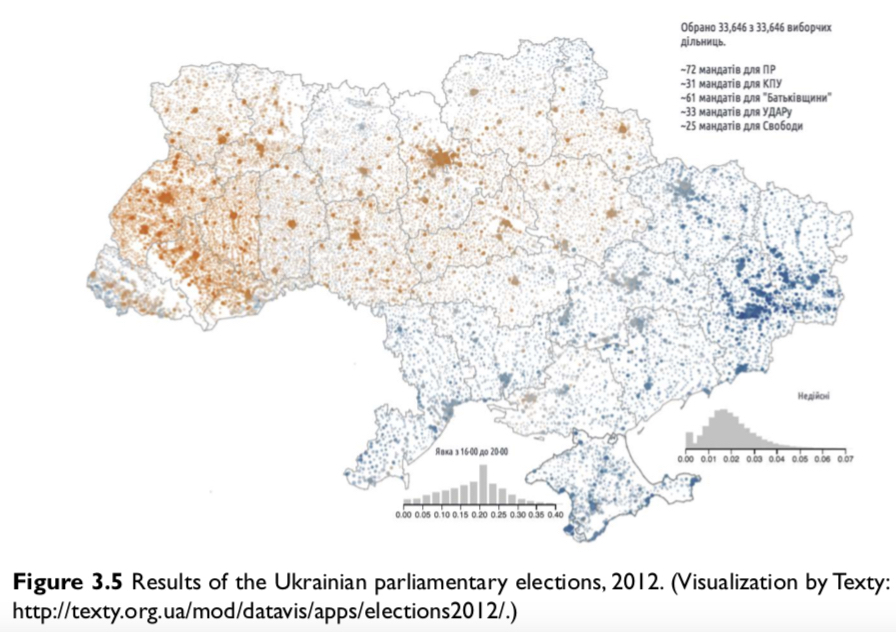
```

---

# The Mind, That Clumsy Modeler

```{r out.width = "550px", fig.align="center", echo=FALSE}
knitr::include_graphics("../images/slides/02-class/dubious7.png")
```

???

"Good visualizations shouldn’t oversimplify information. **They need to clarify it.** In many cases, clarifying a subject requires increasing the amount of information, not reducing it."

--

```{r out.width = "550px", fig.align="center", echo=FALSE}
knitr::include_graphics("../images/slides/02-class/dubious8.png")
```

???

"What you design is never exactly what your audience ends up interpreting, so **reducing the chances for misinterpretation becomes crucial.**"

---

class: middle, center, inverse

# Why Are We So Often Mistaken?

### Cairo's three "bugs" in thinking (Ch. 3)

---

# Patternicity Bug

Humans have an innate ability to detect **patterns**, especially visually. This is why visualizations can be so important!

```{r out.width = "450px", fig.align="center", echo=FALSE}
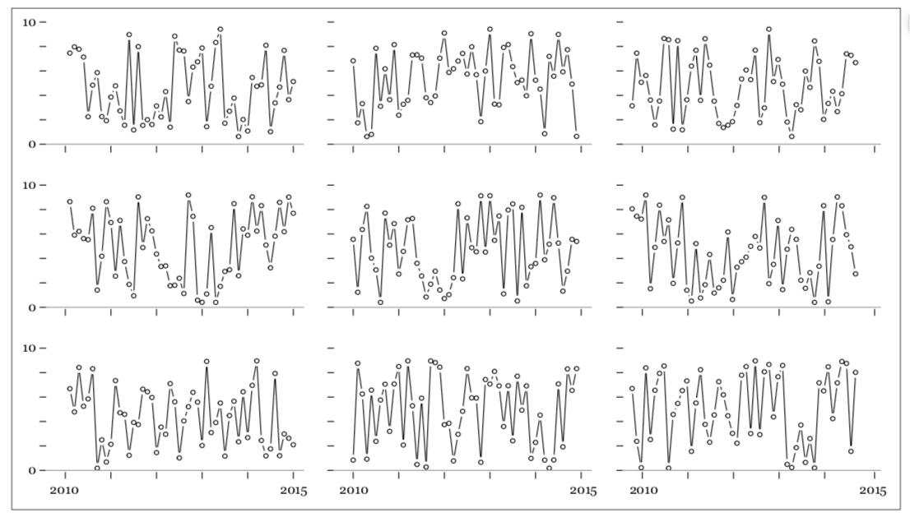
```

However, many patterns that your eyes and brain detect in data are the result of pure **coincidences and noise**, or "**mental overfitting**".

---

# Storytelling Bug

Once we detect patterns, we naturally try to find a **cause-effect explanation** for them.

Storytelling can be a potent tool for communicating effectively, but it is **dangerous if it blinds us toward evidence that should compel us to tweak or discard our models**.

<p align="center">
<iframe src="https://giphy.com/embed/9X6OGGZ2SNyQ8" width="480" height="275" frameBorder="0" class="giphy-embed" allowFullScreen></iframe><p><a href="https://giphy.com/gifs/book-bunnies-snoopy-9X6OGGZ2SNyQ8"></a></p>
</p>

---

# Confirmation Bug

Once a good story takes over our understanding of something, we’ll attach to it like leeches to warm, plump flesh. **An attack on our beliefs will be seen as personal.**

<p align="center">
<iframe src="https://giphy.com/embed/4aBVLu47Zs2AM" width="360" height="250" frameBorder="0" class="giphy-embed" allowFullScreen></iframe><p><a href="https://giphy.com/gifs/princesconsuela-4aBVLu47Zs2AM"></a></p>
</p>

"The way we present information matters as much as the soundness of the information itself."

---

class: middle, center, inverse

# Truth Is Neither Absolute, Nor Relative (Chapter 3)

```{r out.width = "650px", fig.align="center", echo=FALSE}
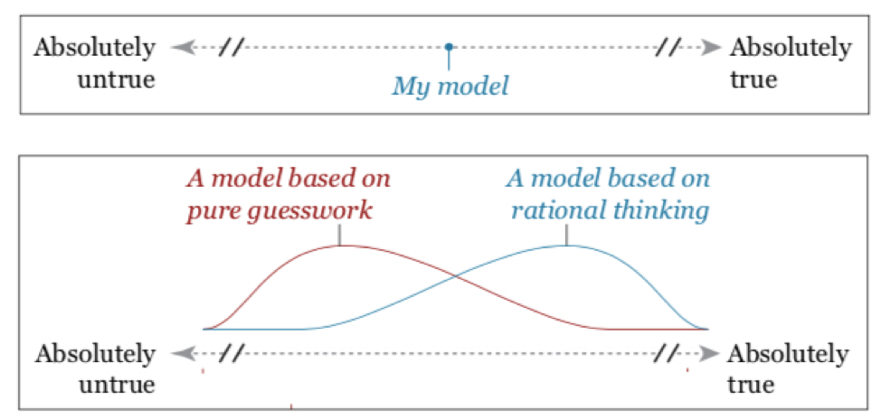
```

???

How to make this go more to the right? 
-Statistics, rigor, logic, experiments, more observations?

---

```{r out.width = "475px", fig.align="center", echo=FALSE}
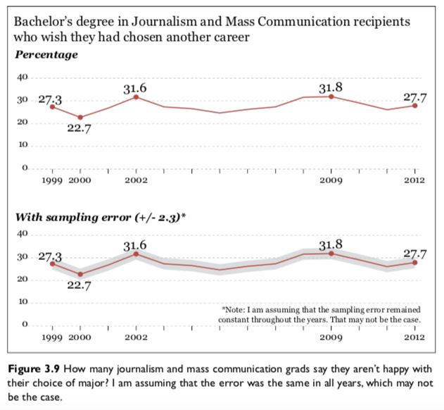
```

```{r out.width = "475px", fig.align="center", echo=FALSE}
knitr::include_graphics("../images/slides/02-class/mental1.png")
```

---

```{r out.width = "475px", fig.align="center", echo=FALSE}

```

```{r out.width = "475px", fig.align="center", echo=FALSE}
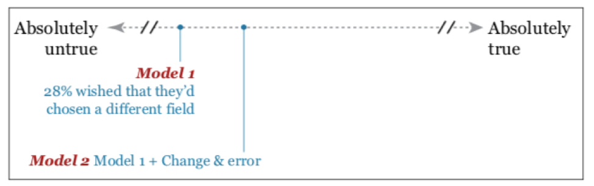
```

---

```{r out.width = "475px", fig.align="center", echo=FALSE}
knitr::include_graphics("../images/slides/02-class/journalism2.png")
```

```{r out.width = "475px", fig.align="center", echo=FALSE}
knitr::include_graphics("../images/slides/02-class/mental3.png")
```

---

```{r out.width = "475px", fig.align="center", echo=FALSE}
knitr::include_graphics("../images/slides/02-class/depth.png")
```

```{r out.width = "475px", fig.align="center", echo=FALSE}
knitr::include_graphics("../images/slides/02-class/mental4.png")
```

---

class: middle, center, inverse

# Basic Principles of Visualization (Chapter 5)

---

# Cairo's design suggestions for visualizations:

### 1. Think about the task(s) you want to enable

### 2. Try different graphic forms

### 3. Arrange the components of the graphic 

### 4. Test the outcomes 

---

# 1. Think about the task(s) you want to enable

- What is your problem?

- What action (task) can someone do to solve the problem?

- What data do you have?

- What are the most important data elements?

---

# 2. Try different graphic forms

```{r out.width = "500px", fig.align="center", echo=FALSE}
knitr::include_graphics("../images/slides/02-class/encoding.png")
```

---

# 3. Arrange the graphic components

```{r out.width = "500px", fig.align="center", echo=FALSE}
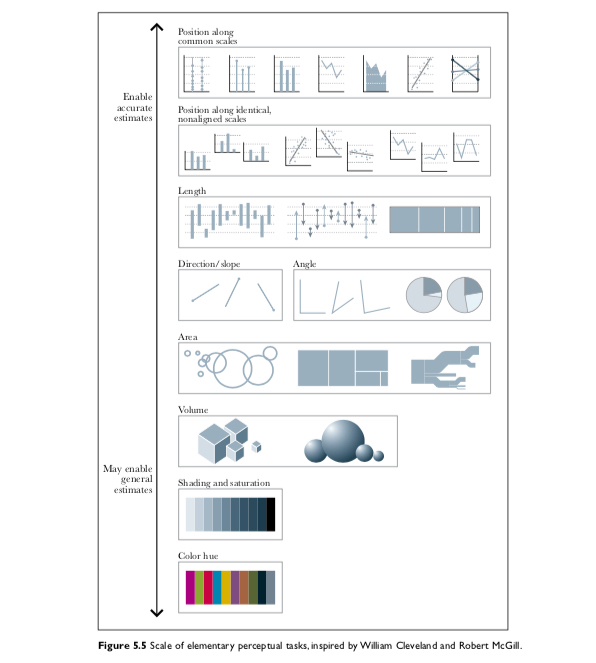
```

---

# 4. Test the outcomes

```{r out.width = "540px", fig.align="center", echo=FALSE}
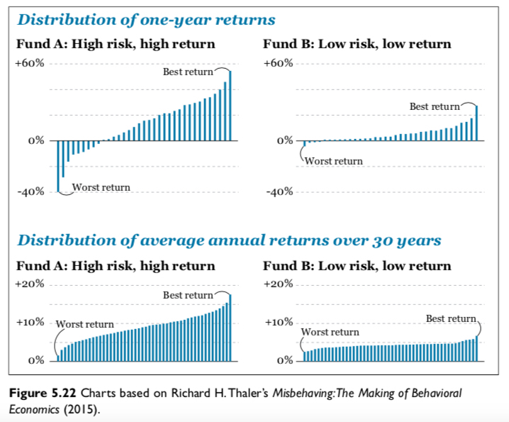
```

---

class: middle, center, inverse

# Look at Data (Chapter 1, Healy)

---

# Hermann Grid Effect

```{r out.width = "500px", fig.align="center", echo=FALSE}
knitr::include_graphics("../images/slides/02-class/herman-grid.jpg")
```

---

class: middle

# Mach bands

```{r out.width = "750px", fig.align="center", echo=FALSE}
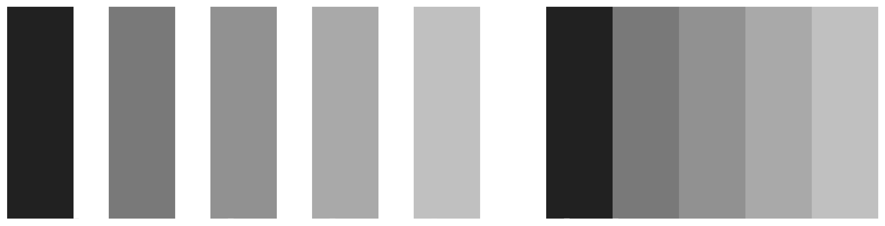
```

???
When the gray bars share a boundary, the apparent contrast between them appears to increase. Speaking loosely, we can say that our visual system is trying to construct a representation of what it is looking at based more on relative differences in the luminance (or brightness) of the bars, rather than their absolute value. Similarly, the ghostly blobs in the Hermann grid effect can be thought of as a side-effect of the visual system being tuned for a different task.

---

class: middle

# Gestalt

```{r out.width = "750px", fig.align="center", echo=FALSE}
knitr::include_graphics("../images/slides/02-class/gestalt.png")
```

---

class: middle

# Pre-attentive

```{r out.width = "750px", fig.align="center", echo=FALSE}
knitr::include_graphics("../images/slides/02-class/pre-attentive.png")
```

---

class: middle

# Multichannel

```{r out.width = "750px", fig.align="center", echo=FALSE}
knitr::include_graphics("../images/slides/02-class/multichannel.png")
```

---

class: middle

.pull-left[
```{r out.width = "350px", fig.align="center", echo=FALSE}
knitr::include_graphics("../images/slides/02-class/channels1.png")
```
]
.pull-right[
```{r out.width = "350px", fig.align="center", echo=FALSE}
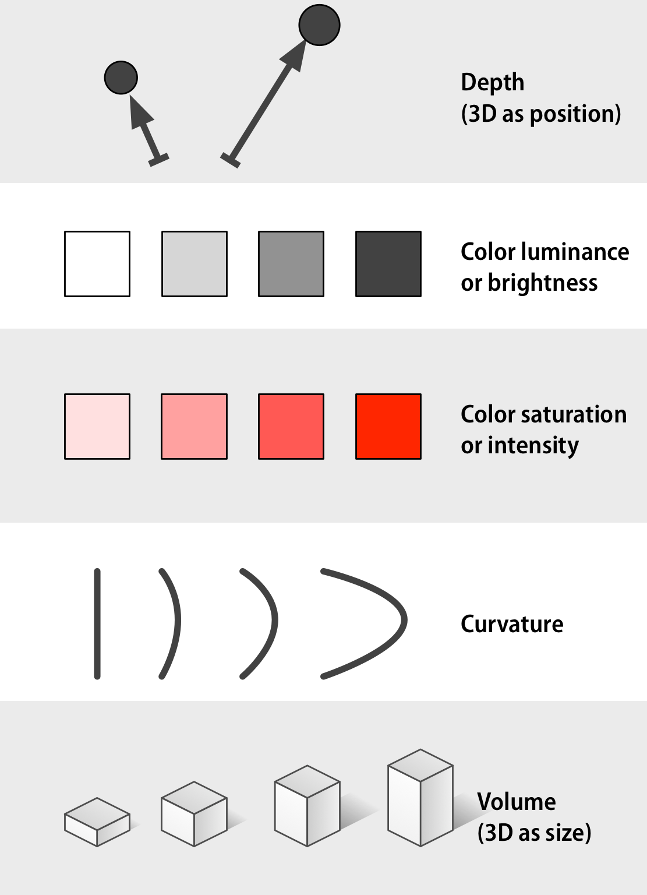
```
]

---

class: middle

# Cleveland and McGill, 1984

```{r out.width = "750px", fig.align="center", echo=FALSE}
knitr::include_graphics("../images/slides/02-class/cleveland.jpg")
```

---

class: middle

# Cleveland and McGill, 1984

```{r out.width = "750px", fig.align="center", echo=FALSE}
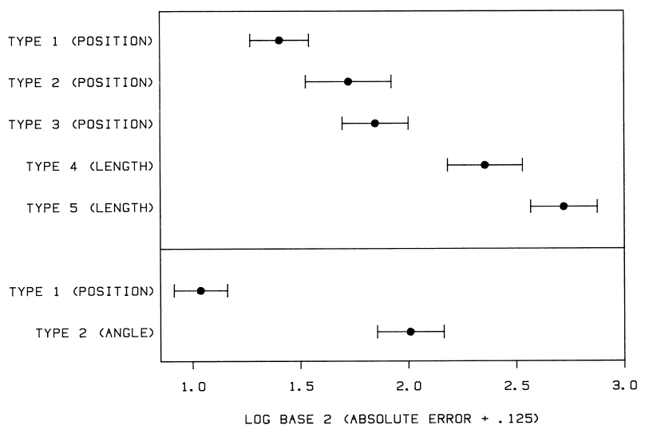
```

---

class: middle

# Heer and Bostock, 2010

```{r out.width = "750px", fig.align="center", echo=FALSE}
knitr::include_graphics("../images/slides/02-class/schematic.png")
```

---

class: middle

```{r out.width = "600px", fig.align="center", echo=FALSE}
knitr::include_graphics("../images/slides/02-class/results.png")
```

---

# Question: How do we implement?

<iframe src="https://giphy.com/embed/3oz8xZvvOZRmKay4xy" width = "800" height="500" frameBorder="0" class="giphy-embed" allowFullScreen></iframe><p><a href="https://giphy.com/gifs/foxhomeent-3oz8xZvvOZRmKay4xy"></a></p>

---

# A (Layered) Grammar of Graphics! 

`ggplot2` and its `tidyverse` friends

<iframe src="https://giphy.com/embed/3ohs4n9YN9nkvCjGow" width = "800" height="500" frameBorder="0" class="giphy-embed" allowFullScreen></iframe><p><a href="https://giphy.com/gifs/groundhog-day-3ohs4n9YN9nkvCjGow"></a></p>


