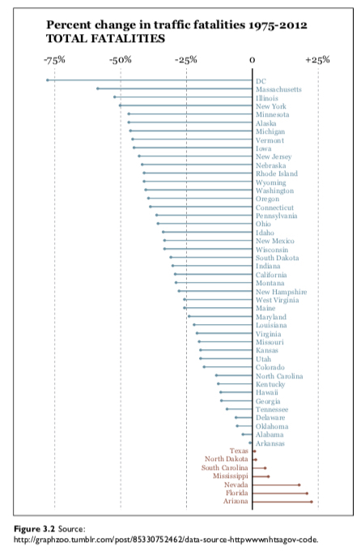
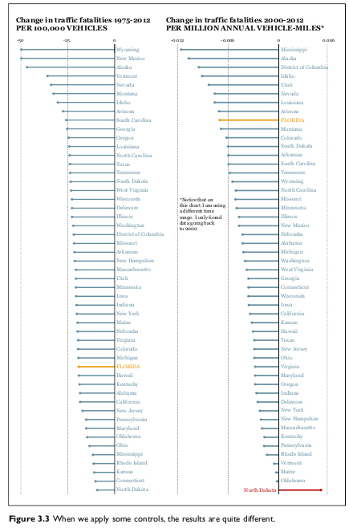

```{r setup, include=FALSE}
options(htmltools.dir.version = FALSE)
library(xaringanthemer)
mono_accent(base_color = "#046A38")
```

class: center, middle, inverse

# The Truth Continuum (Chapter 3)

"Any visualization is a model."

--

"The more adequately a model fits whatever it stands for without being needlessly complex, and the easier it is for its intended audience to interpret it correctly, the better it will be."

---

class: center, middle


---

class: center, middle

```{r out.width = "400px", fig.align="center", echo=FALSE}

```

---

class: center, middle

```{r out.width = "400px", fig.align="center", echo=FALSE}

```

---

class: center

```{r out.width = "500px", fig.align="center", echo=FALSE}
knitr::include_graphics("../images/slides/02-class/dubious4.png")
```

---

class: center, middle

```{r out.width = "500px", fig.align="center", echo=FALSE}
knitr::include_graphics("../images/slides/02-class/dubious5.png")
```

---

class: center, middle

```{r out.width = "650px", fig.align="center", echo=FALSE}
knitr::include_graphics("../images/slides/02-class/dubious6.png")
```

---

```{r out.width = "650px", fig.align="center", echo=FALSE}
knitr::include_graphics("../images/slides/02-class/dubious7.png")
```

--

"Good visualizations shouldn’t oversimplify information. **They need to clarify it.** In many cases, clarifying a subject requires increasing the amount of information, not reducing it."

---

```{r out.width = "650px", fig.align="center", echo=FALSE}
knitr::include_graphics("../images/slides/02-class/dubious8.png")
```

--

"What you design is never exactly what your audience ends up interpreting, so **reducing the chances for misinterpretation becomes crucial.**"

---

class: middle, center, inverse

Why Are We So Often Mistaken?

---

## 1. Patternicity Bug

## 2. Storytelling Bug

## 3. Confirmation Bug

---

# Patternicity Bug

```{r out.width = "650px", fig.align="center", echo=FALSE}
knitr::include_graphics("../images/slides/02-class/patternicity.png")
```

---

# Storytelling Bug

---

# Confirmation Bug

--

"The way we present information matters as much as the soundness of the information itself."

---

class: middle, center, inverse

# Basic Principles of Visualization (Chapter 5)
