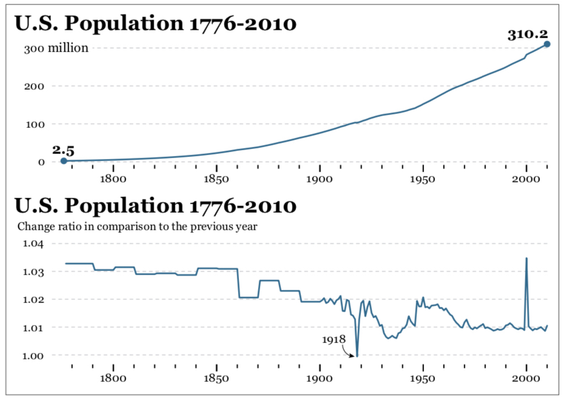
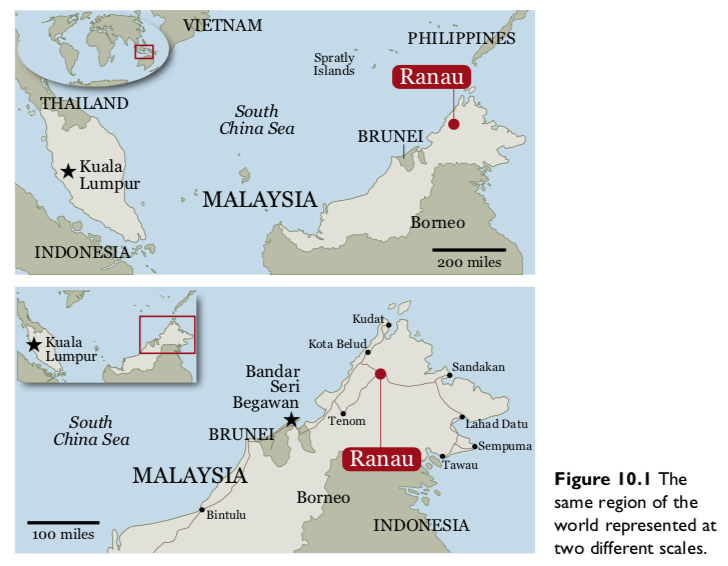
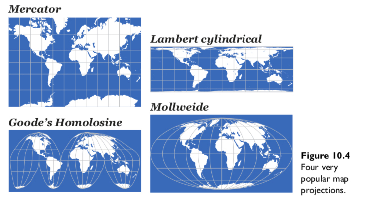
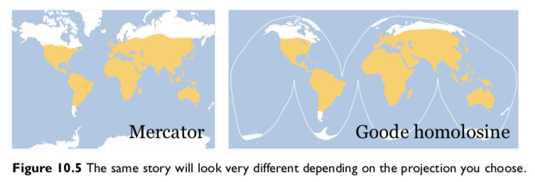
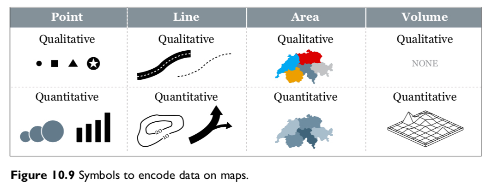
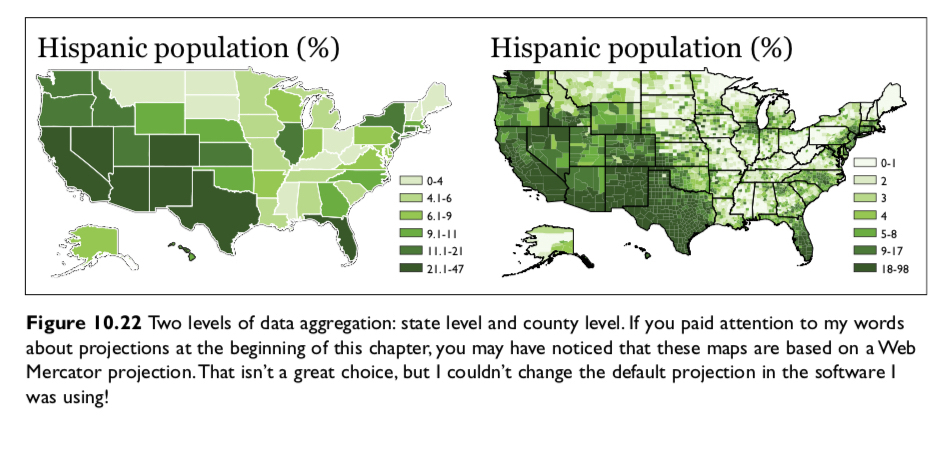
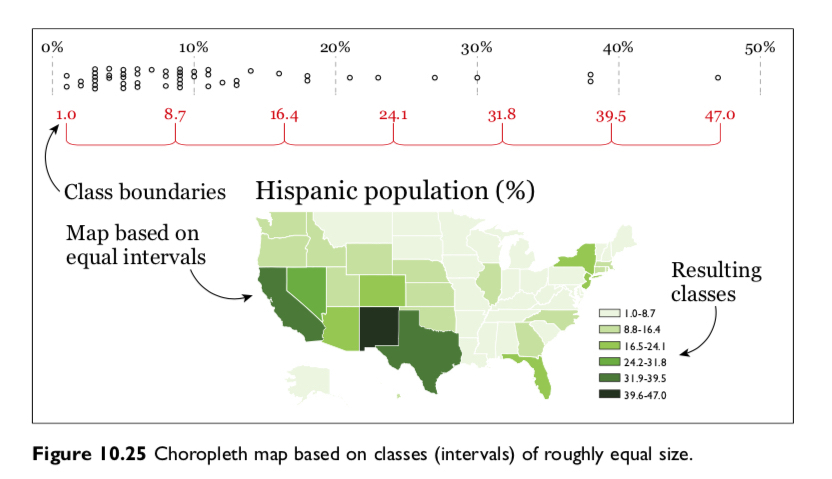
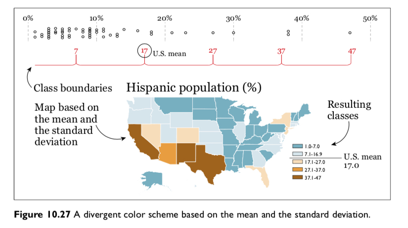
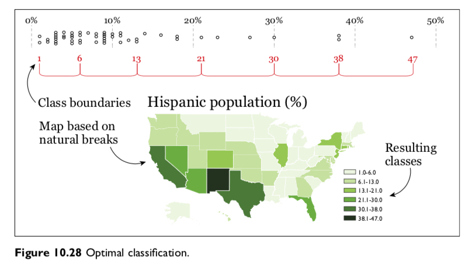

```{r setup, include=FALSE}
knitr::opts_chunk$set(fig.width=4.2, fig.height=4.2, message=FALSE, warning=FALSE) 
options(htmltools.dir.version = FALSE)
library(xaringanthemer)
library(gapminder)

mono_light(
  base_color = "#046A38",
  white_color = "#ffffff",
  text_font_size = "20px",
  header_h1_font_size = "40px",
  header_h2_font_size = "35px", 
  header_h3_font_size = "30px",
  code_font_size = "11px",
  header_font_google = google_font("Josefin Sans"),
  text_font_google   = google_font("Montserrat", "300", "300i"),
  code_font_google   = google_font("Droid Mono")
)
```

# In class assignment: 30 minutes

.pull-left[
## Create new RStudio Cloud Project
1. Pair up with person next to you.

2. Create a new RStudio.Cloud Project. Share that workspace with your partner.

3. Install `devtools` and `socviz` by running:
```{r eval=F}
install.packages('devtools') # install devtools
devtools::install_github("kjhealy/socviz")
```

4. Create a new .Rmd project. Load `socviz` and `tidyverse`. Look at the data frame `organdata`.

]
.pull-right[
## Bootstrapped Mean C.I.'s

1. Read the first examples of this page: [`stat_summary`](https://ggplot2.tidyverse.org/reference/stat_summary.html). 

2. (Optional) Read up on why bootstrapping works [StackExchange](https://stats.stackexchange.com/questions/26088/explaining-to-laypeople-why-bootstrapping-works)

3. Change "05-tables-and-labels-14" plot in  [`05_tables_and_labels.Rmd`](https://rstudio.cloud/spaces/22733/project/160035) to a bootstrapped mean 95% confidence interval. Modify parameters by looking at [`?geom_pointrange`](https://ggplot2.tidyverse.org/reference/geom_linerange.html).

4. (Bonus): Google "tidy bootstrapping". Is there a better (tidy) way to do it?
]

---

class: center, middle, inverse

# Time: Wilke Chapters 13-14

<blockquote class="twitter-tweet tw-align-center" width="50%"><p lang="en" dir="ltr">In this week&#39;s <a href="https://twitter.com/hashtag/tidytuesday?src=hash&amp;ref_src=twsrc%5Etfw">#tidytuesday</a> screencast, I analyze and predict trends in US dairy consumption over time<br><br>In the process I learn to do tidy forecasting with the sweep and timetk packages from <a href="https://twitter.com/bizScienc?ref_src=twsrc%5Etfw">@bizscienc</a> 📈 📉<a href="https://t.co/RyS50Ss6Vx">https://t.co/RyS50Ss6Vx</a> <a href="https://twitter.com/hashtag/rstats?src=hash&amp;ref_src=twsrc%5Etfw">#rstats</a> <a href="https://t.co/Qlf5nfJx1u">pic.twitter.com/Qlf5nfJx1u</a></p>&mdash; David Robinson (@drob) <a href="https://twitter.com/drob/status/1090336749778337792?ref_src=twsrc%5Etfw">January 29, 2019</a></blockquote> <script async src="https://platform.twitter.com/widgets.js" charset="utf-8"></script>

---

class: center, middle

# Visualizing one temporal variable

```{r out.width = "700px", fig.align="center", echo=FALSE}
knitr::include_graphics("../images/slides/04-class/timeseries.png")
```

---

class: center, middle

# Visualizing one temporal variable

```{r out.width = "700px", fig.align="center", echo=FALSE}
knitr::include_graphics("../images/slides/04-class/timeseries2.png")
```

---

class: center, middle

# Visualizing one temporal variable

```{r out.width = "700px", fig.align="center", echo=FALSE}
knitr::include_graphics("../images/slides/04-class/timeseries3.png")
```

---

class: center, middle

# Visualizing one temporal variable

```{r out.width = "700px", fig.align="center", echo=FALSE}
knitr::include_graphics("../images/slides/04-class/timeseries4.png")
```

---

class: center, middle

# Visualizing Indexes

```{r out.width = "700px", fig.align="center", echo=FALSE}
knitr::include_graphics("../images/slides/04-class/index1.png")
```

---

class: center, middle

# Visualizing Indexes: Detrending

```{r out.width = "700px", fig.align="center", echo=FALSE}
knitr::include_graphics("../images/slides/04-class/index2.png")
```

---

class: center, middle

# Visualizing two temporal variables

```{r out.width = "700px", fig.align="center", echo=FALSE}
knitr::include_graphics("../images/slides/04-class/timeseries5.png")
```

---

class: center, middle

# Visualizing two temporal variables

```{r out.width = "700px", fig.align="center", echo=FALSE}
knitr::include_graphics("../images/slides/04-class/timeseries6.png")
```

---

# Keeling Curve: What do you notice?

```{r out.width = "700px", fig.align="center", echo=FALSE}
knitr::include_graphics("../images/slides/04-class/keeling-curve-1.png")
```

---

# Trend + Seasonal + Noise

```{r out.width = "600px", fig.align="center", echo=FALSE}
knitr::include_graphics("../images/slides/04-class/keeling-curve-decomposition-1.png")
```

---

# Ratios to log

```{r out.width = "700px", fig.align="center", echo=FALSE}

```

---

# Ratios to log

```{r out.width = "700px", fig.align="center", echo=FALSE}
knitr::include_graphics("../images/slides/04-class/log.png")
```

---

class: middle, inverse, center

# Spatial/Maps: Wilke Chap. 15 and Healy Chap. 7

<blockquote class="twitter-tweet tw-align-center" width="50%"><p lang="en" dir="ltr">Putting Hawaii and Alaska into their place. <a href="https://twitter.com/hashtag/rstats?src=hash&amp;ref_src=twsrc%5Etfw">#rstats</a> <a href="https://twitter.com/hashtag/dataviz?src=hash&amp;ref_src=twsrc%5Etfw">#dataviz</a> <a href="https://twitter.com/hashtag/gganimate?src=hash&amp;ref_src=twsrc%5Etfw">#gganimate</a> <a href="https://t.co/JOMWlVv3A9">pic.twitter.com/JOMWlVv3A9</a></p>&mdash; Claus Wilke (@ClausWilke) <a href="https://twitter.com/ClausWilke/status/1026190740370731009?ref_src=twsrc%5Etfw">August 5, 2018</a></blockquote> <script async src="https://platform.twitter.com/widgets.js" charset="utf-8"></script>

---

# Scale

```{r out.width = "600px", fig.align="center", echo=FALSE}

```

---

# Scale

```{r out.width = "600px", fig.align="center", echo=FALSE}
knitr::include_graphics("../images/slides/04-class/scale-2.png")
```

---

# Projections

```{r out.width = "550px", fig.align="center", echo=FALSE}

```

---

# Projections

```{r out.width = "600px", fig.align="center", echo=FALSE}

```

---

# Projections

```{r out.width = "700px", fig.align="center", echo=FALSE}
knitr::include_graphics("../images/slides/04-class/projection3.png")
```

---

# Map encoding

```{r out.width = "700px", fig.align="center", echo=FALSE}

```

---

# UVA's Racial Dot Map

```{r out.width = "450px", fig.align="center", echo=FALSE}
knitr::include_graphics("../images/slides/04-class/dotmap.png")
```

<https://demographics.virginia.edu/DotMap/index.html>

---

# Chloropleths

```{r out.width = "600px", fig.align="center", echo=FALSE}
knitr::include_graphics("../images/slides/04-class/chloropleth.png")
```

---

# Chloropleths

```{r out.width = "600px", fig.align="center", echo=FALSE}

```

---

# Chloropleths

```{r out.width = "600px", fig.align="center", echo=FALSE}
knitr::include_graphics("../images/slides/04-class/chloropleth3.png")
```

---

# Chloropleths

```{r out.width = "600px", fig.align="center", echo=FALSE}

```

---

# Cartograms

```{r out.width = "600px", fig.align="center", echo=FALSE}
knitr::include_graphics("../images/slides/04-class/chloropleth5.png")
```

---

# Cartograms

```{r out.width = "600px", fig.align="center", echo=FALSE}

```

---

# Small multiples: Time & Space

```{r out.width = "600px", fig.align="center", echo=FALSE}

```

