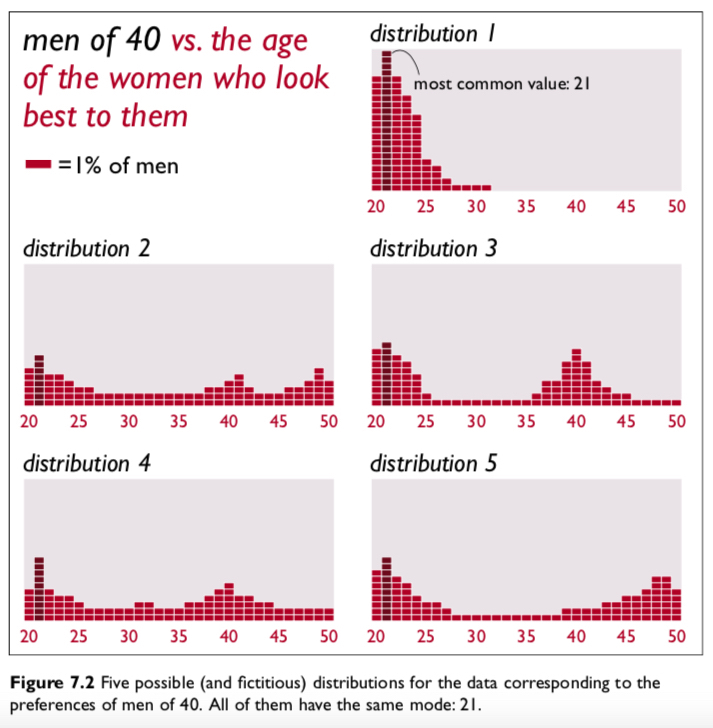
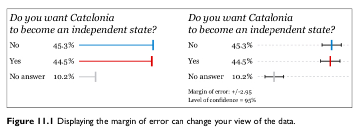
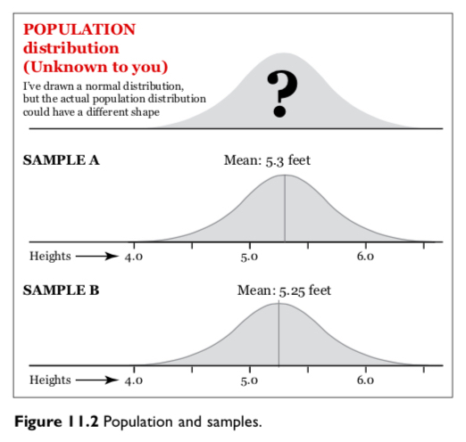
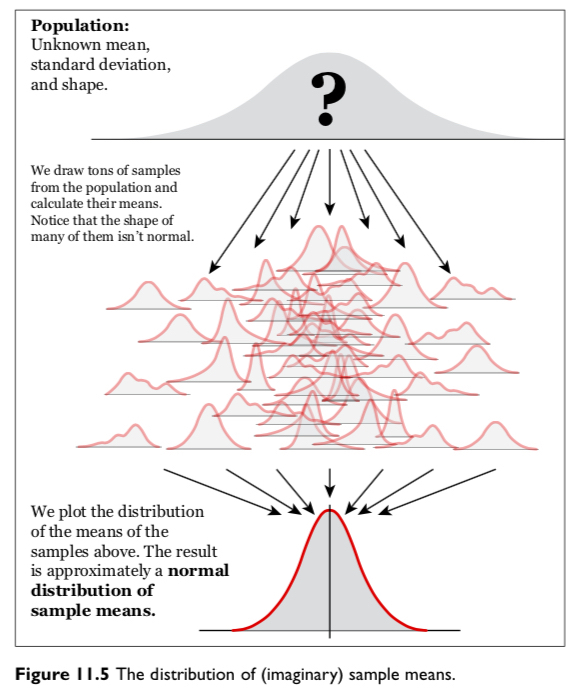

```{r setup, include=FALSE}
knitr::opts_chunk$set(fig.width=4.2, fig.height=4.2, message=FALSE, warning=FALSE) 
options(htmltools.dir.version = FALSE)
library(xaringanthemer)
library(gapminder)

mono_light(
  base_color = "#046A38",
  white_color = "#ffffff",
  text_font_size = "28px",
  header_h1_font_size = "40px",
  header_h2_font_size = "35px", 
  header_h3_font_size = "30px",
  code_font_size = "11px",
  header_font_google = google_font("Josefin Sans"),
  text_font_google   = google_font("Montserrat", "300", "300i"),
  code_font_google   = google_font("Droid Mono")
)
```

class: center, middle, inverse

# Why view Distributions? Cairo Ch. 7 & Wilke Ch. 7 - 9

```{r out.width = "600px", fig.align="center", echo=FALSE}
knitr::include_graphics("../images/slides/01-class/DataSaurusDozen.gif")
```

---

class: center, middle

.pull-left[
```{r out.width = "300px", fig.align="center", echo=FALSE}
knitr::include_graphics("../images/slides/05-class/cairo.png")
```
]
--
.pull-right[
```{r out.width = "280px", fig.align="center", echo=FALSE}
knitr::include_graphics("../images/slides/05-class/cairo2.png")
```
]

---

class: center, middle

```{r out.width = "600px", fig.align="center", echo=FALSE}

```

---

class: center, middle

```{r out.width = "700px", fig.align="center", echo=FALSE}
knitr::include_graphics("../images/slides/05-class/wilke1.png")
```

---

class: center, middle

```{r out.width = "700px", fig.align="center", echo=FALSE}
knitr::include_graphics("../images/slides/05-class/wilke2.png")
```

---

class: center, middle

```{r out.width = "700px", fig.align="center", echo=FALSE}
knitr::include_graphics("../images/slides/05-class/wilke3.png")
```

---

class: center, middle

```{r out.width = "700px", fig.align="center", echo=FALSE}
knitr::include_graphics("../images/slides/05-class/wilke4.png")
```

---

class: center, middle

```{r out.width = "700px", fig.align="center", echo=FALSE}
knitr::include_graphics("../images/slides/05-class/wilke5.png")
```

---

class: center, middle

```{r out.width = "500px", fig.align="center", echo=FALSE}
knitr::include_graphics("../images/slides/05-class/wilke6.png")
```

---

class: center, middle

```{r out.width = "500px", fig.align="center", echo=FALSE}
knitr::include_graphics("../images/slides/05-class/wilke7.png")
```

---

class: center, middle

```{r out.width = "700px", fig.align="center", echo=FALSE}
knitr::include_graphics("../images/slides/05-class/wilke8.png")
```

---

class: center, middle

.pull-left[
```{r eval=FALSE}
ggplot(df, aes(x, y)) + geom_boxplot()
```
]
.pull-right[
```{r eval=FALSE}
ggplot(df, aes(x, y)) + geom_violin()
```
]

```{r out.width = "700px", fig.align="center", echo=FALSE}
knitr::include_graphics("../images/slides/05-class/wilke9.png")
```


---

class: center, middle

```{r out.width = "700px", fig.align="center", echo=FALSE}
knitr::include_graphics("../images/slides/05-class/wilke10.png")
```

---

class: center, middle

```{r out.width = "700px", fig.align="center", echo=FALSE}
knitr::include_graphics("../images/slides/05-class/wilke11.png")
```

---

class: center, middle

```{r out.width = "700px", fig.align="center", echo=FALSE}
knitr::include_graphics("../images/slides/05-class/wilke12.png")
```

---

class: center, middle

```{r out.width = "700px", fig.align="center", echo=FALSE}
knitr::include_graphics("../images/slides/05-class/wilke13.png")
```

---

class: center, middle

```{r out.width = "700px", fig.align="center", echo=FALSE}
knitr::include_graphics("../images/slides/05-class/wilke14.png")
```

---

class: center, inverse, middle

## Uncertainty: Cairo Ch. 10 & Wilke Ch. 16

```{r out.width = "400px", fig.align="center", echo=FALSE}
knitr::include_graphics("../images/slides/05-class/xkcd.png")
```

xkcd

---

class: center, middle

```{r out.width = "700px", fig.align="center", echo=FALSE}

```

---

class: center, middle

```{r out.width = "650px", fig.align="center", echo=FALSE}

```

---

class: center, middle

```{r out.width = "600px", fig.align="center", echo=FALSE}
knitr::include_graphics("../images/slides/05-class/cairo6.png")
```

---

class: center, middle

```{r out.width = "500px", fig.align="center", echo=FALSE}

```

---

## Why is visualizing uncertainty hard?

- Efficient encodings for uncertainty can be hard to find.
<!-- try putting mean, variance, and interval estimation in one plot + doing this when useful channels are already used up -->

- Make sure people understand encodings (what does the plot mean?). 

- Perceptual models of probability (e.g., quantile dot plot, HOP).

- Decisions under uncertainty (e.g., [Gigerenzer et al](https://youtu.be/BcMuYhoL38A) or [Monty Hall problem](https://youtu.be/9vRUxbzJZ9Y)).

- Findings may not apply in all contexts.

- Plus, you still have to actually build it!

[Matthew Kay](https://mjskay.github.io/uncertainty-vis-book/ch-why-hard.html)

---

class: center, middle

```{r out.width = "700px", fig.align="center", echo=FALSE}
knitr::include_graphics("../images/slides/05-class/wilke15.png")
```

---

class: center, middle

```{r out.width = "700px", fig.align="center", echo=FALSE}
knitr::include_graphics("../images/slides/05-class/wilke16.png")
```

---

class: center, middle

```{r out.width = "700px", fig.align="center", echo=FALSE}
knitr::include_graphics("../images/slides/05-class/wilke17.png")
```

---

class: center, middle

```{r out.width = "700px", fig.align="center", echo=FALSE}
knitr::include_graphics("../images/slides/05-class/wilke18.png")
```

---

class: center, middle

```{r out.width = "600px", fig.align="center", echo=FALSE}
knitr::include_graphics("../images/slides/05-class/wilke19.png")
```

```{r out.width = "600px", fig.align="center", echo=FALSE}
knitr::include_graphics("../images/slides/05-class/wilke20.png")
```

