```{r setup, include=FALSE}
knitr::opts_chunk$set(fig.width=4.2, fig.height=4.2, message=FALSE, warning=FALSE) 
options(htmltools.dir.version = FALSE)
library(xaringanthemer)
library(widgetframe) # needed for html widgets in rmarkdown
library(tidyverse)

mono_light(
  base_color = "#046A38",
  white_color = "#ffffff",
  text_font_size = "24px",
  header_h1_font_size = "40px",
  header_h2_font_size = "35px", 
  header_h3_font_size = "30px",
  code_font_size = "11px",
  header_font_google = google_font("Josefin Sans"),
  text_font_google   = google_font("Montserrat", "300", "300i"),
  code_font_google   = google_font("Droid Mono")
)
```

class: center, middle, inverse

# Networks and Trees

```{r out.width = "400px", fig.align="center", echo=FALSE}
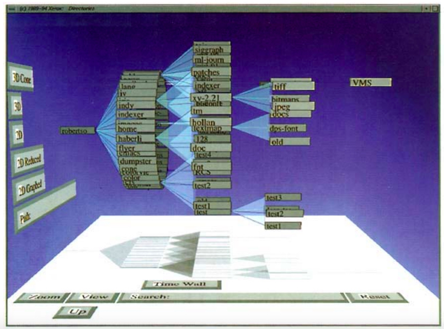
```

Read Chapter 5: Networks and Hiearchies of Mazza

---

# Networks (a.k.a. graphs)

```{r out.width = "600px", fig.align="center", echo=FALSE}
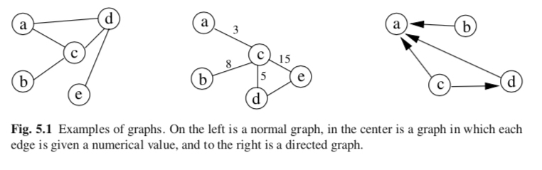
```

- Graphs are visual representations in which the points, called **nodes** or **vertices**, represent instances of the data.

- Nodes are correlated by connections, called **edges**, which represent relationships between the instances. 

- Possible features of a network: weights, direction, labels.

---

class: center, middle

.pull-left[
```{r out.width = "400px", fig.align="center", echo=FALSE}
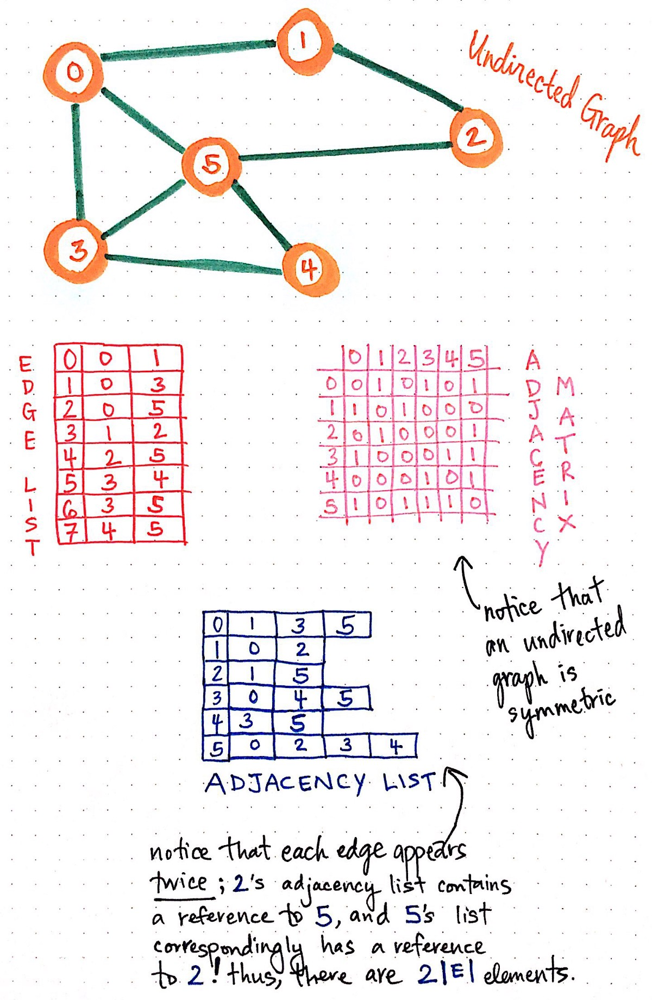
```
]
.pull-right[
```{r out.width = "400px", fig.align="center", echo=FALSE}
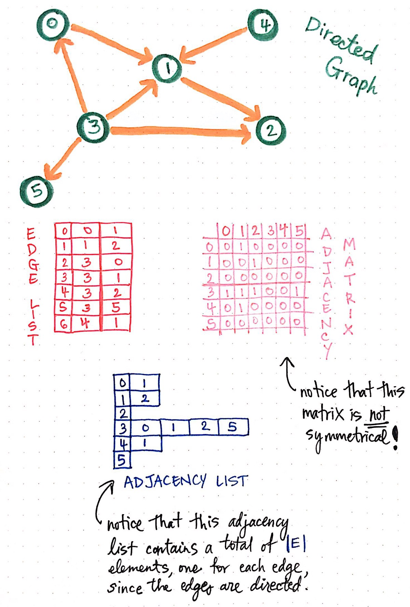
```
]

[Vaidehi Joshi Medium post](https://medium.com/basecs/from-theory-to-practice-representing-graphs-cfd782c5be38)

---

class: middle, center

```{r out.width = "600px", fig.align="center", echo=FALSE}
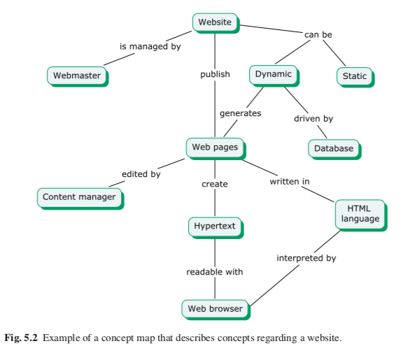
```

---

class: middle, center

```{r out.width = "600px", fig.align="center", echo=FALSE}
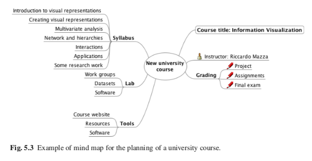
```

[BNOSAC: R NLP packages ecosystem](http://www.bnosac.be/index.php/blog/87-an-overview-of-the-nlp-ecosystem-in-r-nlproc-textasdata)

---

class: middle, center

```{r out.width = "600px", fig.align="center", echo=FALSE}
knitr::include_graphics("../images/slides/08-class/net2.png")
```

---

# Layouts

```{r out.width = "600px", fig.align="center", echo=FALSE}
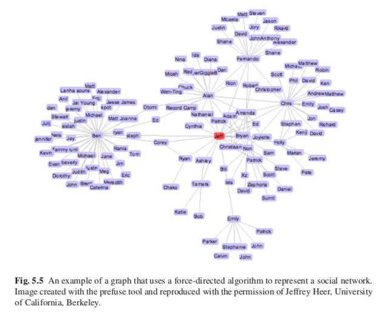
```

See [R-Graph-Gallery Network Layouts](https://www.r-graph-gallery.com/247-network-chart-layouts.html) for more.

---

# Which is the most important node?

```{r}
library(igraph)
library(netrankr)

g <- graph.empty(n = 11,directed = FALSE)
g <- add_edges(g,c(1,11,2,4,3,5,3,11,4,8,5,9,5,11,6,7,6,8,
                    6,10,6,11,7,9,7,10,7,11,8,9,8,10,9,10))
```

```{r out.width = "600px", fig.align="center", echo=FALSE}
knitr::include_graphics("../images/slides/08-class/network.png")
```

---

# Centrality Measures 

```{r out.width = "600px", fig.align="center", echo=FALSE}
knitr::include_graphics("../images/slides/08-class/network.png")
```

.pull-left[
```{r eval=F}
# from igraph
cent_scores <- tibble(
   node = 1:11,
   degree = degree(g),
   betweenness = round(betweenness(g),4),
   closeness = round(closeness(g),4),
   eigenvector = round(eigen_centrality(g)$vector,4),
   subgraph = round(subgraph_centrality(g),4))

cent_scores %>%
  arrange(desc(betweenness))
```
]
.pull-right[
```{r echo=F}
# from igraph
cent_scores <- tibble(
   node = 1:11,
   degree = degree(g),
   betweenness = round(betweenness(g),4),
   closeness = round(closeness(g),4),
   eigenvector = round(eigen_centrality(g)$vector,4),
   subgraph = round(subgraph_centrality(g),4))

cent_scores %>%
  arrange(desc(betweenness))
```

]
---

# Centrality Measures using [DT DataTable](https://rstudio.github.io/DT/)

```{r out.width = "400px", fig.align="center", echo=FALSE}
knitr::include_graphics("../images/slides/08-class/network.png")
```

```{r echo=FALSE}
DT::datatable(cent_scores,
              extensions = 'FixedColumns',
              rownames= FALSE,
              options = list(
                pageLength = 11,
                dom = 't',
                scrollX = TRUE,
                scrollCollapse = TRUE,
                initComplete = JS("
                        function(settings, json) {
                          $(this.api().table().header()).css({
                          'font-size': '12px',
                          });
                        }
                    ")
)) %>%
  DT::formatStyle(columns = colnames(.$x$data), `font-size` = "12px")
```


---

class: middle, center

```{r out.width = "600px", fig.align="center", echo=FALSE}
knitr::include_graphics("../images/slides/08-class/net4.png")
```

---

```{r out.width = "650px", fig.align="center", echo=FALSE}
knitr::include_graphics("../images/slides/08-class/tree1.png")
```

- A **tree** (hierarchy) can be represented through a graph with a starting node called root. 

- Each node has zero or more child nodes its ancestor is called the **parent** node. A node has at most one parent.

---

class: middle, center

```{r out.width = "650px", fig.align="center", echo=FALSE}
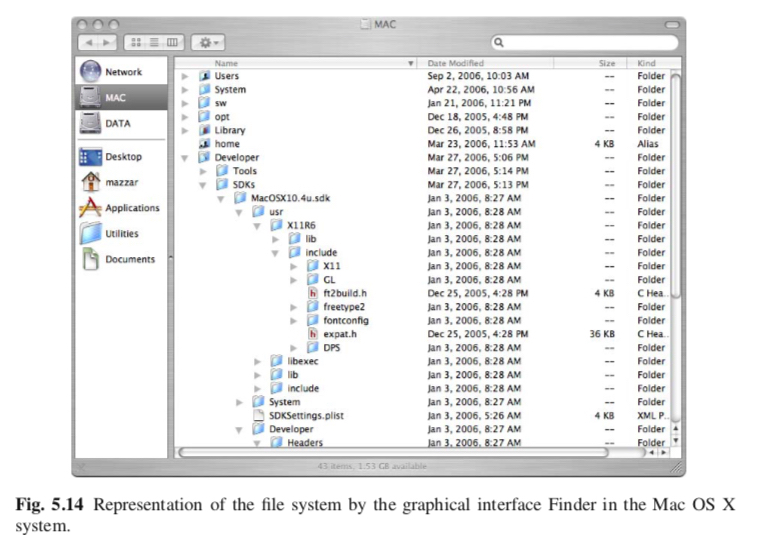
```

---

class: middle, center

```{r out.width = "550px", fig.align="center", echo=FALSE}
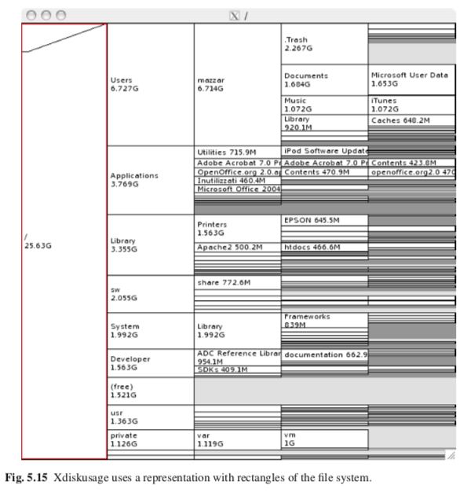
```

---

# json files: Tweet Example

<blockquote class="twitter-tweet"><p lang="en" dir="ltr">1/ Today we’re sharing our vision for the future of the Twitter API platform!<a href="https://t.co/XweGngmxlP">https://t.co/XweGngmxlP</a></p>&mdash; Twitter Dev (@TwitterDev) <a href="https://twitter.com/TwitterDev/status/850006245121695744?ref_src=twsrc%5Etfw">April 6, 2017</a></blockquote> <script async src="https://platform.twitter.com/widgets.js" charset="utf-8"></script>

---

# json files: Tweet Example

```{r out.width = "700px", fig.align="center", echo=FALSE}
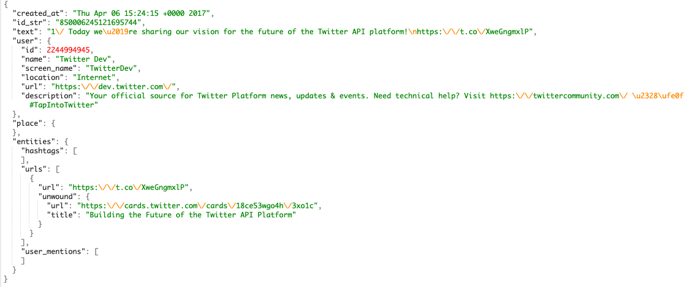
```

- See [Twitter Developer JSON intro](https://developer.twitter.com/en/docs/tweets/data-dictionary/overview/intro-to-tweet-json) for more details. 

- See ['jsonlite' package](https://cran.r-project.org/web/packages/jsonlite/vignettes/json-aaquickstart.html) for handling json files in R.

---

# listviewer: viewing json in R

.pull-left[
```{r eval=F}
library(listviewer)

jsonedit(
  list(
    array = c(1,2,3)
    ,boolean = TRUE
    ,null = NULL
    ,number = 123
    ,object = list( a="b", c="d" )
    ,string = "Hello World. "
  )
)
```
]
.pull-right[
```{r echo=F}
library(listviewer)

jsonedit(
  list(
    array = c(1,2,3)
    ,boolean = TRUE
    ,null = NULL
    ,number = 123
    ,object = list( a="b", c="d" )
    ,string = "Hello World. "
  )
)
```
]


---

class: middle, center

```{r out.width = "650px", fig.align="center", echo=FALSE}
knitr::include_graphics("../images/slides/08-class/tree4.png")
```

---

class: middle, center

```{r out.width = "600px", fig.align="center", echo=FALSE}
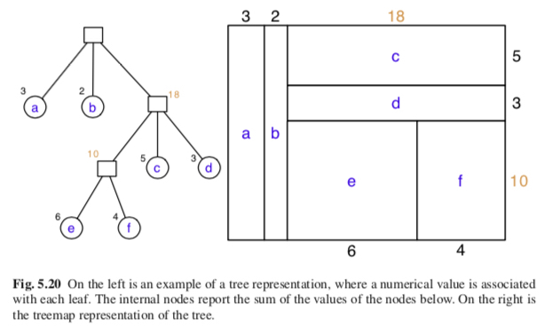
```

---

class: center, middle, inverse

## Katya Ognyanova's "Network visualization with R."

```{r out.width = "600px", fig.align="center", echo=FALSE}
knitr::include_graphics("../images/slides/08-class/katato.png")
```

http://kateto.net/network-visualization

---

class: center, middle

```{r out.width = "800px", fig.align="center", echo=FALSE}
knitr::include_graphics("../images/slides/08-class/kateto1.png")
```

---

class: center, middle

```{r out.width = "800px", fig.align="center", echo=FALSE}
knitr::include_graphics("../images/slides/08-class/katato2.png")
```

---

class: center, middle

```{r out.width = "800px", fig.align="center", echo=FALSE}
knitr::include_graphics("../images/slides/08-class/katato3.png")
```
