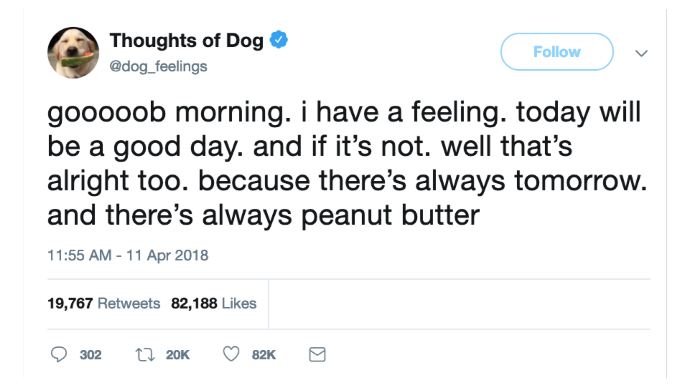
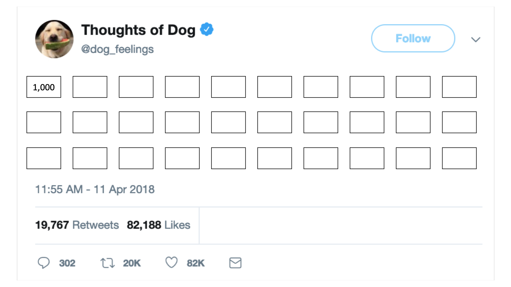
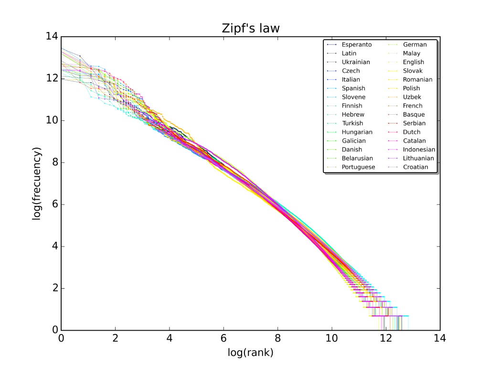
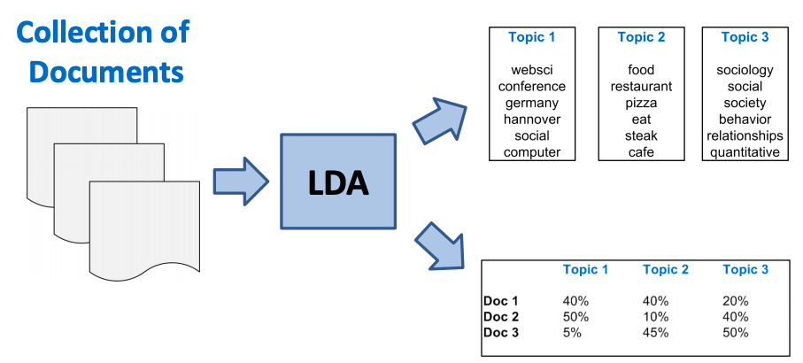
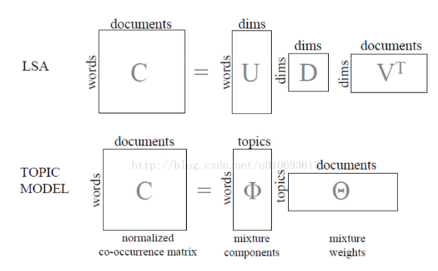

```{r setup, include=FALSE}
knitr::opts_chunk$set(fig.width=4.2, fig.height=4.2, message=FALSE, warning=FALSE) 
options(htmltools.dir.version = FALSE)
library(xaringanthemer)
library(widgetframe) # needed for html widgets in rmarkdown
library(tidyverse)

# helper functions (from David Robinson's R Package)
scale_x_reordered <- function(..., sep = "___") {
  reg <- paste0(sep, ".+$")
  ggplot2::scale_x_discrete(labels = function(x) gsub(reg, "", x), ...)
}

reorder_within <- function(x, by, within, fun = mean, sep = "___", ...) {
  new_x <- paste(x, within, sep = sep)
  stats::reorder(new_x, by, FUN = fun)
}

mono_light(
  base_color = "#046A38",
  white_color = "#ffffff",
  text_font_size = "24px",
  header_h1_font_size = "40px",
  header_h2_font_size = "35px", 
  header_h3_font_size = "30px",
  code_font_size = "11px",
  header_font_google = google_font("Josefin Sans"),
  text_font_google   = google_font("Montserrat", "300", "300i"),
  code_font_google   = google_font("Droid Mono")
)
```

class: center, middle, inverse

# Introduction to Text-as-Data

```{r out.width = "600px", fig.align="center", echo=FALSE}
knitr::include_graphics("../images/slides/08-class/internetlivestats.gif")
```

<http://www.internetlivestats.com/>

---

## High dimensionality of text

```{r out.width = "600px", fig.align="center", echo=FALSE}

```

---

## High dimensionality of text

```{r out.width = "600px", fig.align="center", echo=FALSE}
knitr::include_graphics("../images/slides/08-class/tweet2.png")
```

---

## High dimensionality of text

```{r out.width = "600px", fig.align="center", echo=FALSE}

```

---

## High dimensionality of text

```{r out.width = "600px", fig.align="center", echo=FALSE}
knitr::include_graphics("../images/slides/08-class/tweet4.png")
```

$# of Combinations = 1000 ^ 30 =~ # of Atoms in the Universe$

"A sample of 30-word Twitter messages that use only the 1,000 most common words in the English language ... has roughly as many dimensions as there are **atoms in the universe**."  ["Text as Data", 2017](https://web.stanford.edu/~gentzkow/research/text-as-data.pdf)

---

class: center, middle, inverse

# Weird world of Text: 

```{r out.width = "600px", fig.align="center", echo=FALSE}
knitr::include_graphics("../images/slides/08-class/emojitracker.gif")
```

# Key Properties about Text

http://emojitracker.com/

---

## Zipf's Law

```{r out.width = "600px", fig.align="center", echo=FALSE}

```

[VSauce video on Zipf's Law](https://www.youtube.com/watch?v=fCn8zs912OE)

---

## Bag of Words

```{r out.width = "600px", fig.align="center", echo=FALSE}
knitr::include_graphics("../images/slides/08-class/bow.png")
```

---

## Document Term Matrix

```{r out.width = "600px", fig.align="center", echo=FALSE}
knitr::include_graphics("../images/slides/08-class/dtm.png")
```

---

### Corpus

```{r}
library(quanteda)
tweets <- read_csv("../data/CharlotteTweets20Sample.csv")

# create corpus
twcorpus <- corpus(tweets$body)

summary(twcorpus, n = 10)
```

---

## Document-Feature Matrix

```{r}
# additional stop words to remove, unique to Twitter
stopWords <- c("t.co","https","rt","amp","http","gt","f","u","w")
# add profile ID
docvars(twcorpus, "actor.id") <- as.character(tweets$actor.id) 

twdfm <- dfm(twcorpus,
             remove = c(stopwords("english"), stopWords), 
             remove_punct = TRUE, 
             remove_numbers = TRUE, 
             remove_symbols = TRUE,
             remove_url = TRUE,
             ngrams= 1L)
# remove sparse terms
twdfm <- dfm_trim(twdfm, min_docfreq = 3)

head(twdfm)
```


---

## Word Clouds

.pull-left[
##  Raw Weighting

```{r}
library(RColorBrewer)

textplot_wordcloud(twdfm, 
                   min_size = .75,
                   max_size = 3.5,
                   color = brewer.pal(8, "Dark2"), 
                   random_order = F, 
                   rotation = 0.1, 
                   max_words = 250)
```

]
.pull-right[
## TF-IDF Weighting

```{r}
textplot_wordcloud(dfm_tfidf(twdfm), 
                   min_size = .75,
                   max_size = 3.5,
                   color = brewer.pal(8, "Dark2"), 
                   random_order = F, 
                   rotation = 0.1, 
                   max_words = 250)
```
]

<https://quanteda.io/articles/pkgdown/examples/plotting.html>

---

## Clustering

.pull-left[
```{r eval=F}
numWords <- 50

wordDfm <- twdfm %>% 
  dfm_tfidf() %>% 
  dfm_sort()

wordDfm <- t(wordDfm)[1:numWords,]  # keep the top numWords words
wordDistMat <- dist(wordDfm)
wordCluster <- hclust(wordDistMat)
# create dendrogram
ggdendro::ggdendrogram(wordCluster, rotate = TRUE)
```

]
.pull-right[
```{r fig.height=7, echo=F}
numWords <- 50

wordDfm <- twdfm %>% 
  dfm_tfidf() %>% 
  dfm_sort()

wordDfm <- t(wordDfm)[1:numWords,]  # keep the top numWords words
wordDistMat <- dist(wordDfm)
wordCluster <- hclust(wordDistMat)
# create dendrogram
ggdendro::ggdendrogram(wordCluster, 
                       rotate = TRUE)
```

]

---

.pull-left[
```{r}
tag_dfm <- dfm_select(twdfm, pattern = ("#*"))
toptag <- names(topfeatures(tag_dfm, 50))
head(toptag)
```

```{r}
tag_fcm <- fcm(tag_dfm)
head(tag_fcm)
```


]
.pull-right[
```{r}
topgat_fcm <- fcm_select(tag_fcm, 
                         pattern = toptag)

textplot_network(topgat_fcm, 
                 edge_alpha = 0.3, 
                 edge_size = 2)
```

]

---

class: center, middle, inverse

# Topic Modeling

```{r out.width = "600px", fig.align="center", echo=FALSE}

```

# Latent Dirichlet Allocation

---

## Dimensionality Reduction on DTM

```{r out.width = "600px", fig.align="center", echo=FALSE}

```


---

## Interpreting Topics

```{r}
# install.packages("topicmodels")
library(topicmodels)

# we now export to a format that we can run the topic model with
dtm <- convert(twdfm, to="topicmodels")

# estimate LDA with K topics
K <- 20
lda <- LDA(dtm, k = K, method = "Gibbs", 
                control = list(verbose=25L, seed = 123, burnin = 100, iter = 500))
```

---

## Interpreting Topics

.pull-left[
```{r}
# see Ch 6 of tidytext mining
library(tidytext)
beta <- tidy(lda, matrix = "beta") %>%
  arrange(desc(topic), desc(beta))

head(beta, n = 10)
```
]
.pull-right[
```{r}
top_terms <- beta %>%
  group_by(topic) %>%
  top_n(8, beta) %>%
  ungroup() %>%
  arrange(topic, -beta)

top_terms
```
]

---

```{r}
library(ggthemes)

scale_x_reordered <- function(..., sep = "___") {
  reg <- paste0(sep, ".+$")
  ggplot2::scale_x_discrete(labels = function(x) gsub(reg, "", x), ...)
}

reorder_within <- function(x, by, within, fun = mean, sep = "___", ...) {
  new_x <- paste(x, within, sep = sep)
  stats::reorder(new_x, by, FUN = fun)
}

top_terms %>%
  filter(topic %in% 1:9) %>%
  mutate(term = reorder_within(term, beta, topic),
         topic = factor(topic)) %>%
  ggplot(aes(term, beta, fill = topic)) +
  geom_col(alpha = 0.8, show.legend = FALSE) +
  facet_wrap(~ topic, ncol = 3, scales = "free_y") +
  theme_tufte(base_family = "IBMPlexSans", ticks = FALSE) +
  scale_x_reordered() +
  theme_bw() +
  coord_flip() +
  labs(x = "", y = "")
```


---

## Retrieving Documents by Topic

.pull-left[
```{r}
td_gamma <- tidy(lda, matrix = "gamma") 

head(td_gamma)
```
]
.pull-right[
```{r}
td_gamma %>%
  filter(topic == 2) %>%
  arrange(desc(gamma)) %>%
  head(n=6)
```
]
---

## Summarizing Topic Models

```{r out.width = "600px", fig.align="center", echo=FALSE}
knitr::include_graphics("../images/slides/08-class/topic-overview.png")
```

For code, see <https://github.com/wesslen/nlp-ryan/blob/master/complaints.R>

---

## Visualizing Topic Models

```{r out.width = "800px", fig.align="center", echo=FALSE}
knitr::include_graphics("../images/slides/08-class/topic-variations.png")
```

---

## Evaluating Topic Models

```{r out.width = "700px", fig.align="center", echo=FALSE}
knitr::include_graphics("../images/slides/08-class/silge.png")
```

<https://juliasilge.com/blog/evaluating-stm/>

---

## Text Workflows

```{r out.width = "600px", fig.align="center", echo=FALSE}
knitr::include_graphics("../images/slides/08-class/tidyflow-ch-6.png")
```

---

## Word Embedding Models

```{r out.width = "800px", fig.align="center", echo=FALSE}
knitr::include_graphics("../images/slides/08-class/embedding.png")
```

<https://projector.tensorflow.org/>
