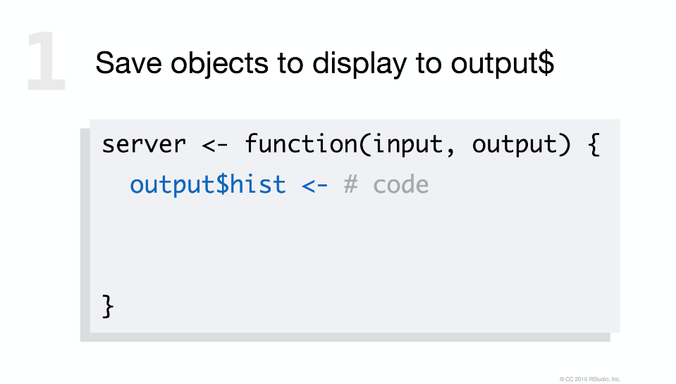
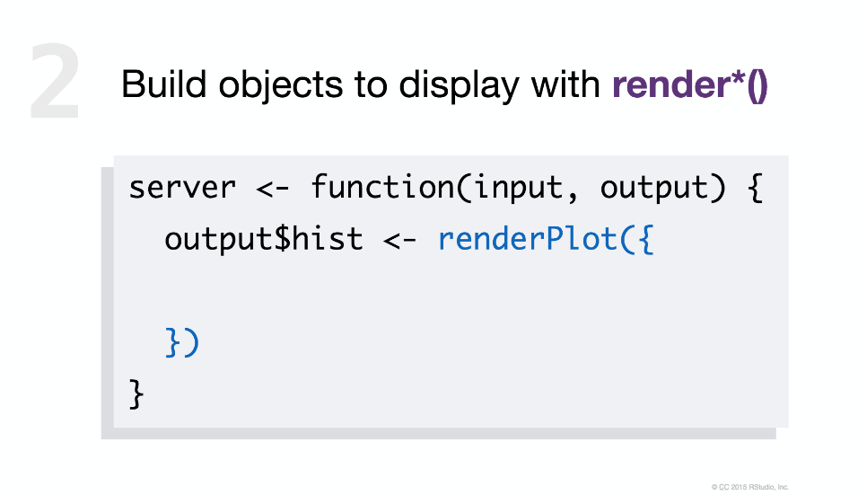
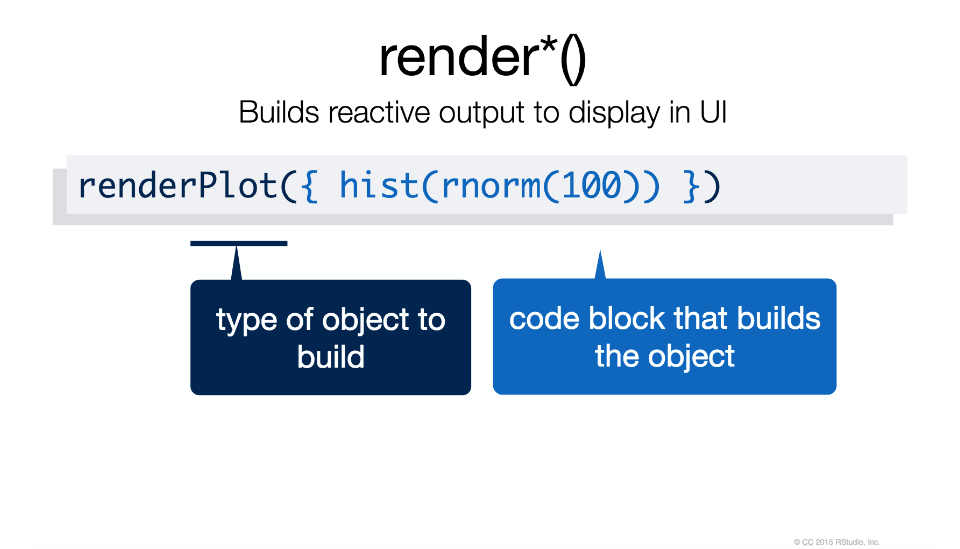
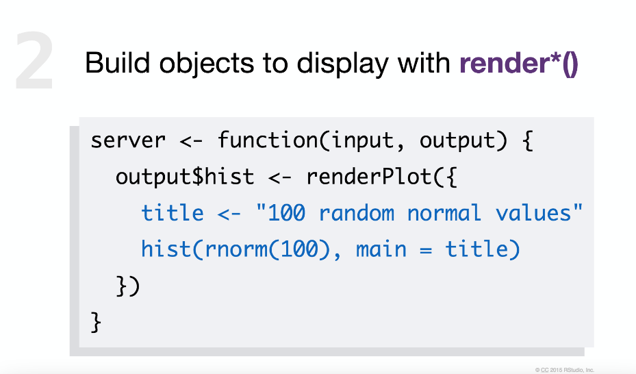
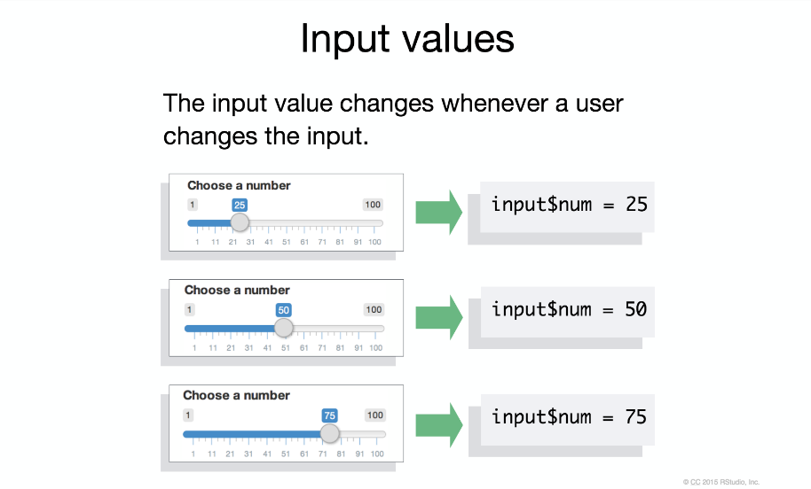
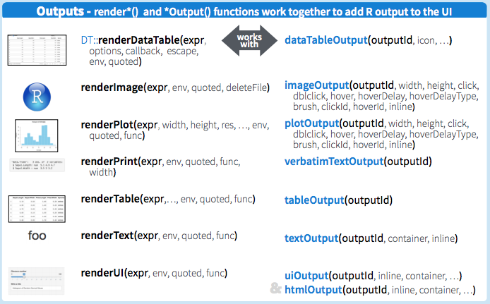
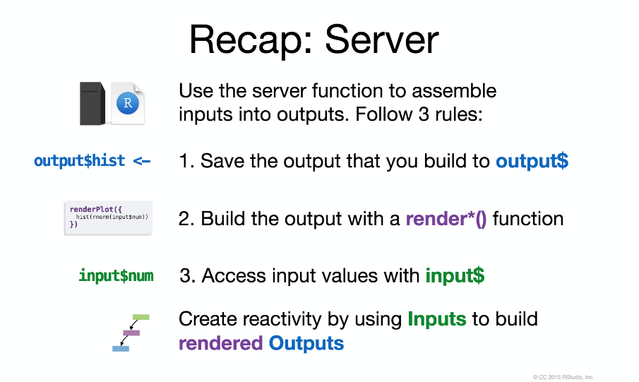
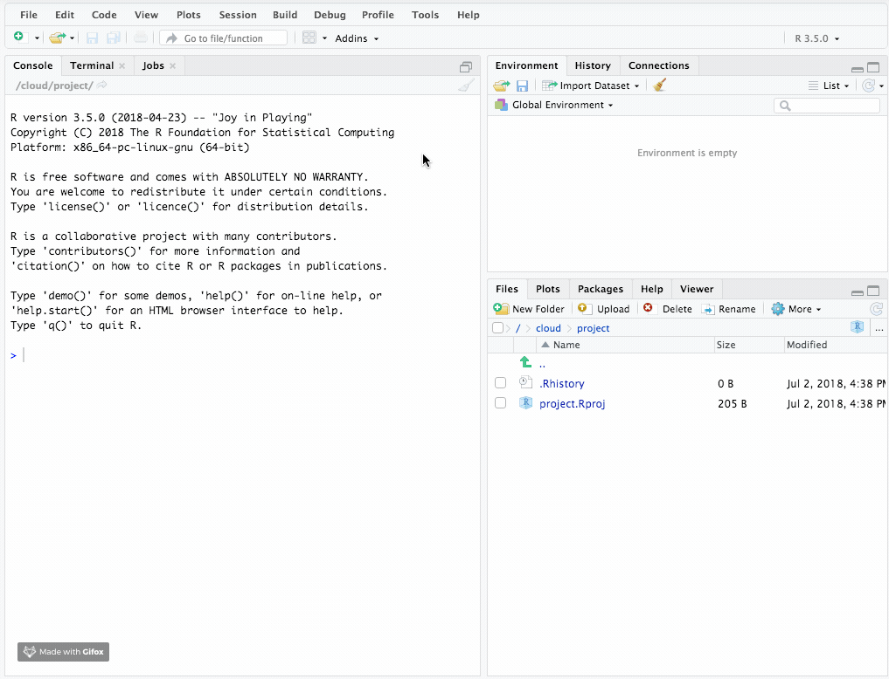
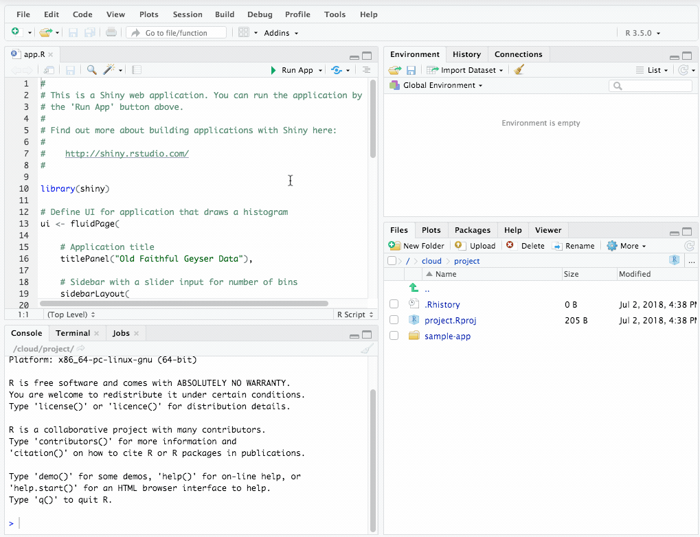
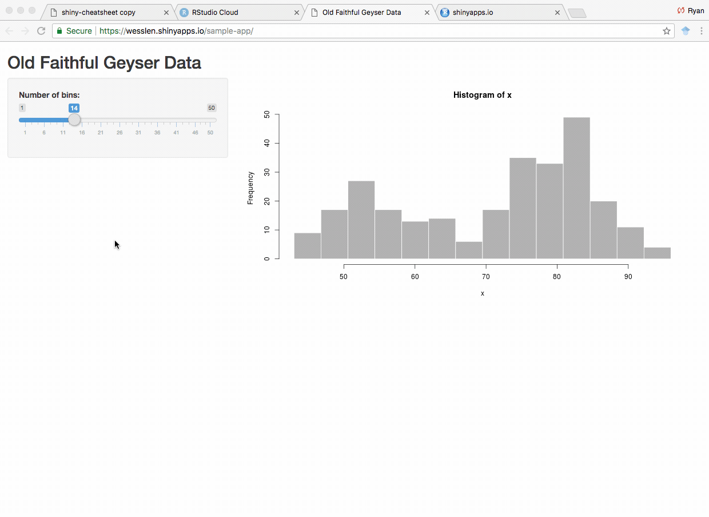

```{r setup, include=FALSE}
knitr::opts_chunk$set(fig.width=4.2, fig.height=4.2, message=FALSE, warning=FALSE) 
options(htmltools.dir.version = FALSE)
library(xaringanthemer)
library(widgetframe) # needed for html widgets in rmarkdown
library(tidyverse)

mono_light(
  base_color = "#046A38",
  white_color = "#ffffff",
  text_font_size = "28px",
  header_h1_font_size = "40px",
  header_h2_font_size = "35px", 
  header_h3_font_size = "30px",
  code_font_size = "11px",
  header_font_google = google_font("Josefin Sans"),
  text_font_google   = google_font("Montserrat", "300", "300i"),
  code_font_google   = google_font("Droid Mono")
)
```

## Shiny

A **Shiny** app is a web page (UI) connected to a computer running a live R session (Server)

```{r echo=F, out.width = "800px"}
knitr::include_graphics("../images/slides/08-class/shiny-01.png")
```

Users can manipulate the UI, which will cause the server to update the UI's displays (by running R code).

---

```{r echo=F, out.width = "800px"}
knitr::include_graphics("../images/slides/08-class/shiny-02.png")
```

---

```{r echo=F, out.width = "800px"}
knitr::include_graphics("../images/slides/08-class/shiny-03.png")
```

---

```{r echo=F, out.width = "800px"}
knitr::include_graphics("../images/slides/08-class/shiny-template.png")
```

---

## Try This

1. Open a new .R file

2. Type this into the file. (Do you have the shiny package?)

    ```{r echo=F, out.width = "600px"}
    knitr::include_graphics("../images/slides/08-class/shiny-template2.png")
    ```

3. Click "Run"

---

class: center, middle, inverse

# User Interface: ui() function

---

## `fluidPage()`

```{r echo=F, out.width = "800px"}
knitr::include_graphics("../images/slides/08-class/shiny-04.png")
```

---

## Example

```{r echo=F, out.width = "800px"}
knitr::include_graphics("../images/slides/08-class/shiny-input-ex1.png")
```

---

## Example

```{r echo=F, out.width = "800px"}
knitr::include_graphics("../images/slides/08-class/shiny-input-ex2.png")
```

---

## Input Syntax

```{r echo=F, out.width = "800px"}
knitr::include_graphics("../images/slides/08-class/shiny-inputs-syntax.png")
```

---

## Inputs

```{r echo=F, out.width = "800px"}
knitr::include_graphics("../images/slides/08-class/shiny-inputs.png")
```

There are multiple common `Input()` functions.

---

## What's in an Input function? HTML

```{r echo=F, out.width = "800px"}
knitr::include_graphics("../images/slides/08-class/shiny-input-ex3.png")
```

---

## Output Syntax

```{r echo=F, out.width = "800px"}
knitr::include_graphics("../images/slides/08-class/shiny-outputs-syntax.png")
```

---

## Output Options

```{r echo=F, out.width = "800px"}
knitr::include_graphics("../images/slides/08-class/shiny-outputs.png")
```

---

## Example

```{r echo=F, out.width = "800px"}
knitr::include_graphics("../images/slides/08-class/shiny-outputs-ex3.png")
```

---

## Example

```{r echo=F, out.width = "800px"}
knitr::include_graphics("../images/slides/08-class/shiny-outputs-ex1.png")
```

---

## Example

```{r echo=F, out.width = "800px"}
knitr::include_graphics("../images/slides/08-class/shiny-outputs-ex2.png")
```

---

## Example

```{r echo=F, out.width = "800px"}
knitr::include_graphics("../images/slides/08-class/shiny-outputs-ex4.png")
```

---

## Layouts

```{r echo=F, out.width = "800px"}
knitr::include_graphics("../images/slides/08-class/shiny-layouts.png")
```

---

## `sidebarLayout()`

```{r echo=F, out.width = "800px"}
knitr::include_graphics("../images/slides/08-class/shiny-layout1.png")
```

---

## `sidebarLayout()`

```{r echo=F, out.width = "800px"}
knitr::include_graphics("../images/slides/08-class/shiny-layout2.png")
```

---

## `sidebarLayout()`

```{r echo=F, out.width = "800px"}
knitr::include_graphics("../images/slides/08-class/shiny-layout3.png")
```

---

## html tags if you know HTML

```{r echo=F, out.width = "800px"}
knitr::include_graphics("../images/slides/08-class/shiny-tags.png")
```

---

# Server: `server()` function

```{r echo=F, out.width = "800px"}
knitr::include_graphics("../images/slides/08-class/shiny-server1.png")
```

---

```{r echo=F, out.width = "800px"}

```

---

```{r echo=F, out.width = "800px"}
knitr::include_graphics("../images/slides/08-class/shiny-server2a.png")
```

---

```{r echo=F, out.width = "800px"}

```

---

```{r echo=F, out.width = "800px"}
knitr::include_graphics("../images/slides/08-class/shiny-server2c.png")
```

---

```{r echo=F, out.width = "800px"}

```

---

```{r echo=F, out.width = "800px"}
knitr::include_graphics("../images/slides/08-class/shiny-server3.png")
```

---

```{r echo=F, out.width = "800px"}

```

---

```{r echo=F, out.width = "800px"}
knitr::include_graphics("../images/slides/08-class/shiny-server5.png")
```

---

```{r echo=F, out.width = "800px"}

```

---

```{r echo=F, out.width = "800px"}
knitr::include_graphics("../images/slides/08-class/shiny-server-reactivity.png")
```

---

## Shiny: Output

```{r echo=F, out.width = "800px"}

```

---

## Server Recap

```{r echo=F, out.width = "800px"}

```

---

## 15 minute Quick Assignment

Open the `app.R` file.

Try these three tasks:

1. add a new slider that sets the number of breaks for the `rnorm()` function

2. add a `textInput()` that sets the name of the plot

3. add a `actionButton()` that updates the name of the plot (part 2) only when clicking (hint: see ?observeEvent)

---

# Deploying Apps to Shinyapps.io

```{r echo=F, out.width = "800px"}
knitr::include_graphics("../images/slides/08-class/shiny-shinyapps.png")
```

---

## Setup connection to ShinyApps.io

```{r echo=F, out.width = "700px"}

```

---

## Setup connection to ShinyApps.io

```{r echo=F, out.width = "700px"}
knitr::include_graphics("../images/slides/08-class/deploy2.gif")
```

---

## Deploy to ShinyApps.io

```{r echo=F, out.width = "700px"}

```

---

## Deploy to ShinyApps.io

```{r echo=F, out.width = "700px"}

```
