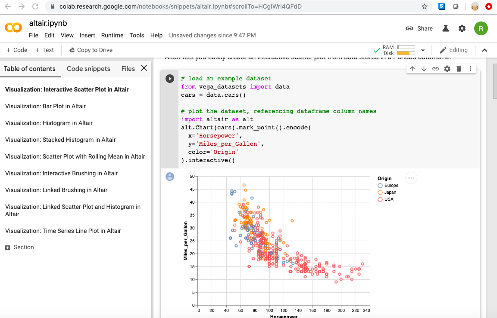
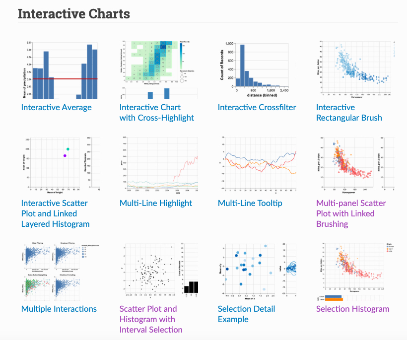

```{r setup, include=FALSE}
knitr::opts_chunk$set(message=FALSE, warning=FALSE)

options(htmltools.dir.version = FALSE)
#devtools::install_github("ropenscilabs/icon")
library(xaringanthemer); library(tidyverse)
mono_light(
  base_color = "#046A38",
  white_color = "#ffffff",
  text_font_size = "24px",
  header_h1_font_size = "40px",
  header_h2_font_size = "35px", 
  header_h3_font_size = "30px",
  code_font_size = "14px",
  header_font_google = google_font("Josefin Sans"),
  text_font_google   = google_font("Montserrat", "300", "300i"),
  code_font_google   = google_font("Droid Mono")
)

extra_css <- list(
  ".red"   = list(color = "red"),
  ".small" = list("font-size" = "90%"),
  ".large" = list("font-size" = "150%"),
  ".xlarge" = list(
    "font-size" = "250%",
    "vertical-align" = "middle" ),
  ".full-width" = list(
    display = "flex",
    width   = "100%",
    flex    = "1 1 auto"
  )
)
```

## Python+R (reticulate)

[Reticulate](https://rstudio.github.io/reticulate/) is an R package for connecting to an existing python distribution (e.g., Anaconda, virtual environment).

```{r echo=F, out.width = "700px"}
knitr::include_graphics("../images/slides/14-class/r_from_python.png")
```

---

## Python Configurations

```{r echo=F, out.width = "500px"}
knitr::include_graphics("../images/slides/14-class/python_environment.png")
```

xkcd

---

## 1. Run [RStudio's ML Docker Image](https://hub.docker.com/r/rocker/ml) in one of these ways:

1. Easiest option (free, no local install): [play-with-docker](https://labs.play-with-docker.com/) 

2. Will take time to install (free): [local Docker](https://docs.docker.com/install/)

3. Will cost money: [Digital Ocean Droplet](https://marketplace.digitalocean.com/apps/rstudio)

This docker image also includes Machine Learning packages (for CPU) like h2o, tensorflow, and [keras](https://keras.rstudio.com/). It can expand to GPU environments too!

---

## Play-with-docker.com

```{bash eval=FALSE}
# run in bash command/terminal
docker run -e PASSWORD=[create_a_pwd] -p 8787:8787 rocker/ml
```


---

## 3. Open RStudio via port 8787 

You can do this by clicking the "Open Port" button and then typing in 8787.

FYI: username: rstudio, pwd: whatever you chose

---

## 4. [Importing python packages](https://rstudio.github.io/reticulate/index.html#importing-python-modules)

```{r eval=FALSE}
# run in RStudio console/file
# fyi reticulate is prepackaged
library(reticulate)
os <- import("os")
os$listdir(".")
```

---

## 5. [Installing python packages](https://rstudio.github.io/reticulate/articles/python_packages.html)

- Run this in RStudio *terminal*:

```{bash eval=FALSE}
#run in rstudio terminal
easy_install pip
easy_install virtualenv
```

- Restart RStudio session (Session > Restart R)

- Run this in RStudio *console*:

```{r eval=FALSE}
#run in rstudio console
reticulate::py_install("pandas")
```

- Run this to install a demo MNIST model:

```{r eval=FALSE}
#run in rstudio console
download.file("https://gist.github.com/wesslen/aec5666a3a29238dd651eccf1425ae20",
              destfile = "mnist-keras.R")
```

---

## Colab Notebooks

<https://colab.research.google.com/>

```{r echo=F, out.width = "700px"}

```

Think of it as RStudio.Cloud for Python. Even has GPU's!

---

## Altair: An Interactive Grammar of Graphics

Altair is a python package for Vega/Vega-Lite, which are an interactive grammar of graphics. What is that?

Jake VanderPlas' [Altair Tutorial at PyCon 2018](https://speakerdeck.com/jakevdp/altair-tutorial-intro-pycon-2018)

---

<https://altair-viz.github.io/gallery/index.html>

```{r echo=F, out.width = "500px", fig.cap="Altair Gallery"}

```

---

## How to run Altair via a Colab Notebook

```{r echo=F, out.width = "700px"}
knitr::include_graphics("../images/slides/14-class/altair.png")
```

---

## Run Multiple Tutorials

- Go to "GitHub" tab. In the URL, paste "https://github.com/altair-viz/altair-tutorial.git" then press Return (or Enter)

- Change Repository to "altair-viz/altair_tutorials"

- Open Notebooks

Can change to other Repositories like "altair-viz/altair_notebooks"

---

## Links

1. [Docker training](https://training.play-with-docker.com/) / [R Docker Training](https://ropenscilabs.github.io/r-docker-tutorial/)

2. Altair tutorial [jupyter notebooks](https://github.com/altair-viz/altair-tutorial/blob/master/notebooks/Index.ipynb) and [video](https://www.youtube.com/watch?v=ms29ZPUKxbU)

3. Yihui's thoughts on [R-Python notebooks](https://yihui.name/en/2018/09/notebook-war/#how-about-r-markdown-notebooks)

4. [Python `reticulate` configuration](https://rstudio.github.io/reticulate/articles/versions.html)

5. [RStudio `reticulate` cheatsheet](https://github.com/rstudio/cheatsheets/raw/master/reticulate.pdf)
