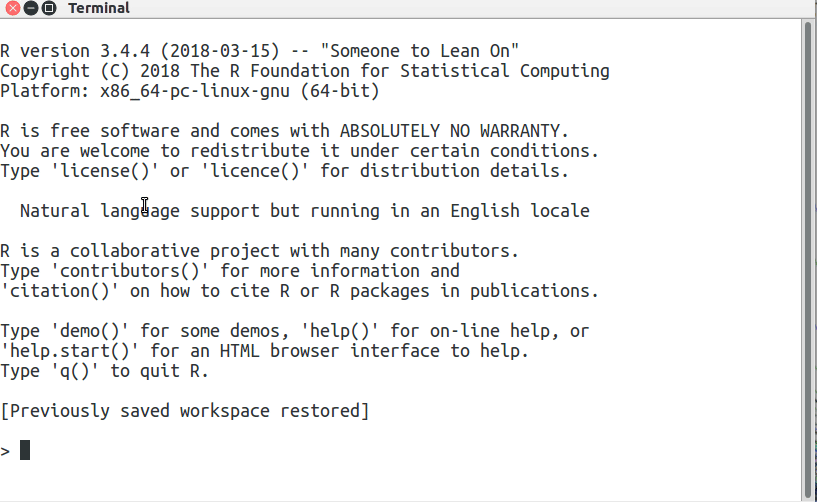
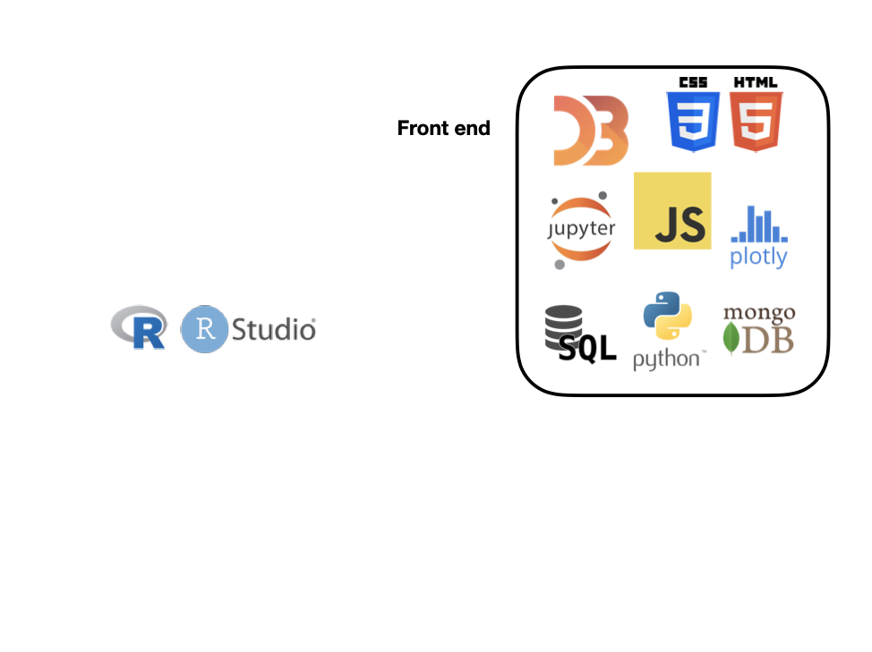
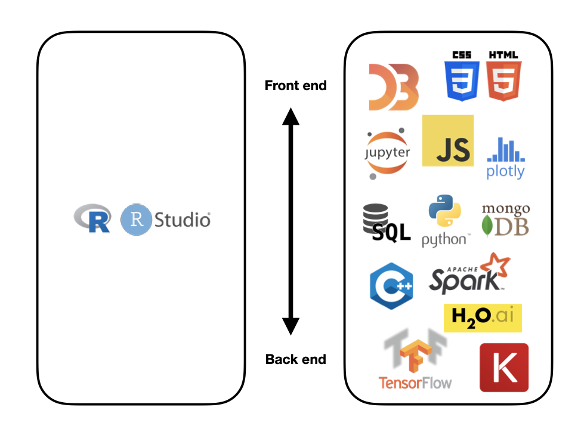
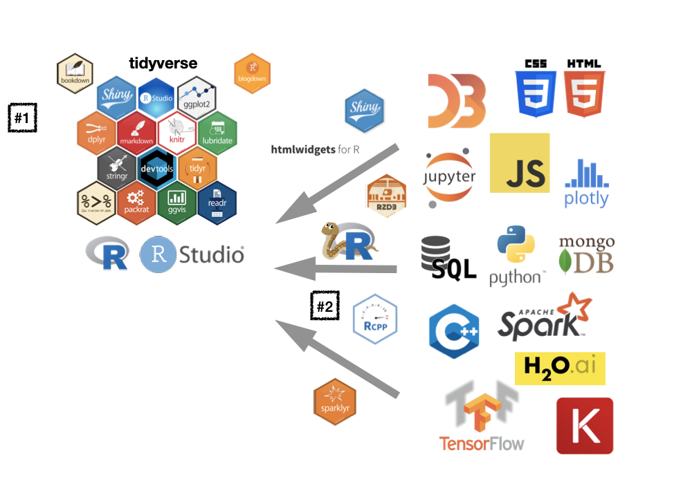
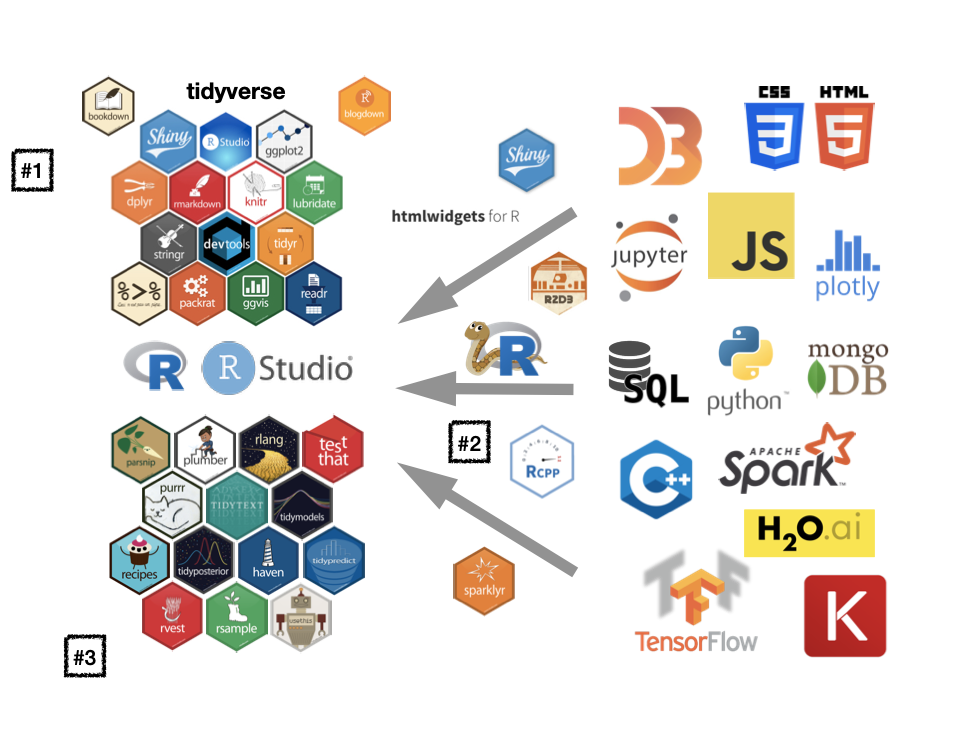

```{r setup, include=FALSE}
options(htmltools.dir.version = FALSE)
library(xaringanthemer)
mono_accent(base_color = "#046A38")
```

# What is R?



---

# What is RStudio?


---

# 1. Why R / RStudio?

It's free, as in ... free beer?

<div style="width:80%;height:0;padding-bottom:77%;position:relative;"><iframe src="https://giphy.com/embed/3o6MbkGRfcasxz9rnW" width="80%" height="80%" style="position:absolute" frameBorder="0" class="giphy-embed" allowFullScreen></iframe></div><p><a href="https://giphy.com/gifs/season-11-the-simpsons-11x5-3o6MbkGRfcasxz9rnW">via GIPHY</a></p>

---


# 2. Why R / RStudio?

<blockquote class="twitter-tweet" data-lang="en"><p lang="en" dir="ltr">well this R=Batman, Python=Superman apparently showed up in a vendor pitch to one of my colleagues. That must make it official. <a href="https://twitter.com/hashtag/rstats?src=hash&amp;ref_src=twsrc%5Etfw">#rstats</a> <a href="https://twitter.com/hashtag/python?src=hash&amp;ref_src=twsrc%5Etfw">#python</a> <a href="https://t.co/pkKGB8EOHj">pic.twitter.com/pkKGB8EOHj</a></p>&mdash; JD Long (@CMastication) <a href="https://twitter.com/CMastication/status/1037486624500854784?ref_src=twsrc%5Etfw">September 5, 2018</a></blockquote>
<script async src="https://platform.twitter.com/widgets.js" charset="utf-8"></script>

---


---



---


---



---


---



---



---

# 3. Why R / RStudio?

The community (and kind resources)

```{r}
knitr::include_app("http://apps.garrickadenbuie.com/rstudioconf-2019/")
```


---

# And it's just fun!

<blockquote class="twitter-tweet" data-conversation="none" data-lang="en"><p lang="en" dir="ltr">I can and it&#39;s HORRIFYING😬😬😬😬 <a href="https://twitter.com/hashtag/rstats?src=hash&amp;ref_src=twsrc%5Etfw">#rstats</a> <a href="https://t.co/aMQiwva7fr">pic.twitter.com/aMQiwva7fr</a></p>&mdash; Tyler Morgan-Wall (@tylermorganwall) <a href="https://twitter.com/tylermorganwall/status/1088978382195437568?ref_src=twsrc%5Etfw">January 26, 2019</a></blockquote>
<script async src="https://platform.twitter.com/widgets.js" charset="utf-8"></script>


---

class: middle, center, inverse

# tidyverse


Appendix: 

<blockquote class="twitter-tweet" data-lang="en"><p lang="en" dir="ltr">I had a long flight and I guess <a href="https://twitter.com/drob?ref_src=twsrc%5Etfw">@drob</a> was right all along, so I wrote a lil thing about some of the themes I noticed at <a href="https://twitter.com/hashtag/rstudioconf?src=hash&amp;ref_src=twsrc%5Etfw">#rstudioconf</a> 💜<a href="https://t.co/5QIAVOCrlR">https://t.co/5QIAVOCrlR</a> <a href="https://t.co/d9TUlHJj5m">pic.twitter.com/d9TUlHJj5m</a></p>&mdash; Brooke Watson (@brookLYNevery1) <a href="https://twitter.com/brookLYNevery1/status/1086756454638379009?ref_src=twsrc%5Etfw">January 19, 2019</a></blockquote>
<script async src="https://platform.twitter.com/widgets.js" charset="utf-8"></script>

