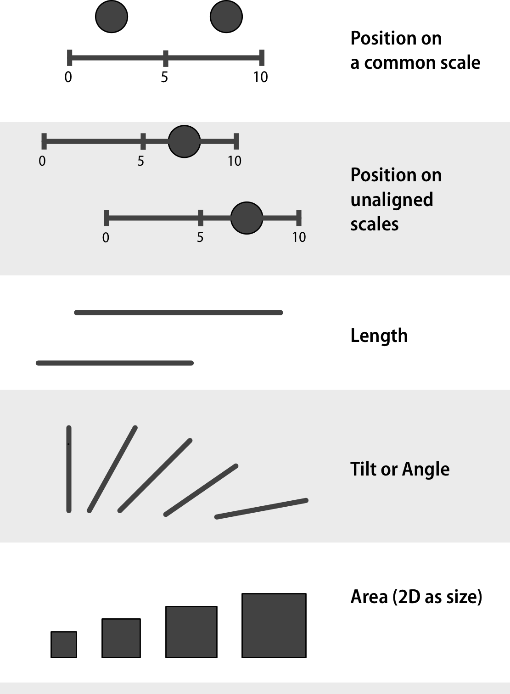
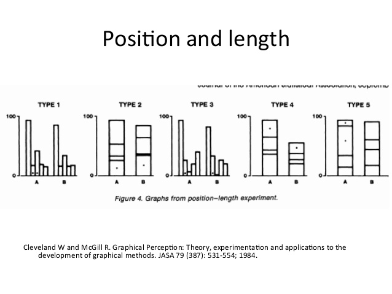

```{r setup, include=FALSE}
options(htmltools.dir.version = FALSE)
library(xaringanthemer)
mono_light(
  base_color = "#046A38",
  white_color = "#ffffff",
  text_font_size = "28px",
  header_h1_font_size = "40px",
  header_h2_font_size = "35px", 
  header_h3_font_size = "30px",
  code_font_size = "14px",
  header_font_google = google_font("Josefin Sans"),
  text_font_google   = google_font("Montserrat", "300", "300i"),
  code_font_google   = google_font("Droid Mono")
)
```

class: middle, center, inverse

# Look at Data (Chapter 1, Healy)

---

# Hermann Grid Effect

```{r out.width = "500px", fig.align="center", echo=FALSE}
knitr::include_graphics("../images/slides/02-class/herman-grid.jpg")
```

---

class: middle

# Mach bands

```{r out.width = "750px", fig.align="center", echo=FALSE}
knitr::include_graphics("../images/slides/02-class/mach-bands.png")
```

???
When the gray bars share a boundary, the apparent contrast between them appears to increase. Speaking loosely, we can say that our visual system is trying to construct a representation of what it is looking at based more on relative differences in the luminance (or brightness) of the bars, rather than their absolute value. Similarly, the ghostly blobs in the Hermann grid effect can be thought of as a side-effect of the visual system being tuned for a different task.

---

class: middle

# Gestalt

```{r out.width = "750px", fig.align="center", echo=FALSE}
knitr::include_graphics("../images/slides/02-class/gestalt.png")
```

---

class: middle

# Pre-attentive

```{r out.width = "750px", fig.align="center", echo=FALSE}
knitr::include_graphics("../images/slides/02-class/pre-attentive.png")
```

---

class: middle

# Multichannel

```{r out.width = "750px", fig.align="center", echo=FALSE}
knitr::include_graphics("../images/slides/02-class/multichannel.png")
```

---

class: middle

.pull-left[
```{r out.width = "350px", fig.align="center", echo=FALSE}

```
]
.pull-right[
```{r out.width = "350px", fig.align="center", echo=FALSE}
knitr::include_graphics("../images/slides/02-class/channels2.png")
```
]

---

class: middle

# Cleveland and McGill, 1984

```{r out.width = "750px", fig.align="center", echo=FALSE}

```

---

class: middle

# Cleveland and McGill, 1984

```{r out.width = "700px", fig.align="center", echo=FALSE}
knitr::include_graphics("../images/slides/02-class/fig-x-dot-chart.png")
```

---

class: middle

# Cleveland and McGill, 1984

```{r out.width = "750px", fig.align="center", echo=FALSE}
knitr::include_graphics("../images/slides/02-class/cleveland-results.png")
```

---

class: middle

# Heer and Bostock, 2010

```{r out.width = "750px", fig.align="center", echo=FALSE}
knitr::include_graphics("../images/slides/02-class/schematic.png")
```

---

class: middle

```{r out.width = "600px", fig.align="center", echo=FALSE}
knitr::include_graphics("../images/slides/02-class/results.png")
```

---

# Question: How do we implement?

<iframe src="https://giphy.com/embed/3oz8xZvvOZRmKay4xy" width = "800" height="500" frameBorder="0" class="giphy-embed" allowFullScreen></iframe><p><a href="https://giphy.com/gifs/foxhomeent-3oz8xZvvOZRmKay4xy"></a></p>

---

# A (Layered) Grammar of Graphics! 

`ggplot2` and its `tidyverse` friends

<iframe src="https://giphy.com/embed/3ohs4n9YN9nkvCjGow" width = "800" height="500" frameBorder="0" class="giphy-embed" allowFullScreen></iframe><p><a href="https://giphy.com/gifs/groundhog-day-3ohs4n9YN9nkvCjGow"></a></p>


