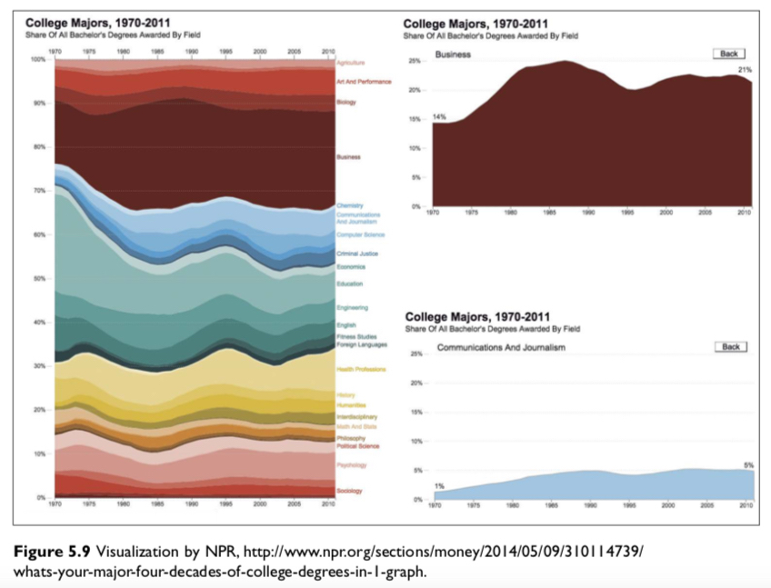
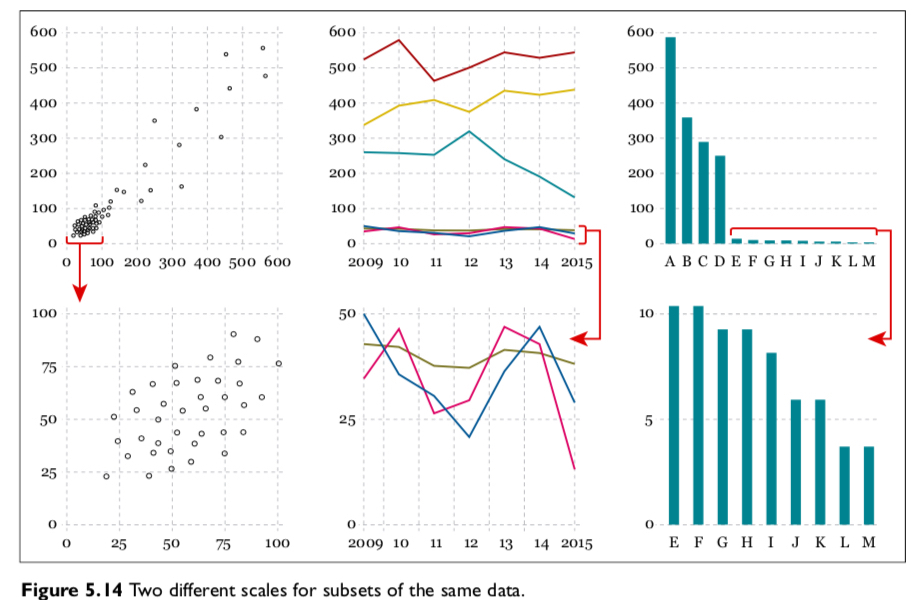
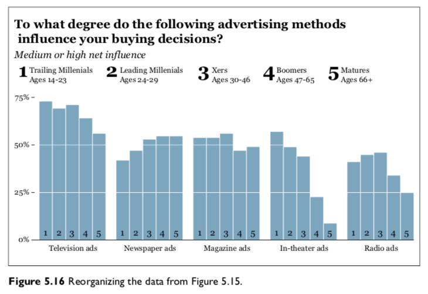
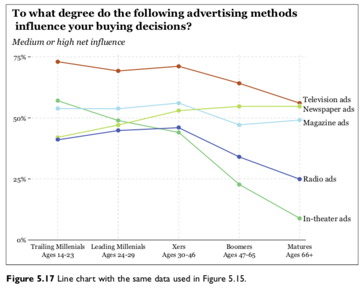
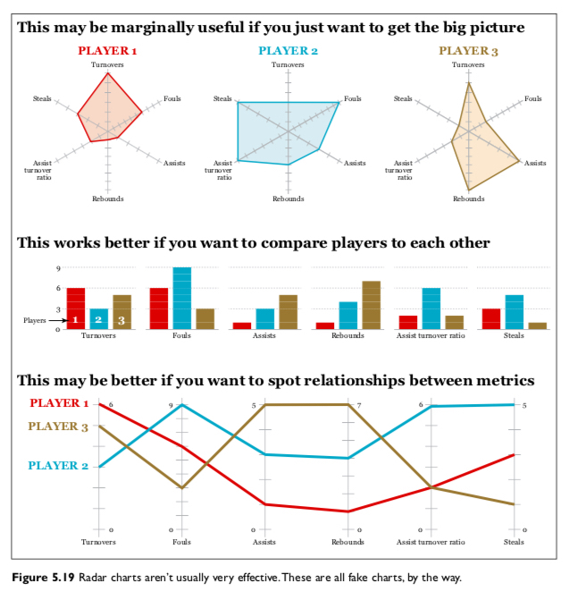

```{r setup, include=FALSE}
knitr::opts_chunk$set(fig.width=4.2, fig.height=4.2, message=FALSE, warning=FALSE) 
options(htmltools.dir.version = FALSE)
library(xaringanthemer)
library(gapminder)

mono_light(
  base_color = "#046A38",
  white_color = "#ffffff",
  text_font_size = "28px",
  header_h1_font_size = "40px",
  header_h2_font_size = "35px", 
  header_h3_font_size = "30px",
  code_font_size = "11px",
  header_font_google = google_font("Josefin Sans"),
  text_font_google   = google_font("Montserrat", "300", "300i"),
  code_font_google   = google_font("Droid Mono")
)
```

class: middle, center, inverse

# Basic Principles of Visualization: Cairo, Chapter 5

---

class: center, middle

```{r out.width = "400px", fig.align="center", echo=FALSE}
knitr::include_graphics("../images/slides/02-class/perceptual.png")
```

What if we want to show "high" and "low" levels?

---

class: center, middle

```{r out.width = "700px", fig.align="center", echo=FALSE}

```

---

class: center, middle

```{r out.width = "700px", fig.align="center", echo=FALSE}

```

---

class: center, middle

```{r out.width = "700px", fig.align="center", echo=FALSE}
knitr::include_graphics("../images/slides/03-class/sample1.png")
```

---

class: center, middle

```{r out.width = "700px", fig.align="center", echo=FALSE}

```

---

class: center, middle

```{r out.width = "700px", fig.align="center", echo=FALSE}

```

---

class: center, middle

```{r out.width = "600px", fig.align="center", echo=FALSE}

```

---

class: middle, inverse

#      Directory of Visualizations: Wilke, Chapter 5 (with tidyverse)


```{r message=TRUE,warning=TRUE,fig.align="left"}
library(tidyverse)
```

---

For this section, I'm going to use the `mpg` dataset.

```{r}
head(mpg,n=5)
```

```{r}
# glimpse is from dplyr
glimpse(mpg)
```

---

# Amounts

Descriptive statistics like averages and counts by one or two categorical groups (covariates or features). These use **absolute values**, rather than *relative* values, therefore **scale matters**.

```{r out.width = "600px", fig.align="center", echo=FALSE}
knitr::include_graphics("../images/slides/03-class/amounts-1.png")
```

```{r out.width = "600px", fig.align="center", echo=FALSE}
knitr::include_graphics("../images/slides/03-class/amounts-2.png")
```

---

# Amounts

```{r out.width = "600px", fig.align="center", echo=FALSE}
knitr::include_graphics("../images/slides/03-class/amounts-1.png")
```

.pull-left[
```{r eval=FALSE}
ggplot(mpg, aes(x = class)) +
  geom_bar()
```
]
.pull-right[
```{r echo=FALSE}
ggplot(mpg, aes(x = class)) +
  geom_bar()
```
]

---

# Amounts

```{r out.width = "600px", fig.align="center", echo=FALSE}
knitr::include_graphics("../images/slides/03-class/amounts-1.png")
```

.pull-left[
```{r eval=FALSE}
ggplot(mpg, aes(x = class, `fill = class`)) +
  geom_bar() +
  `coord_flip() +`
  labs(x = " ", y = "Car count",
       title = "Cars by type") +
  `theme(legend.position = "none")`
```

]
.pull-right[
```{r echo=FALSE}
ggplot(mpg, aes(x = class, fill = class)) +
  geom_bar() +
  coord_flip() +
  labs(x = " ", y = "Car count", title = "Cars by type") +
  theme(legend.position = "none")
```
]

---

# Amounts

```{r out.width = "600px", fig.align="center", echo=FALSE}
knitr::include_graphics("../images/slides/03-class/amounts-1.png")
```

.pull-left[
```{r eval=FALSE}
l <- c("2seater","minivan","pickup",
       "subcompact","midsize","compact","suv")

mpg %>%
  `mutate(class = factor(class, levels = l))` %>%
  ggplot(aes(x = class, fill = class)) +
  geom_bar() +
  coord_flip() +
  labs(x = " ", y = "Car count",
       title = "Cars by type") +
  theme(legend.position = "none")
```
]
.pull-right[
```{r echo=FALSE}
l <- c("2seater","minivan","pickup",
       "subcompact","midsize","compact","suv")

mpg %>%
  mutate(class = factor(class, levels = l)) %>%
  ggplot(aes(x = class, fill = class)) +
  geom_bar() +
  coord_flip() +
  labs(x = " ", y = "Car count",
       title = "Cars by type") +
  theme(legend.position = "none")
```
]

---

# Amounts

```{r out.width = "600px", fig.align="center", echo=FALSE}
knitr::include_graphics("../images/slides/03-class/amounts-2.png")
```

.pull-left[
```{r eval=FALSE}
l <- c("2seater","minivan","pickup",
       "subcompact","midsize","compact","suv")

mpg %>%
  mutate(class = factor(class, levels = l)) %>%
  ggplot(aes(x = class, `fill = drv`)) +
  geom_bar() +
  coord_flip() +
  labs(x = " ", y = "Car count",
       title = "Cars by type") +
  theme(legend.position = c(0.8,0.2))
```
]
.pull-right[
```{r echo=FALSE}
l <- c("2seater","minivan","pickup",
       "subcompact","midsize","compact","suv")

mpg %>%
  mutate(class = factor(class, levels = l)) %>%
  ggplot(aes(x = class, fill = drv)) +
  geom_bar() +
  coord_flip() +
  labs(x = " ", y = "Car count",
       title = "Cars by type") +
  theme(legend.position = c(0.8,0.2))
```
]

---

# Proportions

Relative values to compare sizes of categories. 

```{r out.width = "600px", fig.align="center", echo=FALSE}
knitr::include_graphics("../images/slides/03-class/proportions-1.png")
```

```{r out.width = "600px", fig.align="center", echo=FALSE}
knitr::include_graphics("../images/slides/03-class/proportions-2.png")
```


---

# Proportions

```{r out.width = "600px", fig.align="center", echo=FALSE}
knitr::include_graphics("../images/slides/03-class/proportions-1.png")
```

.pull-left[
```{r eval=FALSE}
p <- mpg %>%
  count(class) %>%
  mutate(pct = n / sum(n)) %>%
  ggplot(aes(x = "", y = pct, fill = class)) +
  geom_bar(width = 1, stat = "identity")

p
```
]
.pull-right[
```{r echo=FALSE}
p <- mpg %>%
  count(class) %>%
  mutate(pct = n / sum(n)) %>%
  ggplot(aes(x = "", y = pct, fill = class)) +
  geom_bar(width = 1, stat = "identity")

p
```
]

---

# Proportions

```{r out.width = "600px", fig.align="center", echo=FALSE}
knitr::include_graphics("../images/slides/03-class/proportions-1.png")
```

.pull-left[
```{r eval=FALSE}
p <- mpg %>%
  count(class) %>%
  mutate(pct = n / sum(n)) %>%
  ggplot(aes(x = "", y = pct, fill = class)) +
  geom_bar(width = 1, stat = "identity")

p + `coord_polar("y", start=0) +`
  theme_minimal() +
  labs(x = " ", y = "Proportion by class")
```
]
.pull-right[
```{r echo=FALSE}
p + coord_polar("y", start=0) +
  theme_minimal() +
  labs(x = " ", y = "Proportion by class")
```
]

---

# Proportions

```{r out.width = "600px", fig.align="center", echo=FALSE}
knitr::include_graphics("../images/slides/03-class/proportions-2.png")
```


.pull-left[
```{r eval=FALSE}
library(treemapify)
mpg %>%
  filter(year == 1999) %>%
  `count(manufacturer) %>%`
  ggplot(aes(`area = n,`
             `fill = manufacturer`, 
             `label = manufacturer`)) +
  geom_treemap() +`
  geom_treemap_text() +
  theme(legend.position = "none")
```
]
.pull-right[
```{r echo=FALSE}
library(treemapify)
mpg %>%
  filter(year == 1999) %>%
  count(manufacturer) %>%
  ggplot(aes(area = n, fill = manufacturer, label = manufacturer)) +
  geom_treemap() +
  geom_treemap_text() +
  theme(legend.position = "none")
```
]

---

# Proportions

```{r out.width = "600px", fig.align="center", echo=FALSE}
knitr::include_graphics("../images/slides/03-class/proportions-2.png")
```


.pull-left[
```{r eval=FALSE}
library(ggalluvial)

data(vaccinations)

ggplot(vaccinations,
       aes(x = survey, y = freq,  
           `alluvium = subject, stratum = response,`
           fill = response, label = response)) +
  scale_x_discrete(expand = c(.1, .1)) +
  geom_flow() +
  geom_stratum(alpha = .5) +
  `geom_text(stat = "stratum", size = 3) +`
  theme(legend.position = "none") +
  labs(title = "Vaccination survey response at three times")
```
]
.pull-right[
```{r echo=FALSE}
library(ggalluvial)
data(vaccinations)
ggplot(vaccinations,
       aes(x = survey, stratum = response, alluvium = subject,
           y = freq,
           fill = response, label = response)) +
  scale_x_discrete(expand = c(.1, .1)) +
  geom_flow() +
  geom_stratum(alpha = .5) +
  geom_text(stat = "stratum", size = 3) +
  theme(legend.position = "none") +
  labs(title = "Vaccination survey response at three times")
```
]

---

# Distributions

What is the variance? How evenly spread are the values?

```{r out.width = "600px", fig.align="center", echo=FALSE}
knitr::include_graphics("../images/slides/03-class/distributions-1.png")
```

```{r out.width = "600px", fig.align="center", echo=FALSE}

```

---

# Distributions

```{r out.width = "600px", fig.align="center", echo=FALSE}
knitr::include_graphics("../images/slides/03-class/distributions-1.png")
```

.pull-left[
```{r eval=FALSE}
ggplot(mpg, aes(x = hwy)) +
  geom_histogram()
```
]
.pull-right[
```{r echo=FALSE}
ggplot(mpg, aes(x = hwy)) +
  geom_histogram()
```
]

---

# Distributions

```{r out.width = "600px", fig.align="center", echo=FALSE}
knitr::include_graphics("../images/slides/03-class/distributions-1.png")
```

.pull-left[
```{r eval=FALSE}
ggplot(mpg, aes(x = hwy)) +
  geom_`density()`
```
]
.pull-right[
```{r echo=FALSE}
ggplot(mpg, aes(x = hwy)) +
  geom_density()
```
]

---

# Distributions

```{r out.width = "600px", fig.align="center", echo=FALSE}
knitr::include_graphics("../images/slides/03-class/distributions-1.png")
```

.pull-left[
```{r eval=FALSE}
ggplot(mpg, aes(x = hwy)) +
  geom_density(`adjust = 0.2`) # adjust kernel
```
]
.pull-right[
```{r echo=FALSE}
ggplot(mpg, aes(x = hwy)) +
  geom_density(adjust = 0.2)
```
]
---

# Distributions

```{r out.width = "600px", fig.align="center", echo=FALSE}

```

.pull-left[
```{r eval=FALSE}
ggplot(mpg, aes(x = hwy, `fill = drv`)) +
  geom_density(alpha = 0.4) +
  `theme(legend.position = c(0.8,0.8))`
```
]
.pull-right[
```{r echo=FALSE}
ggplot(mpg, aes(x = hwy, fill = drv)) +
  geom_density(alpha = 0.4) +
  theme(legend.position = c(0.8,0.8))
```
]

---

# Distributions

```{r out.width = "600px", fig.align="center", echo=FALSE}

```

.pull-left[
```{r eval=FALSE}
library(ggridges)
library(ggthemes)

l2 <- c("subcompact","midsize","compact",
       "2seater","minivan","pickup","suv")

mpg %>%
  mutate(class = factor(class, levels = l2)) %>%
  ggplot(aes(`x = hwy, y = class, fill = class`)) +
  `geom_density_ridges(alpha = 0.4) +`
  `theme_tufte() +`
  theme(legend.position = "none")
```
]
.pull-right[
```{r echo=FALSE}
library(ggridges)
library(ggthemes)

l2 <- c("subcompact","midsize","compact",
       "2seater","minivan","pickup","suv")

mpg %>%
  mutate(class = factor(class, levels = l2)) %>%
  ggplot(aes(x = hwy, y = class, fill = class)) +
  geom_density_ridges(alpha = 0.4) +
  theme_tufte() +
  theme(legend.position = "none")
```
]


---

# x-y relationships

What is the relationship between two or more variables?

```{r out.width = "600px", fig.align="center", echo=FALSE}
knitr::include_graphics("../images/slides/03-class/basic-scatter-1.png")
```

```{r out.width = "600px", fig.align="center", echo=FALSE}
knitr::include_graphics("../images/slides/03-class/xy-lines-1.png")
```

---

# x-y relationships

```{r out.width = "600px", fig.align="center", echo=FALSE}
knitr::include_graphics("../images/slides/03-class/basic-scatter-1.png")
```


.pull-left[
```{r eval=FALSE}
ggplot(mpg, aes(x = cty, y = hwy)) +
  geom_point()
```
]
.pull-right[
```{r echo=FALSE}
ggplot(mpg, aes(x = cty, y = hwy)) +
  geom_point()
```
]

---

# x-y relationships

```{r out.width = "600px", fig.align="center", echo=FALSE}
knitr::include_graphics("../images/slides/03-class/basic-scatter-1.png")
```


.pull-left[
```{r eval=FALSE}
library(ggthemes)

ggplot(mpg, aes(x = cty, y = hwy)) +
  geom_point(`aes(color = trans)`, size = 0.5) +
  `facet_wrap(~trans) +`
  theme_fivethirtyeight() +
  theme(legend.position = "none",
        `text = element_text(size=10)`)
```
]
.pull-right[
```{r echo=FALSE}
library(ggthemes)

ggplot(mpg, aes(x = cty, y = hwy)) +
  geom_point(aes(color = trans), size = 0.5) +
  facet_wrap(~trans) +
  theme_fivethirtyeight() +
  theme(legend.position = "none",
        text = element_text(size=10))
```
]


---

# x-y relationships

```{r out.width = "600px", fig.align="center", echo=FALSE}
knitr::include_graphics("../images/slides/03-class/xy-lines-1.png")
```


.pull-left[
```{r eval=FALSE}
library(nycflights13)

# break up by data manipulation
df <- flights %>%
  mutate(day=as.Date(time_hour)) %>%
  filter(day < "2013-02-01") %>%
  count(day,origin)

# and ggplot
ggplot(df, aes(x=day, y=n, color=origin)) +
  geom_line(aes(group=origin)) +
  geom_point() +
  theme(legend.position="bottom")
```
]
.pull-right[
```{r echo=FALSE}
library(nycflights13)
flights %>%
  mutate(day=as.Date(time_hour)) %>%
  filter(day < "2013-02-01") %>%
  count(day,origin) %>%
  ggplot(aes(x=day, y=n, color=origin)) +
  geom_line(aes(group=origin)) +
  geom_point() +
  theme(legend.position="bottom")
```
]

---

# x-y relationships

```{r out.width = "600px", fig.align="center", echo=FALSE}
knitr::include_graphics("../images/slides/03-class/xy-binning-1.png")
```

.pull-left[
```{r eval=FALSE}
filter(mpg, class != "2seater") %>%
  ggplot(aes(x = cty, y = hwy)) +
  geom_density_2d()
```
]
.pull-right[
```{r echo=FALSE}
filter(mpg, class != "2seater") %>%
  ggplot(aes(x = cty, y = hwy)) +
  geom_density_2d()
```
]

---

# x-y relationships

```{r out.width = "600px", fig.align="center", echo=FALSE}
knitr::include_graphics("../images/slides/03-class/xy-binning-1.png")
```

.pull-left[
```{r eval=FALSE}
filter(mpg, class != "2seater") %>%
  ggplot(aes(x = cty, y = hwy)) +
  geom_density_2d(`aes(color = class)`) + 
  `facet_wrap(~class) +`
  `theme(legend.position = "none")`
```
]
.pull-right[
```{r echo=FALSE}
filter(mpg, class != "2seater") %>%
  ggplot(aes(x = cty, y = hwy)) +
  geom_density_2d(aes(color = class)) + 
  facet_wrap(~class) +
  theme(legend.position = "none")
```
]

---

# x-y relationships

```{r out.width = "600px", fig.align="center", echo=FALSE}
knitr::include_graphics("../images/slides/03-class/xy-binning-1.png")
```

.pull-left[
```{r eval=FALSE}
filter(mpg, class != "2seater") %>%
  ggplot(aes(x = cty, y = hwy)) +
  `geom_hex(aes(color = class), bins = 10) +`
  facet_wrap(~class) +
  theme(legend.position = "none")
```
]
.pull-right[
```{r echo=FALSE}
filter(mpg, class != "2seater") %>%
  ggplot(aes(x = cty, y = hwy)) +
  geom_hex(aes(color = class), bins = 10) + 
  facet_wrap(~class) +
  theme(legend.position = "none")
```
]

---

# Geospatial

```{r out.width = "600px", fig.align="center", echo=FALSE}
knitr::include_graphics("../images/slides/03-class/geospatial-1.png")
```

.pull-left[
```{r eval=FALSE}
library(maps)

crimes <- USArrests %>%
  rownames_to_column(var = "state") %>%
  mutate(state = tolower(state)) %>%
  `gather("variable","value",-state)`

states_map <- map_data("state")

crimes %>%
  `filter(variable == "Assault")` %>%
  ggplot(aes(map_id = state)) +
  `geom_map(aes(fill = value), map = states_map)` +
  expand_limits(x = states_map$long, 
                y = states_map$lat) +
  theme(legend.position = "bottom")
```
]
.pull-right[
```{r echo=FALSE,fig.width=5}
library(maps)

crimes <- USArrests %>%
  rownames_to_column(var = "state") %>%
  mutate(state = tolower(state)) %>%
  gather("variable","value",-state)

states_map <- map_data("state")

crimes %>%
  filter(variable == "Assault") %>%
  ggplot(aes(map_id = state)) +
  geom_map(aes(fill = value), map = states_map) +
  expand_limits(x = states_map$long, y = states_map$lat) +
  theme(legend.position = "bottom")
```
]
---

# Uncertainty

```{r out.width = "600px", fig.align="center", echo=FALSE}
knitr::include_graphics("../images/slides/03-class/errorbars-1.png")
```

.pull-left[
```{r eval=FALSE}
l3 <- c("compact","subcompact","midsize",
       "2seater","minivan","suv","pickup")

# avg highway mpg with boostrapped 95% CI 
mpg %>%
  mutate(class = factor(class, levels = l3)) %>%
  ggplot(aes(x = class, y = hwy, color = class)) +
  `stat_summary(fun.y = mean, geom = "point")` + 
  `stat_summary(fun.data = mean_cl_boot,` 
               `geom = "pointrange")` + 
  theme_bw() +
  coord_flip() +
  theme(legend.position = "none") +
  labs(x = " ", y = "Highway MPG with 95% CI")
```
]
.pull-right[
```{r echo=FALSE}
l3 <- c("compact","subcompact","midsize",
       "2seater","minivan","suv","pickup")

# avg highway mpg with boostrapped 95% CI 
mpg %>%
  mutate(class = factor(class, levels = l3)) %>%
  ggplot(aes(x = class, y = hwy, color = class)) +
  stat_summary(fun.y = mean, geom = "point") + 
  stat_summary(fun.data = mean_cl_boot, geom = "pointrange") + 
  theme_bw() +
  coord_flip() +
  theme(legend.position = "none") +
  labs(x = " ", y = "Highway MPG with 95% CI")
```
]
---

# Uncertainty

```{r out.width = "600px", fig.align="center", echo=FALSE}
knitr::include_graphics("../images/slides/03-class/errorbars-1.png")
```

.pull-left[
```{r eval=FALSE}
l3 <- c("compact","subcompact","midsize",
       "2seater","minivan","suv","pickup")

# avg highway mpg with boostrapped 95% CI 
mpg %>%
  mutate(class = factor(class, levels = l3)) %>%
  ggplot(aes(x = class, y = hwy, color = class)) +
  stat_summary(fun.y = mean, geom = "point") + 
  stat_summary(fun.data = mean_cl_boot, 
               `geom = "errorbar"`) + 
  theme_bw() +
  coord_flip() +
  theme(legend.position = "none") +
  labs(x = " ", y = "Highway MPG with 95% CI")
```
]
.pull-right[
```{r echo=FALSE}
l3 <- c("compact","subcompact","midsize",
       "2seater","minivan","suv","pickup")

# avg highway mpg with boostrapped 95% CI 
mpg %>%
  mutate(class = factor(class, levels = l3)) %>%
  ggplot(aes(x = class, y = hwy, color = class)) +
  stat_summary(fun.y = mean, geom = "point") + 
  stat_summary(fun.data = mean_cl_boot, geom = "errorbar") + 
  theme_bw() +
  coord_flip() +
  theme(legend.position = "none") +
  labs(x = " ", y = "Highway MPG with 95% CI")
```
]

---

# Uncertainty

```{r out.width = "600px", fig.align="center", echo=FALSE}
knitr::include_graphics("../images/slides/03-class/confidence-dists-1.png")
```

```{r out.width = "600px", fig.align="center", echo=FALSE}
knitr::include_graphics("../images/slides/03-class/confidence-bands-1.png")
```
