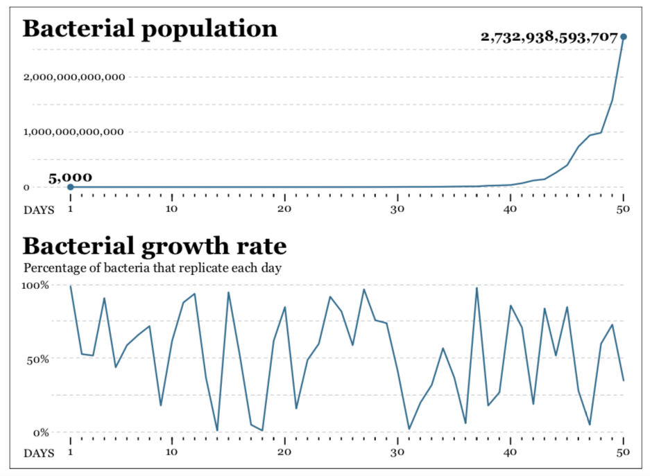
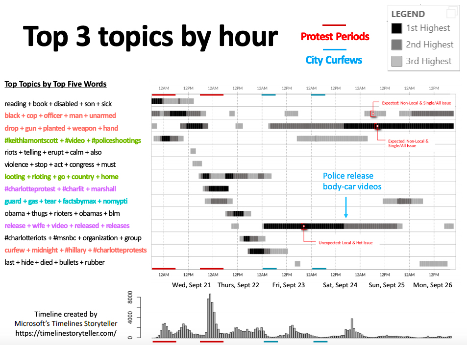
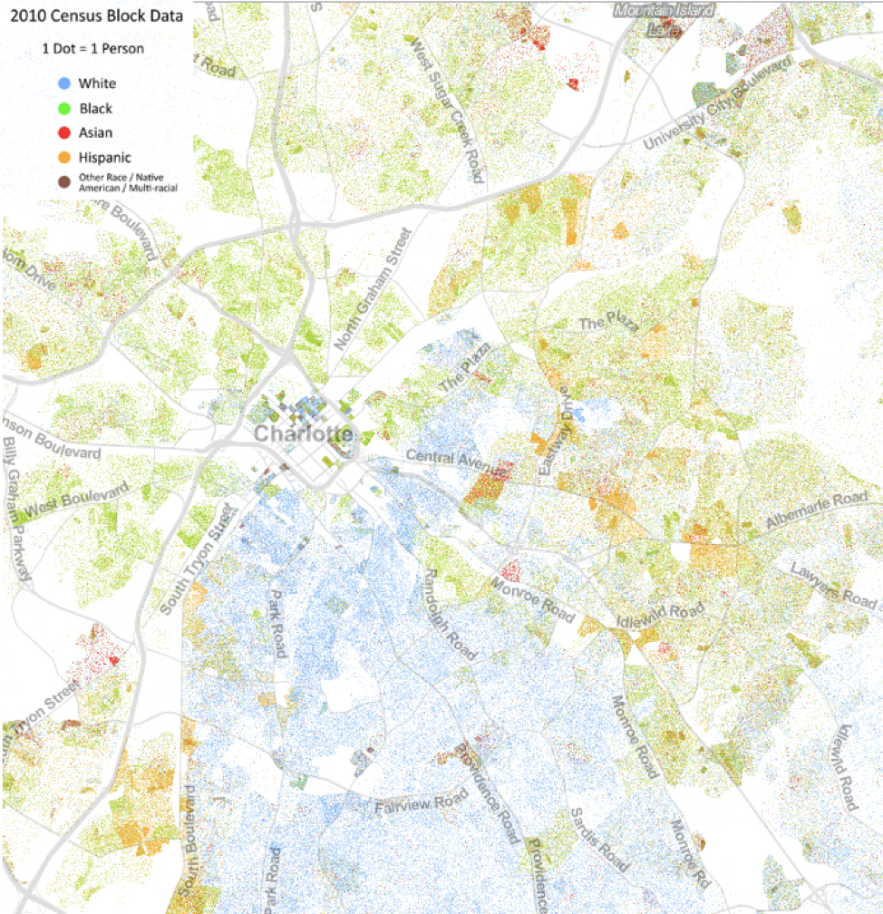
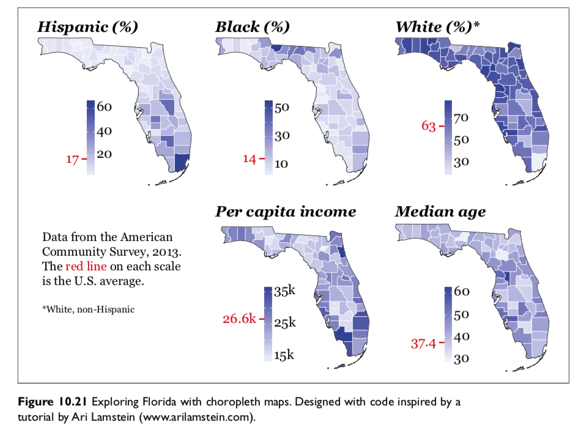
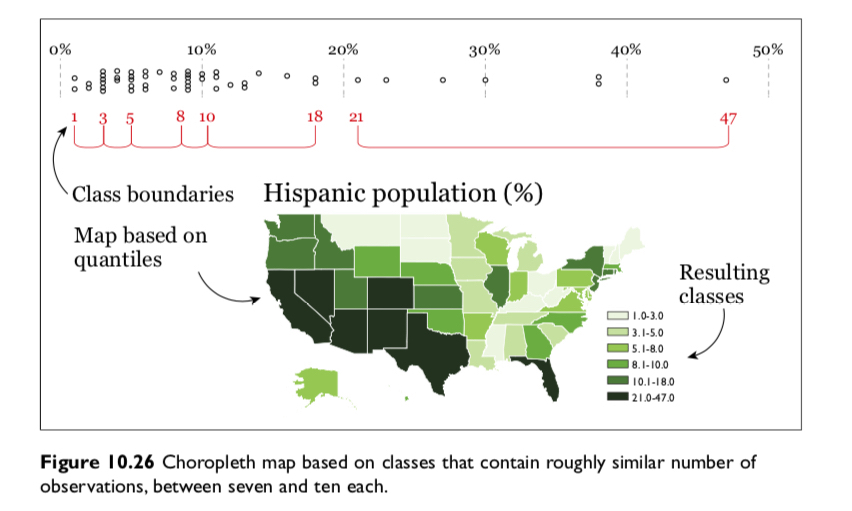
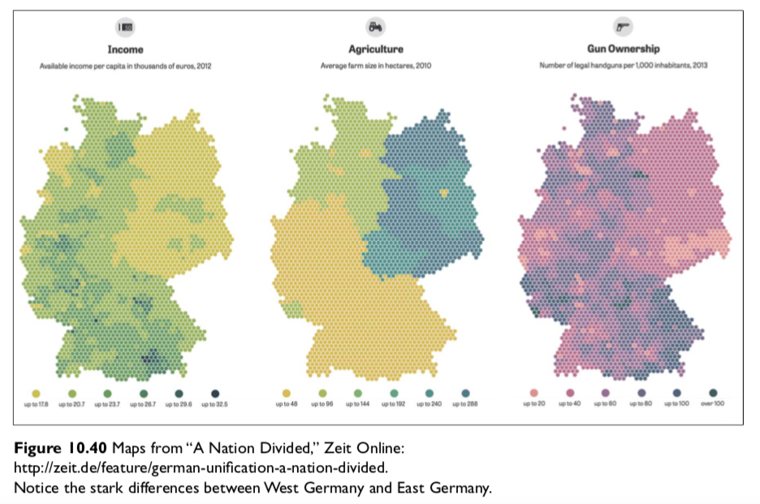
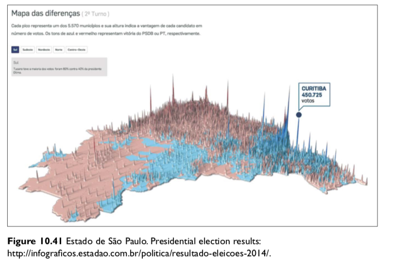

```{r setup, include=FALSE}
knitr::opts_chunk$set(fig.width=4.2, fig.height=4.2, message=FALSE, warning=FALSE) 
options(htmltools.dir.version = FALSE)
library(xaringanthemer)
library(gapminder)

mono_light(
  base_color = "#046A38",
  white_color = "#ffffff",
  text_font_size = "28px",
  header_h1_font_size = "40px",
  header_h2_font_size = "35px", 
  header_h3_font_size = "30px",
  code_font_size = "11px",
  header_font_google = google_font("Josefin Sans"),
  text_font_google   = google_font("Montserrat", "300", "300i"),
  code_font_google   = google_font("Droid Mono")
)
```

class: center, middle, inverse

# Time and space

```{r out.width = "600px", fig.align="center", echo=FALSE}
knitr::include_graphics("../images/slides/04-class/2chainz.gif")
```

---

# Time and Space - why?

```{r out.width = "700px", fig.align="center", echo=FALSE}
knitr::include_graphics("../images/slides/04-class/why.png")
```

---

class: center, middle, inverse

# Time: Cairo Chapter 8 and Wilke Chapters 13-14

<blockquote class="twitter-tweet tw-align-center" width="70%" data-lang="en"><p lang="en" dir="ltr">Visualisation of the streamflow across the <a href="https://twitter.com/hashtag/Alps?src=hash&amp;ref_src=twsrc%5Etfw">#Alps</a> during today’s <a href="https://twitter.com/hashtag/Foehn?src=hash&amp;ref_src=twsrc%5Etfw">#Foehn</a> event. Uplift and resulting snowfall on the windward side (right) and strong Foehn winds down the lee slopes (centre). Explanations: see below. Made with <a href="https://twitter.com/hashtag/ggplot2?src=hash&amp;ref_src=twsrc%5Etfw">#ggplot2</a> and <a href="https://twitter.com/hashtag/gganimate?src=hash&amp;ref_src=twsrc%5Etfw">#gganimate</a>. <a href="https://t.co/goPW9H0zhO">pic.twitter.com/goPW9H0zhO</a></p>&mdash; myweather.ch (@myweather_ch) <a href="https://twitter.com/myweather_ch/status/1091426853393518592?ref_src=twsrc%5Etfw">February 1, 2019</a></blockquote>
<script async src="https://platform.twitter.com/widgets.js" charset="utf-8"></script>

---

class: center, middle

# Trend + Seasonal + Noise

```{r out.width = "400px", fig.align="center", echo=FALSE}
knitr::include_graphics("../images/slides/04-class/trends.png")
```

---

class: center, middle

# Visualizing one temporal variable

```{r out.width = "700px", fig.align="center", echo=FALSE}
knitr::include_graphics("../images/slides/04-class/timeseries.png")
```

---

class: center, middle

# Visualizing one temporal variable

```{r out.width = "700px", fig.align="center", echo=FALSE}
knitr::include_graphics("../images/slides/04-class/timeseries2.png")
```

---

class: center, middle

# Visualizing one temporal variable

```{r out.width = "700px", fig.align="center", echo=FALSE}
knitr::include_graphics("../images/slides/04-class/timeseries3.png")
```

---

class: center, middle

# Visualizing one temporal variable

```{r out.width = "700px", fig.align="center", echo=FALSE}
knitr::include_graphics("../images/slides/04-class/timeseries4.png")
```

---

class: center, middle

# Visualizing Indexes

```{r out.width = "700px", fig.align="center", echo=FALSE}
knitr::include_graphics("../images/slides/04-class/index1.png")
```

---

class: center, middle

# Visualizing Indexes

```{r out.width = "700px", fig.align="center", echo=FALSE}
knitr::include_graphics("../images/slides/04-class/index2.png")
```

---

class: center, middle

# Visualizing two temporal variables

```{r out.width = "700px", fig.align="center", echo=FALSE}
knitr::include_graphics("../images/slides/04-class/timeseries5.png")
```

---

class: center, middle

# Visualizing two temporal variables

```{r out.width = "700px", fig.align="center", echo=FALSE}
knitr::include_graphics("../images/slides/04-class/timeseries6.png")
```

---

class: center, middle

# Ratios to log

```{r out.width = "700px", fig.align="center", echo=FALSE}
knitr::include_graphics("../images/slides/04-class/ratio.png")
```

---

class: center, middle

# Ratios to log

```{r out.width = "700px", fig.align="center", echo=FALSE}

```

---

class: center, middle

# Mix effects

```{r out.width = "700px", fig.align="center", echo=FALSE}
knitr::include_graphics("../images/slides/04-class/mix.png")
```

---

class: center, middle

# Timelines storyteller

```{r out.width = "700px", fig.align="center", echo=FALSE}
knitr::include_graphics("../images/slides/04-class/dailyroutines.gif")
```

<https://timelinestoryteller.com/>

---

class: center, middle

# Example: Charlotte Protest Tweets

```{r out.width = "700px", fig.align="center", echo=FALSE}

```

---

class: middle, inverse, center

# Spatial/Maps: Cairo Chap. 10 and Wilke Chap. 15

<blockquote class="twitter-tweet tw-align-center" width="60%" data-lang="en"><p lang="en" dir="ltr">A nice example of projection distortion! How big is Alaska really? <a href="https://t.co/37I6wre2dM">https://t.co/37I6wre2dM</a></p>&mdash; TimSalabim (@TimSalabim3) <a href="https://twitter.com/TimSalabim3/status/1026193095568838657?ref_src=twsrc%5Etfw">August 5, 2018</a></blockquote>
<script async src="https://platform.twitter.com/widgets.js" charset="utf-8"></script>


---

class: center, middle

# Scale

```{r out.width = "600px", fig.align="center", echo=FALSE}
knitr::include_graphics("../images/slides/04-class/scale.png")
```

---

class: center, middle

# Projections

```{r out.width = "700px", fig.align="center", echo=FALSE}
knitr::include_graphics("../images/slides/04-class/projection.png")
```

---

class: center, middle

# Projections

```{r out.width = "700px", fig.align="center", echo=FALSE}
knitr::include_graphics("../images/slides/04-class/projection2.png")
```

---

class: center, middle

# Map encoding

```{r out.width = "700px", fig.align="center", echo=FALSE}
knitr::include_graphics("../images/slides/04-class/encode.png")
```

---

class: center, middle

# UVA's Racial Dot Map

```{r out.width = "500px", fig.align="center", echo=FALSE}

```

<https://demographics.virginia.edu/DotMap/index.html>

---

class: center, middle

# Chloropleths

```{r out.width = "600px", fig.align="center", echo=FALSE}

```

---

# Chloropleths

```{r out.width = "600px", fig.align="center", echo=FALSE}
knitr::include_graphics("../images/slides/04-class/chloropleth2.png")
```

--

```{r out.width = "600px", fig.align="center", echo=FALSE}
knitr::include_graphics("../images/slides/04-class/chloropleth3.png")
```

---

class: center, middle

```{r out.width = "700px", fig.align="center", echo=FALSE}
knitr::include_graphics("../images/slides/04-class/chloropleth4.png")
```

---

class: center, middle

```{r out.width = "700px", fig.align="center", echo=FALSE}

```

---

class: center, middle

```{r out.width = "700px", fig.align="center", echo=FALSE}
knitr::include_graphics("../images/slides/04-class/chloropleth6.png")
```

---

class: center, middle

```{r out.width = "700px", fig.align="center", echo=FALSE}
knitr::include_graphics("../images/slides/04-class/chloropleth7.png")
```

---

class: center, middle

# kernel density

```{r out.width = "600px", fig.align="center", echo=FALSE}
knitr::include_graphics("../images/slides/04-class/kernel.png")
```

---

class: center, middle

# hexabin

```{r out.width = "600px", fig.align="center", echo=FALSE}

```

---

class: center, middle

# 3d height

```{r out.width = "600px", fig.align="center", echo=FALSE}

```

---

class: center, middle

# Voronoi of Airport locations

```{r out.width = "600px", fig.align="center", echo=FALSE}
knitr::include_graphics("../images/slides/04-class/voronoi1.png")
```

---

class: center, middle

# 3D Voronoi of Airport locations

```{r out.width = "600px", fig.align="center", echo=FALSE}
knitr::include_graphics("../images/slides/04-class/voronoi2.png")
```

---

Example: `ggvoronoi` ([vignette](https://cran.r-project.org/web/packages/ggvoronoi/vignettes/ggvoronoi.html))

```{r getdata, include=FALSE}
set.seed(45056)
x <- sample(1:200,100)
y <- sample(1:200,100)
points <- data.frame(x, y,
                     distance = sqrt((x-100)^2 + (y-100)^2))
circle <- data.frame(x = 100*(1+cos(seq(0, 2*pi, length.out = 2500))),
                     y = 100*(1+sin(seq(0, 2*pi, length.out = 2500))),
                     group = rep(1,2500))
```

```{r ggvoronoi1}
library(ggvoronoi)

head(points, n = 2)
```
.pull-left[
```{r ggvoronoi2, fig.width=5}
ggplot(points) +
  geom_point(aes(x,y,color=distance)) +
  geom_path(data=circle,aes(x,y,group=group))
```
]
.pull-right[
```{r voronoi3, fig.width=5}
ggplot(points, aes(x,y,fill=distance)) +
  geom_voronoi() +
  stat_voronoi(geom="path") +
  geom_point()
```
]
