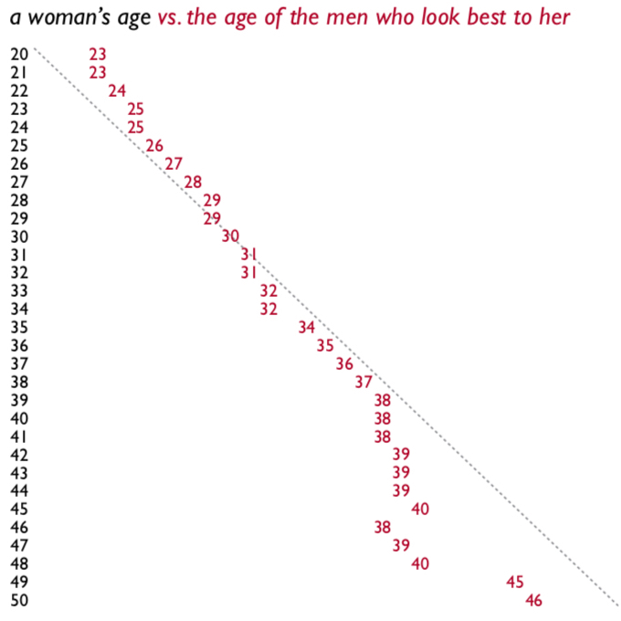
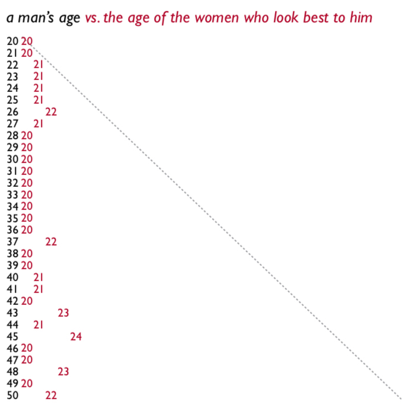
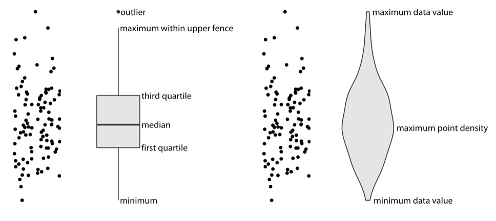
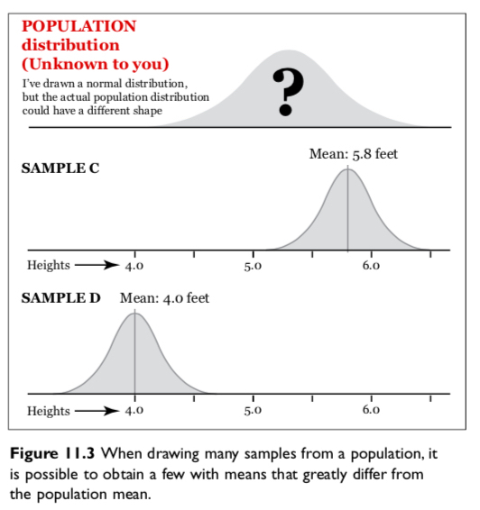

```{r setup, include=FALSE}
knitr::opts_chunk$set(fig.width=4.2, fig.height=4.2, message=FALSE, warning=FALSE) 
options(htmltools.dir.version = FALSE)
library(xaringanthemer)
library(tidyverse)
library(gapminder)
library(socviz)
library(kableExtra)

mono_light(
  base_color = "#046A38",
  white_color = "#ffffff",
  text_font_size = "28px",
  header_h1_font_size = "40px",
  header_h2_font_size = "35px", 
  header_h3_font_size = "30px",
  code_font_size = "11px",
  header_font_google = google_font("Josefin Sans"),
  text_font_google   = google_font("Montserrat", "300", "300i"),
  code_font_google   = google_font("Droid Mono")
)

extra_css <- list(
  ".verysmall" = list(
    "font-size" = "80%"
  ),
  ".center2" = list(
    "margin" = "auto",
    "top" = "30%",
    "width" = "110%"
  ),
  ".sbig .remark-code" = list(
    "font-size" = "60%"
  ),
  ".big .remark-code" = list(
    "font-size" = "75%"
  ),
  ".little .remark-code" = list(
    "font-size" = "40%"
  ),
  ".center3" = list(
    "margin" = "0",
    "top" = "20%",
    "width" = "90%"
  ),
  ".full-width" = list(
    "display" = "flex",
    "width"   = "100%",
    "flex"    = "1 1 auto"
  ),
  ".right-column2" = list(
    "width" = "60%",
    "float" = "right",
    "padding-top" = "1em"
  ),
  ".bg-text" = list(
    "position" = "absolute",
    "top" = "50%",
    "left" = "10%",
    "text-align" = "left"
  ),
  ".remark-slide-number" = list(
    "color" = "#FFFFFF", 
    "opacity" = "1" 
  )
)

write_extra_css(css = extra_css, outfile = "custom-class.css")
```

class: center, middle, inverse

# Why view Distributions? Cairo Ch. 7 & Wilke Ch. 7 - 9

```{r out.width = "600px", fig.align="center", echo=FALSE}
knitr::include_graphics("../images/slides/01-class/DataSaurusDozen.gif")
```

---

class: center, middle

.pull-left[
```{r out.width = "300px", fig.align="center", echo=FALSE}

```
]
--
.pull-right[
```{r out.width = "280px", fig.align="center", echo=FALSE}

```
]

---

class: center, middle

```{r out.width = "600px", fig.align="center", echo=FALSE}
knitr::include_graphics("../images/slides/05-class/cairo3.png")
```

---

class: center, middle

```{r out.width = "700px", fig.align="center", echo=FALSE}
knitr::include_graphics("../images/slides/05-class/wilke1.png")
```

---

class: center, middle

```{r out.width = "700px", fig.align="center", echo=FALSE}
knitr::include_graphics("../images/slides/05-class/wilke2.png")
```

---

class: center, middle

```{r out.width = "700px", fig.align="center", echo=FALSE}
knitr::include_graphics("../images/slides/05-class/wilke3.png")
```

---

class: center, middle

```{r out.width = "700px", fig.align="center", echo=FALSE}
knitr::include_graphics("../images/slides/05-class/wilke4.png")
```

---

class: center, middle

```{r out.width = "700px", fig.align="center", echo=FALSE}
knitr::include_graphics("../images/slides/05-class/wilke5.png")
```

---

class: center, middle

```{r out.width = "500px", fig.align="center", echo=FALSE}
knitr::include_graphics("../images/slides/05-class/wilke6.png")
```

---

class: center, middle

```{r out.width = "500px", fig.align="center", echo=FALSE}
knitr::include_graphics("../images/slides/05-class/wilke7.png")
```

---

class: center, middle

.pull-left[
```{r eval=FALSE}
ggplot(df, aes(x, y)) + geom_boxplot()
```
]
.pull-right[
```{r eval=FALSE}
ggplot(df, aes(x, y)) + geom_violin()
```
]

```{r out.width = "700px", fig.align="center", echo=FALSE}

```


---

class: center, middle

```{r out.width = "700px", fig.align="center", echo=FALSE}
knitr::include_graphics("../images/slides/05-class/wilke10.png")
```

---

class: center, middle

```{r out.width = "700px", fig.align="center", echo=FALSE}
knitr::include_graphics("../images/slides/05-class/wilke11.png")
```

---

class: center, middle

```{r out.width = "700px", fig.align="center", echo=FALSE}
knitr::include_graphics("../images/slides/05-class/wilke12.png")
```

---

class: center, middle

```{r out.width = "700px", fig.align="center", echo=FALSE}
knitr::include_graphics("../images/slides/05-class/wilke13.png")
```

---

class: center, middle

```{r out.width = "700px", fig.align="center", echo=FALSE}
knitr::include_graphics("../images/slides/05-class/wilke14.png")
```

---

class: center, inverse, middle

## Uncertainty: Cairo Ch. 10 & Wilke Ch. 16

```{r out.width = "400px", fig.align="center", echo=FALSE}
knitr::include_graphics("../images/slides/05-class/xkcd.png")
```

xkcd

---

class: center, middle

```{r out.width = "700px", fig.align="center", echo=FALSE}
knitr::include_graphics("../images/slides/05-class/cairo4.png")
```

---

class: center, middle

```{r out.width = "650px", fig.align="center", echo=FALSE}
knitr::include_graphics("../images/slides/05-class/cairo5.png")
```

---

class: center, middle

```{r out.width = "550px", fig.align="center", echo=FALSE}

```

---

class: center, middle

```{r out.width = "500px", fig.align="center", echo=FALSE}
knitr::include_graphics("../images/slides/05-class/cairo7.png")
```

---

## Bootstrapping: Within ggplot2

```{r eval=F}
organdata %>% 
  ggplot(aes(x = country, y = donors)) +
  stat_summary(fun.y = mean, geom = "point", size = 3) + 
  stat_summary(fun.data = mean_cl_boot, geom = "errorbar", width = 0.5) +
  coord_flip() +
  cowplot::theme_cowplot() +
  labs(x = " ", 
       y = "Organ Donations in 000's", 
       title = "Avg Organ Donations (000s) by Country")
```

```{r echo=F,fig.width=6}
organdata %>% 
  ggplot(aes(x = country, y = donors)) +
  stat_summary(fun.y = mean, geom = "point", size = 3) + 
  stat_summary(fun.data = mean_cl_boot, geom = "errorbar", width = 0.5) +
  coord_flip() +
  cowplot::theme_cowplot() +
  labs(x = " ", y = "Organ Donations in 000's", title = "Avg Organ Donations (000s) by Country")
```

<https://rstudio.cloud/spaces/22733/project/527500>

---

## Bootstrapping: Outside ggplot2

```{r eval=F}
organdata %>%
  group_by(country) %>%
  do(as_tibble(bind_rows(Hmisc::smean.cl.boot(.$donors)))) %>%
  ggplot(aes(x = reorder(country, Mean), y = Mean)) +
  geom_point(size = 3) +
  geom_errorbar(aes(ymin = Lower, ymax = Upper), width = 0.5) +
  coord_flip() +
  cowplot::theme_cowplot() +
  labs(x = " ", y = "Organ Donations in 000's", title = "Avg Organ Donations (000s) by Country")
```

```{r echo=F,fig.width=6}
organdata %>%
  group_by(country) %>%
  do(as_tibble(bind_rows(Hmisc::smean.cl.boot(.$donors)))) %>%
  ggplot(aes(x = reorder(country, Mean), y = Mean)) +
  geom_point(size = 3) +
  geom_errorbar(aes(ymin = Lower, ymax = Upper), width = 0.5) +
  coord_flip() +
  cowplot::theme_cowplot() +
  labs(x = " ", y = "Organ Donations in 000's", title = "Avg Organ Donations (000s) by Country")
```

<https://rstudio.cloud/spaces/22733/project/527500>

---

# Bootstrapping with HOPs + `gganimate`

```{r fig.height=4, echo=FALSE}
knitr::include_graphics("../../images/slides/05-class/bootstrap-demo-1.gif")
```

[`ungeviz` package by Claus Wilke](https://wilkelab.org/ungeviz/articles/sampling-bootstrapping.html)
---

# Unemployment Rate

```{r eval=FALSE}
df %>%
  ggplot(aes(x = date, y = unemployment)) +
  geom_line() +
  coord_cartesian(ylim = c(0, .11), expand = FALSE),
  scale_y_continuous(labels = scales::percent) +
  labs(x = NULL, y = NULL, subtitle = "US unemployment over time")
```

```{r fig.height=4, echo=FALSE}
knitr::include_graphics("../../images/slides/05-class/ggplot-unemploy.png")
```

---

# Unemployment Rate

.center2[
```{r out.width = "800px", fig.align="center", echo=FALSE}
knitr::include_graphics("../../images/slides/05-class/01-unemp-blog.png")
```
]

[Kay and Hullman Multiple Views Blog 1](https://medium.com/multiple-views-visualization-research-explained/uncertainty-visualization-explained-67e7a73f031b)

---

# Unemployment Rate

.center2[
```{r out.width = "800px", fig.align="center", echo=FALSE}
knitr::include_graphics("../../images/slides/05-class/02-unemp-blog.png")
```
]
.center2[
```{r out.width = "800px", fig.align="center", echo=FALSE}
knitr::include_graphics("../../images/slides/05-class/03-unemp-blog.png")
```
]

[Kay and Hullman Multiple Views Blog 1](https://medium.com/multiple-views-visualization-research-explained/uncertainty-visualization-explained-67e7a73f031b)

---

# Unemployment Rate

.center2[
```{r out.width = "800px", fig.align="center", echo=FALSE}
knitr::include_graphics("../../images/slides/05-class/kay0.png")
```
]

Source: [Matthew Kay](https://github.com/mjskay/uncertainty-examples/blob/master/us-unemployment.md)

???

Could use a "predictive bar" for the most likely path (draw) and uncertainty around it... fixes the reader to whatever arbitrary interval (95%) the visualization designer chose to display.

---

# Unemployment Rate

.center2[
```{r out.width = "800px", fig.align="center", echo=FALSE}
knitr::include_graphics("../../images/slides/05-class/kay0b.png")
```
]

Source: [Matthew Kay](https://github.com/mjskay/uncertainty-examples/blob/master/us-unemployment.md)

???

By showing multiple intervals, we can distinguish between different intervals of uncertainty...

---

# Unemployment Rate

.center2[
```{r out.width = "800px", fig.align="center", echo=FALSE}
knitr::include_graphics("../../images/slides/05-class/kay0c.png")
```
]

Source: [Matthew Kay](https://github.com/mjskay/uncertainty-examples/blob/master/us-unemployment.md)

---

# Unemployment Rate

.center2[
```{r out.width = "800px", fig.align="center", echo=FALSE}
knitr::include_graphics("../../images/slides/05-class/kay1.png")
```
]

Source: [Matthew Kay](https://github.com/mjskay/uncertainty-examples/blob/master/us-unemployment.md)

---

# Unemployment Rate

.center2[
```{r out.width = "800px", fig.align="center", echo=FALSE}
knitr::include_graphics("../../images/slides/05-class/kay1.gif")
```
]

[Hypothetical Outcome Plots (HOP)](https://medium.com/hci-design-at-uw/hypothetical-outcomes-plots-experiencing-the-uncertain-b9ea60d7c740): [`tidybayes`](https://mjskay.github.io/tidybayes/) & [`gganimate`](https://gganimate.com/)

---

## Why is visualizing uncertainty hard?

- Efficient encodings for uncertainty can be hard to find.
<!-- try putting mean, variance, and interval estimation in one plot + doing this when useful channels are already used up -->

- Make sure people understand encodings (what does the plot mean?). 

- Perceptual models of probability (e.g., quantile dot plot, HOP).

- Decisions under uncertainty (e.g., [Gigerenzer et al](https://youtu.be/BcMuYhoL38A) or [Monty Hall problem](https://youtu.be/9vRUxbzJZ9Y)).

- Findings may not apply in all contexts.

- Plus, you still have to actually build it!

[Matthew Kay](https://mjskay.github.io/uncertainty-vis-book/ch-why-hard.html)

