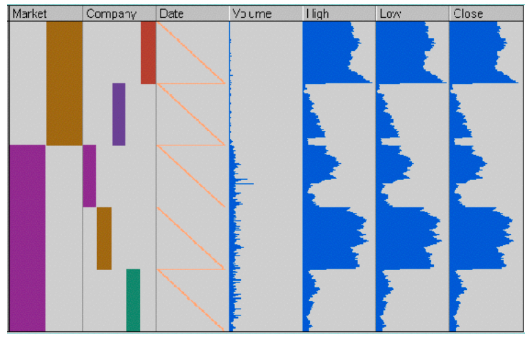
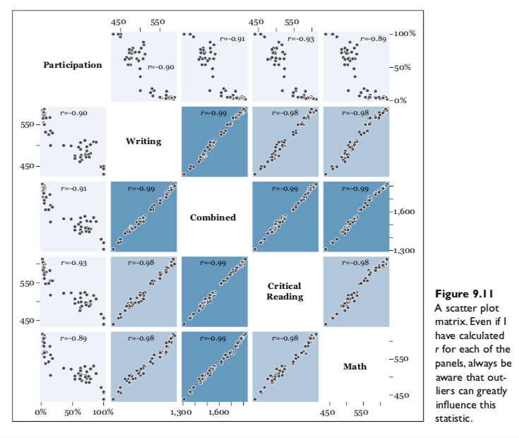
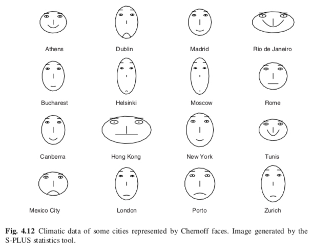
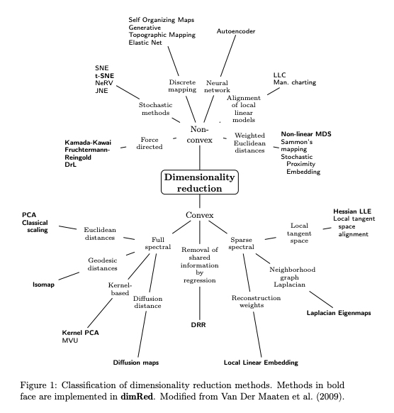
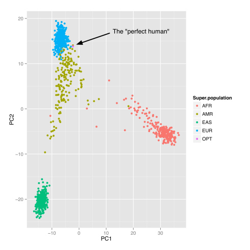

```{r setup, include=FALSE}
knitr::opts_chunk$set(fig.width=4.2, fig.height=4.2, message=FALSE, warning=FALSE) 
options(htmltools.dir.version = FALSE)
library(xaringanthemer)
library(widgetframe) # needed for html widgets in rmarkdown
library(plyr)
library(tidyverse)
library(broom)
library(knitr)
library(ggfortify)

df <- data.frame(
  id = 1:10,
  name = c("Bob", "Ashley", "James", "David", "Jenny", 
    "Hans", "Leo", "John", "Emily", "Lee"), 
  age = c(28, 27, 30, 28, 29, 29, 27, 27, 31, 30),
  grade = c("C", "A", "A", "C", "B", "B", "B", "A", "C", "C"),
  test1_score = c(8.9, 9.5, 9.6, 8.9, 9.1, 9.3, 9.3, 9.9, 8.5, 8.6),
  test2_score = c(9.1, 9.1, 9.2, 9.1, 8.9, 8.5, 9.2, 9.3, 9.1, 8.8),
  final_score = c(9, 9.3, 9.4, 9, 9, 8.9, 9.25, 9.6, 8.8, 8.7),
  registered = c(TRUE, FALSE, TRUE, FALSE, TRUE, TRUE, TRUE, FALSE, FALSE, FALSE),
  stringsAsFactors = FALSE)

us_arrests <- USArrests %>% 
  rownames_to_column(var = "state") %>% 
  # I prefer column names to be all lowercase so I am going to change them here
  rename_all(tolower) %>% 
  as_tibble()

data(iris)

mono_light(
  base_color = "#046A38",
  white_color = "#ffffff",
  text_font_size = "28px",
  header_h1_font_size = "40px",
  header_h2_font_size = "35px", 
  header_h3_font_size = "30px",
  code_font_size = "11px",
  header_font_google = google_font("Josefin Sans"),
  text_font_google   = google_font("Montserrat", "300", "300i"),
  code_font_google   = google_font("Droid Mono")
)
```

class: center, middle, inverse

# Multidimensional Data: Cairo Ch. 9 and Wilke Ch. 12

```{r out.width = "600px", fig.align="center", echo=FALSE}

```

Rao and Card, 1994

---

## Summary information

```{r}
glimpse(mpg)
```

---

## `skimr` package

```{r}
library(skimr)
skim(mpg)
```

---

## Table based

```{r fig.width = 2, echo=FALSE}
library(formattable)

l <- as.htmlwidget(
  formattable(df, list(
    age = color_tile("white", "orange"),
    grade = formatter("span", style = x ~ ifelse(x == "A", 
      style(color = "green", font.weight = "bold"), NA)),
    area(col = c(test1_score, test2_score)) ~ normalize_bar("pink", 0.2),
    final_score = formatter("span",
      style = x ~ style(color = ifelse(rank(-x) <= 3, "green", "gray")),
      x ~ sprintf("%.2f (rank: %02d)", x, rank(-x))),
    registered = formatter("span",
      style = x ~ style(color = ifelse(x, "green", "red")),
      x ~ icontext(ifelse(x, "ok", "remove"), ifelse(x, "Yes", "No")))
  ))
)

frameWidget(l)
```

---

```{r}
library(formattable)

head(df)
```


```{r eval=FALSE}
f <- formattable(df, list(
  age = color_tile("white", "orange"),
  grade = formatter("span", style = x ~ ifelse(x == "A", 
    style(color = "green", font.weight = "bold"), NA)),
  area(col = c(test1_score, test2_score)) ~ normalize_bar("pink", 0.2),
  final_score = formatter("span",
    style = x ~ style(color = ifelse(rank(-x) <= 3, "green", "gray")),
    x ~ sprintf("%.2f (rank: %02d)", x, rank(-x))),
  registered = formatter("span",
    style = x ~ style(color = ifelse(x, "green", "red")),
    x ~ icontext(ifelse(x, "ok", "remove"), ifelse(x, "Yes", "No")))
))

# to make work in Rmarkdown/xaringan
f %>%
  as.htmlwidget() %>%
  frameWidget() 
```

---

## `datacomb` package

```{r out.width = "700px", fig.align="center", echo=FALSE}
knitr::include_graphics("../images/slides/07-class/dc2-demo.gif")
```

<https://github.com/cmpolis/datacomb>

---

## Heatmaps


```{r eval=FALSE}
library(d3heatmap)

d3heatmap(mtcars, scale = "column", colors = "YlOrRd")
```

```{r fig.width=8, echo=FALSE}
library(d3heatmap)

l <- d3heatmap(mtcars, scale = "column", colors = "YlOrRd")
frameWidget(l)
```

---

## Scatterplot matrix

```{r out.width = "650px", fig.align="center", echo=FALSE}

```

---

## Scatterplot matrix

```{r out.width = "570px", fig.align="center", echo=FALSE}
knitr::include_graphics("../images/slides/07-class/cairo-scattermatrix2.png")
```

---

## Scatterplot matrix

```{r eval=FALSE}
library(pairsD3)
pairsD3(iris[,1:4], group=iris[,5])
```

```{r echo=FALSE}
library(pairsD3)
l <- pairsD3(iris[,1:4],group=iris[,5])
frameWidget(l, width = "100%")
```

---

## Parallel coordinates: 

<iframe src="../images/slides/07-class/parcoords.html" width="100%" height="100%" frameBorder="0"></iframe>

[`parcoords`](http://www.buildingwidgets.com/blog/2015/1/30/week-04-interactive-parallel-coordinates-1)

---

## Radar (Star) Plot

```{r out.width = "500px", fig.align="center", echo=FALSE}
knitr::include_graphics("../images/slides/07-class/star.png")
```

---

## Radar (Star) Plot

```{r out.width = "600px", fig.align="center", echo=FALSE}
knitr::include_graphics("../images/slides/07-class/star2.png")
```

---

## Chernoff Faces

```{r out.width = "700px", fig.align="center", echo=FALSE}
knitr::include_graphics("../images/slides/07-class/chernoff1.png")
```

---

## Chernoff Faces

```{r out.width = "700px", fig.align="center", echo=FALSE}

```

---

## Chernoff Faces: `ggChernoff`

```{r fig.width=6, fig.height=5}
#devtools::install_github('Selbosh/ggChernoff')
library(ggChernoff)
ggplot(data.frame(x = rnorm(20), y = rexp(20), z = runif(20))) +
  aes(x, y, smile = z) +
  geom_chernoff(fill = 'steelblue1') +
  scale_smile_continuous('Smilez', breaks = 0:10/10, midpoint = .5)
```

---

## `DfaceR` Shiny App

```{r out.width = "500px", fig.align="center", echo=FALSE}
knitr::include_graphics("../images/slides/07-class/faces.png")
```

<https://oddhypothesis.shinyapps.io/DFaceR/>

---

class: center, middle, inverse

# Dimensionality Reduction: 

```{r out.width = "500px", fig.align="center", echo=FALSE}

```

---

# Simplest approach: `dplyr`

```{r out.width = "300px", fig.align="center", echo=FALSE}
knitr::include_graphics("../images/slides/07-class/dplyr.png")
```

---

## Dimensionality Reduction

There exist many algorithms for projecting n-dimensions to 2D:

- Principal components analysis (PCA)

- Multi-dimensional scaling (MDS)

- Linear discriminant analysis (LDA)

- t-Distributed Stochastic Neighbor Embedding (t-SNE)

---

## Principal Components

```{r out.width = "500px", fig.align="center", echo=FALSE}
knitr::include_graphics("../images/slides/07-class/pca.png")
```

- Introduces a new set of variables (PC's) by **linear combination of the original variables** and standardized (zero mean and unit variance). 

- The PCs are uncorrelated and ordered (first feature most important, etc.)

- Usually, key data features can be seen from first 2-3 PC's.

---

## Case Study 1: Perfect Human

```{r out.width = "450px", fig.align="center", echo=FALSE}

```

Lior Patcher's [Dec 2014 blog post](https://liorpachter.wordpress.com/tag/principal-component-analysis/) / see [definition of "Repute"](https://www.snpedia.com/index.php/Repute) genes (good/bad)

---

## Case Study 1: Perfect Human

```{r out.width = "450px", fig.align="center", echo=FALSE}

```

Lior Patcher's [Dec 2014 blog post](https://liorpachter.wordpress.com/tag/principal-component-analysis/)

---

## Case Study 2: Tyler Bradley's [blog post](https://tbradley1013.github.io/2018/02/01/pca-in-a-tidy-verse-framework/)

```{r}
us_arrests %>% 
  head()
```

```{r}
us_arrests_pca <- us_arrests %>% 
  nest() %>% 
  mutate(pca = map(data, ~ prcomp(.x %>% select(-state), 
                                  center = TRUE, scale = TRUE)),
         pca_aug = map2(pca, data, ~augment(.x, data = .y)))

us_arrests_pca %>%
  head()
```

---

## PCA

.pull-left[
```{r}
var_exp <- us_arrests_pca %>% 
  unnest(pca_aug) %>% 
  summarize_at(.vars = vars(contains("PC")), 
               .funs = funs(var)) %>% 
  gather(key = pc, value = variance) %>% 
  mutate(var_exp = variance/sum(variance),
         cum_var_exp = cumsum(var_exp),
         pc = str_replace(pc, ".fitted", ""))

var_exp
```
]
.pull-right[
```{r echo=FALSE}
var_exp %>% 
  rename(
    `Variance Explained` = var_exp,
    `Cumulative Variance Explained` = cum_var_exp
  ) %>% 
  gather(key = key, value = value, `Variance Explained`:`Cumulative Variance Explained`) %>% 
  ggplot(aes(pc, value, group = key)) + 
  geom_point() + 
  geom_line() + 
  facet_grid(key~.) +
  theme_bw() +
  lims(y = c(0, 1)) +
  labs(y = "Variance",
       title = "Variance explained by each component")
```
]
---

## PCA with [`ggbiplot`](https://github.com/vqv/ggbiplot)

```{r echo=FALSE, fig.width=8, fig.height=7}
t <- "First two principal components of PCA on USArrests dataset"

us_arrests_pca %>%
  mutate(
    pca_graph = map2(
      .x = pca,
      .y = data,
      ~ autoplot(.x, loadings = TRUE, loadings.label = TRUE,
                 loadings.label.repel = TRUE,
                 data = .y, label = TRUE,
                 label.label = "state",
                 label.repel = TRUE) +
        theme_bw() +
        labs(x = "Principal Component 1",
             y = "Principal Component 2",
             title = t)
    )
  ) %>%
  pull(pca_graph)
```

---

## PCA with [`ggbiplot`](https://github.com/vqv/ggbiplot)

```{r eval=FALSE}
t <- "First two principal components of PCA on USArrests dataset"

us_arrests_pca %>%
  mutate(pca_graph = map2(.x = pca, .y = data,
      ~ autoplot(.x, loadings = TRUE, loadings.label = TRUE,
                 loadings.label.repel = TRUE,
                 data = .y, label = TRUE,
                 label.label = "state",
                 label.repel = TRUE) +
        theme_bw() +
        labs(x = "Principal Component 1",
             y = "Principal Component 2",
             title = t)
    )
  ) %>%
  pull(pca_graph)
```


