```{r setup, include=FALSE}
knitr::opts_chunk$set(message=FALSE, warning=FALSE)

options(htmltools.dir.version = FALSE)
#devtools::install_github("ropenscilabs/icon")
library(xaringanthemer); library(tidyverse); library(vembedr)
mono_light(
  base_color = "#046A38",
  white_color = "#ffffff",
  text_font_size = "24px",
  header_h1_font_size = "40px",
  header_h2_font_size = "35px", 
  header_h3_font_size = "30px",
  code_font_size = "14px",
  header_font_google = google_font("Josefin Sans"),
  text_font_google   = google_font("Montserrat", "300", "300i"),
  code_font_google   = google_font("Droid Mono")
)

extra_css <- list(
  ".red"   = list(color = "red"),
  ".small" = list("font-size" = "90%"),
  ".large" = list("font-size" = "150%"),
  ".xlarge" = list(
    "font-size" = "250%",
    "vertical-align" = "middle" ),
  ".full-width" = list(
    display = "flex",
    width   = "100%",
    flex    = "1 1 auto"
  )
)
```

class: center, middle

<div align="center"> <blockquote class="twitter-tweet" data-lang="en"><p lang="en" dir="ltr">&quot;AI is the new electricity!&quot; Electricity transformed countless industries; AI will now do the same. <a href="https://t.co/dGFEUMSmVj">pic.twitter.com/dGFEUMSmVj</a></p>&mdash; Andrew Ng (@AndrewYNg) <a href="https://twitter.com/AndrewYNg/status/735874952008589312?ref_src=twsrc%5Etfw">May 26, 2016</a></blockquote> </div>

---

class: center, middle

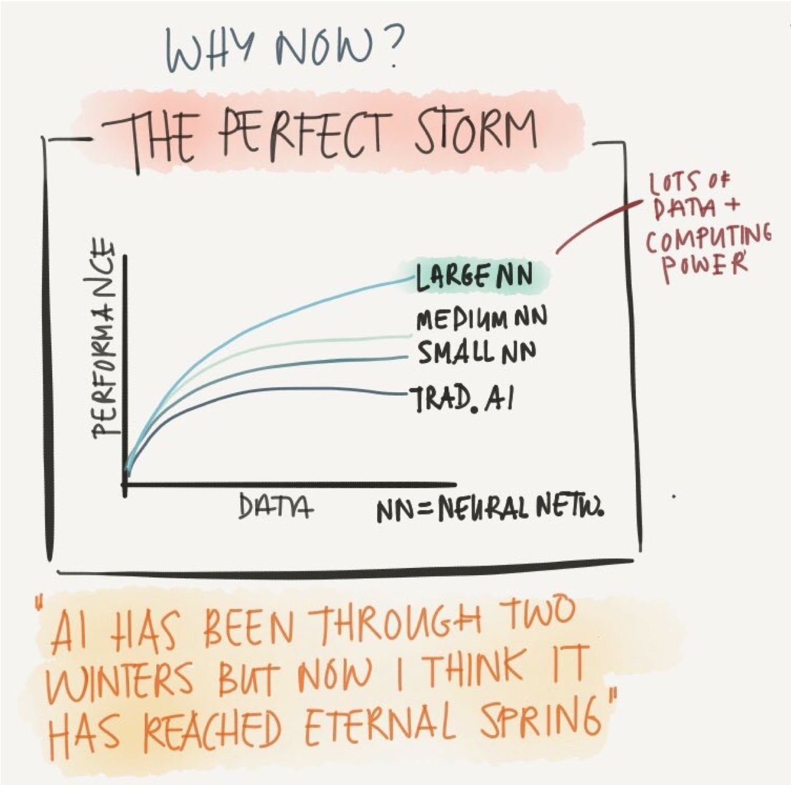

[Andrew Ng on YouTube](https://youtu.be/21EiKfQYZXc) & `@TessFernandes`

---

class: center, middle

.pull-left[
### Neural Networks
<div align="center">

</div>
]


--
.pull-right[
### Large-Scale Computing
<div align="center">

</div>

["NVIDIA DGX-2 ‘The World’s Largest GPU’ Announced ... with $399,000 Price Tag"](https://wccftech.com/nvidia-dgx-2-the-worlds-largest-gpu-announced-2-petaflops-of-power-with-16x-stacked-volta-gpus-with-399000-price-tag/)
]

???

When these were combined with large scale computing -- specifically GPU's

- Graphical processing unit : originally built for graphics due to large number of multiplications

- Just matrix algebra with some calculus
---

class: center, middle


Adapted from [Chollet (2018)](https://www.manning.com/books/deep-learning-with-python)

???

-Let's understand these terms.

-Start from the outside in. AI: traditional like search algorithms (e.g., shortest path) or planning problems

-ML: decision trees, ensembles, or support vector machines

-DL is a subset

---

class: middle


[Google Trends](https://trends.google.com/trends/explore?date=2008-10-03%202018-10-03&q=deep%20learning,Machine%20Learning,Big%20Data,Artificial%20intelligence)

???

-How have these terms changed over time? let's use google trends as approximations (can click link -- fyi easter eggs)

- AI was the largest 10 years ago, but Big Data blew up in 2012.

- However it has faded. Machine learning jumped and is now the highest.

- But if we think of deep learning as a subset of machine learning, DL drove the increase (only started 2012)

---

class: center, middle

## Advances in Deep Learning

<div align="center">

</div>

[xkcd](https://xkcd.com/1838/)

???

-Let's talk about what's driving these advances?

- From this xkcd cartoon, what can deep learning do if its simply doing large scale linear algebra?

- A lot!

---

## Image Classification

<div align="center">

</div>

[Stanford CS231 Course](http://cs231n.github.io/classification/)

???

- Image to numbers. The pixels are inputs, then build a function to predict what's the object.

- Then could run traditional ML: yet assumes you know what you're looking for.

- Manual and semi-automatic rules traditionally did okay but not great.

---

<div align="center">
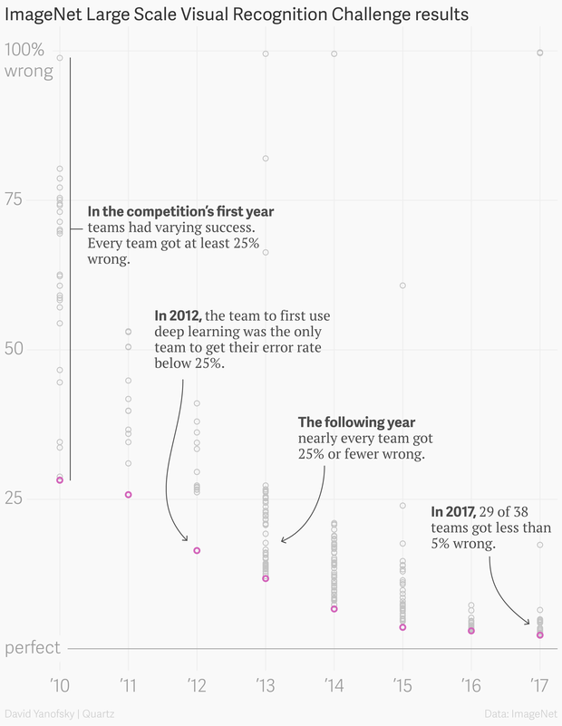
</div>

[Dave Gershgorn's Quartz Blog on ImageNet](https://qz.com/1034972/the-data-that-changed-the-direction-of-ai-research-and-possibly-the-world/)

???

- Let's consider the ImageNet challenge which was a dataset of millions of **labelled** images for objects.

- 2010 there was a wide range from 25-100%

- Then in 2012, the first team used DL with a significant reduction.

- Ever since then, DL has drastically reduced performance down to majority  of teamgot less than 5% wrong

---

## Style transfer with [DeepArt.io](https://deepart.io/#)

.pull-left[
<div align="center">
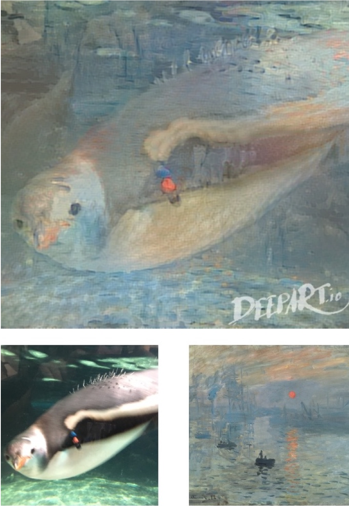
</div>
]
.pull-right[
<div align="center">

</div>
]

???

- Other applications have yielded incredible gains in style transfer 

... in which one image -- a content image -- say pictures of penguins or a kangaroo could find its underlying representation ...


... and apply it to other styles - say Monet or Van Gogh. These examples I created using Deepart.io

---

class: middle, center

## Style transfer to video


[Chan et al., 2018](https://arxiv.org/abs/1808.07371) / [video demo](https://www.youtube.com/watch?v=PCBTZh41Ris&feature=youtu.be)

???

More recently researchers at UC Berkeley applied the same idea to video, more specifically dancing.

- After getting enough video of an target individuals, the create motion transfer to project dancing -- of say Bruno Mars -- to their own videos.

- I really like this because it gives me hope (to dance).

---

class: middle

```{r out.width="100%",echo=FALSE}
htmltools::div(
  align = "center",
  vembedr::embed_youtube("MVBe6_o4cMI",
                         width = 1000,
                         height = 600,
                         allowfullscreen = TRUE)
)
```

[Suwajanakorn, Seitz, and Kemelmacher-Shilzerman (2017)](https://grail.cs.washington.edu/projects/AudioToObama/siggraph17_obama.pdf)

???

- Or in another paper by U of Wash researcher, they trained a DL model from audio to video (multimodal)

---

## Don't think it's that easy...

<div align="center">
<video width="65%" height="65%" autoplay loop>
  <source src="../images/slides/13-class/kid.mp4" type="video/mp4" />
  Your browser does not support the video tag.
</video>
</div>

[Jake VanderPlas' tweet](https://twitter.com/jakevdp/status/1043927469705707521)

---

## Practical Problems with Deep Learning

### Supervised machine learning: labels (y variable) are expensive!

--

### Need **lots** of data

--

### Expensive to train (GPUs)

--

### Can use pre-trained model, but may need to customize

--

### Architecture & tuning hyper-parameters

--

### Rare skill (only few years old!)

--

### But it gets worse...

---

## Deep fakes...

<div align="center">
<iframe width="750" height="600" src="https://www.bloomberg.com/multimedia/api/embed/iframe?id=a95db34d-2c60-4046-ac94-4a18dc82bac4" allowscriptaccess="always" frameborder="0"></iframe>
</div>

---

## Regulatory: GDPR

<div align="center">

</div>

[Goodman and Flaxman (2016)](https://arxiv.org/abs/1606.08813)

???

-Read the lines. At face value, such regulations would require intervention...

-Like self-driving cars -- the cars themselves are not dangerous, but they are when they're immediately released into human systems

-While yes combination of human in the loop, more research is needed to understand how decision-making with such tools

--

.small[Although the question on whether GDPR has a "right to explanation" is hotly debated, e.g. [Wachter, Mittelstadt, and Floridi, 2016](https://papers.ssrn.com/sol3/papers.cfm?abstract_id=2903469)]

---

## Adversarial Examples

<div align="center">

</div>

[Su, Vargas, & Kouichi (2018)](https://arxiv.org/abs/1710.08864)

???

- Alternatively, a different type of research has exposed vulnerabilities in many models using an "adversarial approach"

- Try to find what is the smallest change in the input -- say one pixel -- can affect the model's output?

- In this paper, the authors found many examples where changing one pixel, the model switched the laptop to the one in parthenses like thinking a horse was a cat in the bottom left or an airplane was a dog in the top left

---

## Adversarial Examples

<div align="center">

</div>

[Carlini and Wagner (2018)](https://arxiv.org/pdf/1801.01944.pdf)

???

- Or in another paper but applied to sound, researchers found that after training a network on audio to output a phrase

- if they added a small amount of noise - imperceptible to a person - this could result in a completely different output

- think someone records your voice, takes it to your alexa, then adds subtle noise to tell alexa to charge your credit card

---

## Algorithmic Bias

<div align="center">

</div>

[Kate Crawford (2017)](https://youtu.be/fMym_BKWQzk)

???

- Or even more important, researcher have raised issues with machine learning as the underlying data may reinforce pre-existing biases already present

- these slides include examples by Kate Crawford in her 2017 NIPS presentation.

- like machine translation that would translate a simple phrase from english to turkish, reversing the phrase alters the gender associated with terms due to prior data (or pre-existing biases)

- even worse, we can find digital fingerprints of past queries to represent abhorrent statements. While could use band-aids (fixed rules), never eliminate if data creation (i.e., biases) continue when using learning.

---

## Algorithmic Bias

<div align="center">

</div>
[New York Times (2018)](https://www.nytimes.com/2018/02/09/technology/facial-recognition-race-artificial-intelligence.html)
???

One researcher from MIT has tackled this issue.

Joy BUO-LAM-WINI webscraped hundreds of global politican photos and tested many off-the-shelf image classifiers that predict **gender**

These models did well on white males (1 percent error) - but performed terribly on dark-skinned females - incorrectly identifying 35 percent.


---

```{r out.width="90%", echo=FALSE}
htmltools::div(
  align = "center",
  vembedr::embed_youtube("hSSmmlridUM",
                         width = 900,
                         height = 550,
                         allowfullscreen = TRUE) %>% use_start_time("16m29s")
)
```

> We need to audit our black boxes -Zeynep Tufekci

---

class: middle, center

## But it's a black box...

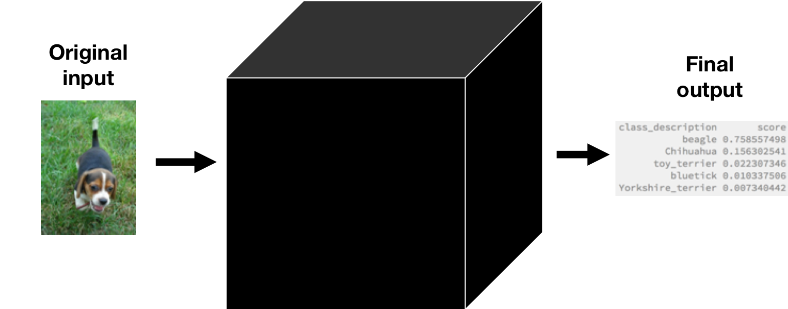

???

1) Ethical 

2) Legal

3) Business
---

class: middle, center, inverse

## What is Explainable AI?


---

## Explainable AI: <a href="https://www.darpa.mil/program/explainable-artificial-intelligence" target="_blank">DARPA XAI</a>

.large[2015 DARPA (Defense Department Research Arm) program with two goals:]

--

.large[1) Produce **more explainable** models, while maintaining a high level of learning performance (prediction accuracy)]

--

.large[2) Enable human users to **understand**, **appropriately trust**, and **effectively manage** the emerging generation of artificially intelligent partners.]
---

## Explainable AI

<div align="center">
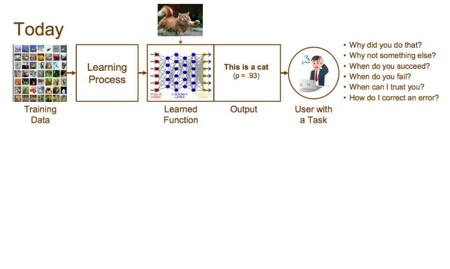
</div>

<a href="https://www.darpa.mil/program/explainable-artificial-intelligence" target="_blank">DARPA XAI</a>

---

## Explainable AI

<div align="center">

</div>

<a href="https://www.darpa.mil/program/explainable-artificial-intelligence" target="_blank">DARPA XAI</a>


---

## XAI Approaches

<div align="center">
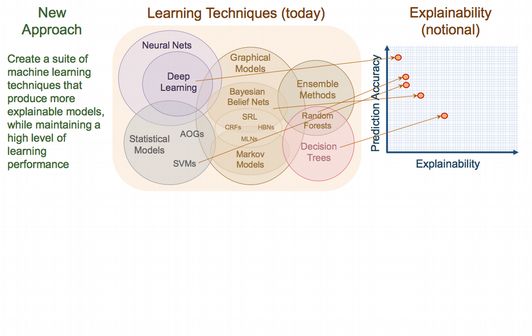
</div>

<a href="https://www.darpa.mil/program/explainable-artificial-intelligence" target="_blank">DARPA XAI</a>

???

- Based on idea that there are variety of techniques - from ML to DL that have a tradeoff between prediction accuracy and explanability.

- DL is in the top left as it has the highest prediction, but lowest explanation -- while decision trees may have high explanability but low prediction power.

- So one goal is to build model that shift this curve to the right.

---

## XAI Approaches

<div align="center">
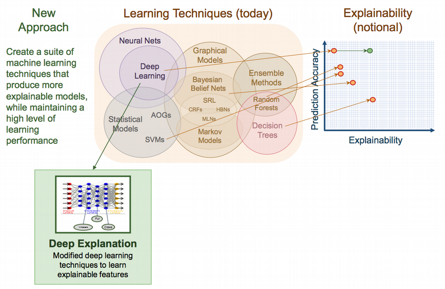
</div>

<a href="https://www.darpa.mil/program/explainable-artificial-intelligence" target="_blank">DARPA XAI</a>

???

One approach focuses only on deep learning. Specifically, how can a data scientist find which neurons fired where to understand why a large neural network made its prediction.

- While definitely a good move, one downside to this approach is it assume expertise with deep neural networks -- architecture, tuning -- so it may have limited application in the near term.

---

## XAI Approaches

<div align="center">

</div>

<a href="https://www.darpa.mil/program/explainable-artificial-intelligence" target="_blank">DARPA XAI</a>

???

Another approach -- which I like -- is demanding a higher standard than just correlation and instead find causal factors.

- This is important for situations around counterfactuals, or what if scenarios?

- One example includes work by Judea Pearl on bayesian networks to identify causal factors 

- can be very difficult, especially without randomized controlled experiments -- the traditional gold standard for finding causal inference in social science.

---

## XAI Approaches

<div align="center">
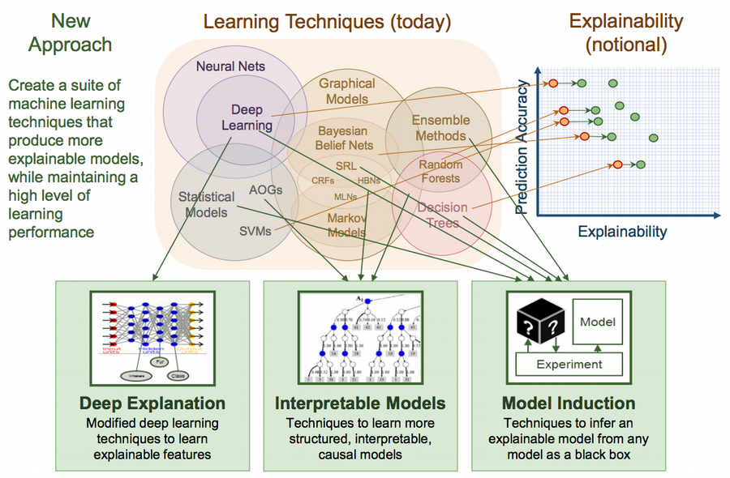
</div>

<a href="https://www.darpa.mil/program/explainable-artificial-intelligence" target="_blank">DARPA XAI</a>

???

The last is what we'll explore is model induction or sometimes called model-agnostic.

These are approaches that may build a local or surrogate model that takes the inputs and the model outputs (regardless of the model) to identify key structures in the model 

- poke it with a stick. see which way it moves.

---

## Model Induction (Agnostic): LIME

<iframe width="700" height="450" src="https://www.youtube.com/embed/hUnRCxnydCc" frameborder="0" allow="autoplay; encrypted-media" allowfullscreen></iframe>

[Ribeiro, Singh, Guestrin, 2016](https://dl.acm.org/citation.cfm?id=2939778)

???

Skip this slide if down on time.

---

## LIME Intuition from [Molnar, 2018](https://christophm.github.io/interpretable-ml-book/)

<div align="center">

</div>

Shiny App by Omayma Said: <https://omaymas.shinyapps.io/lime_explainer/>

---

## Application: LIME for image classification

<div align="center">

</div>

[Thomas Lin Pederson's Blogpost on TensorFlow for R  Blog](https://blogs.rstudio.com/tensorflow/posts/2018-03-09-lime-v04-the-kitten-picture-edition/)

---

## Use pre-trained vgg16

```{r eval=F,echo=TRUE}
# see https://keras.rstudio.com/
library(keras)

# create pre-trained vgg16 as model
model <- application_vgg16(
  weights = "imagenet",
  include_top = TRUE
)
```

<div align="center">

</div>

---

class: center


---

class: middle

## Predict Image using vgg16

```{r eval=F,echo=TRUE}
# set image's local file path
img_path <- file.path('rusty-puppy.jpg')

# create prediction (res) of the image (after prep-) and the model
res <- predict(model, image_prep(img_path))

# get top 5 predictions
imagenet_decode_predictions(res)
```

.pull-left[

```{r eval=F,echo=T}
# class_description       score
#            beagle 0.758557498
#         Chihuahua 0.156302541
#       toy_terrier 0.022307346
#          bluetick 0.010337506
# Yorkshire_terrier 0.007340442
```
]

.pull-right[
<div align="center">

</div>
]

---

```{r eval=F, echo=T}
plot_superpixels(img_path, n_superpixels = 200, weight = 40)
```


<div align="center">
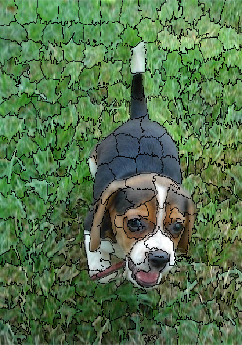
</div>

---

```{r eval=F, echo=T}
library(lime)

# get model labels
model_labels <- system.file(
  'extdata', 
  'imagenet_labels.rds', 
  package = 'lime') %>%
  readRDS() # read in rds file

# create classifier
classifier <- as_classifier(model, model_labels)
```

--

```{r eval=F, echo=T}
# create explainer for given image
explainer <- lime(img_path, classifier, image_prep)

# takes 10+ min on CPU (ideally use GPU(s)!)
explanation <- explain(img_path,          # image
                       explainer,         # explainable model
                       n_labels = 2,      # choose top 2 classes
                       n_features = 20)   # use 20 features

plot_image_explanation(explanation,       # explanation
                       display = 'block', # block-mode
                       threshold = 0.01)
```

---

class: middle

<div align="center">

</div>


---

## The cone of shame...

<div align="center">

</div>

---

## Or in disguise...

<div align="center">
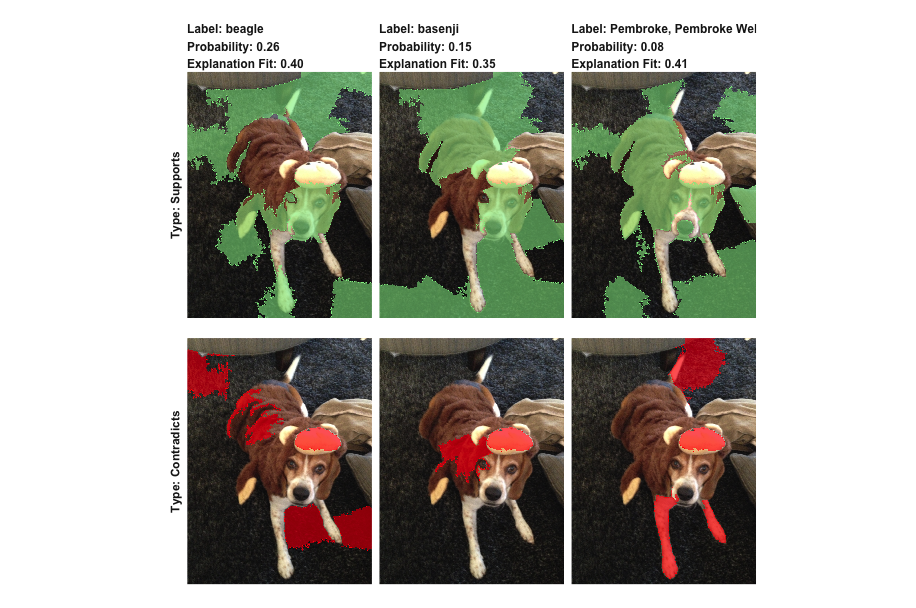
</div>


---

```{r eval=F, echo=T}
plot_image_explanation(explanation, threshold = 0.01)
```

<div align="center">
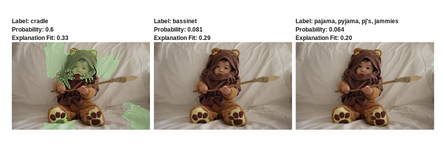
</div>

--

```{r eval=F, echo=T}
plot_image_explanation(explanation, threshold = 0.001)
```

<div align="center">
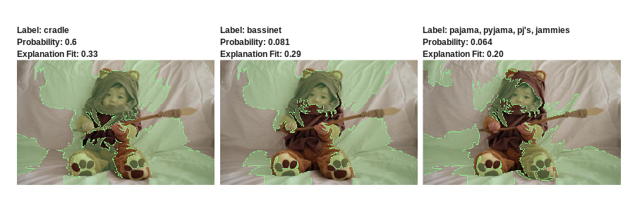
</div>

[`@smironchuk`'s Pinterest Ewok Costumes](https://www.pinterest.com/smironchuk/ewok-costume/)

---

```{r eval=F, echo=T}
interactive_text_explanations(cfpbExplanation) # run shiny app
```


[lime](https://github.com/thomasp85/lime) Package


---

## Caveats to LIME

### Slow for images (less so for text/tabular data).

### Good for local explanations, not global explanations.

### Cognitive psychology: what makes a good explanation?

- Can cognitive theories on visual attention provide clues on how person understands explanation?

- What happens if someone's prior knowledge conflicts with explanations (e.g., cognitive biases)?

### Other Approaches

- [Global surrogate models](https://christophm.github.io/interpretable-ml-book/global.html), see Molnar's book.

---

## Explainable AI Resources

### Christoph Molnar's [Interpretable Machine Learning](https://christophm.github.io/interpretable-ml-book/) Book [`r icon::fa("github")`](https://github.com/christophM/interpretable-ml-book)

### Deep explanation

- Olah et al.'s ["Buiding Block of Interpretability"](https://distill.pub/2018/building-blocks/)

### Bayesian networks and causal inference

- Pearl & Mackenzie's ["The Book of Why"](https://www.amazon.com/Book-Why-Science-Cause-Effect/dp/046509760X)

### Cognitive science take on deep learning: 

- Gary Marcus' ["Deep Learning: A Critical Appraisal"](https://arxiv.org/abs/1801.00631)

- [2017 Lecun & Marcus NYU Debate](https://www.youtube.com/watch?v=vdWPQ6iAkT4) 
